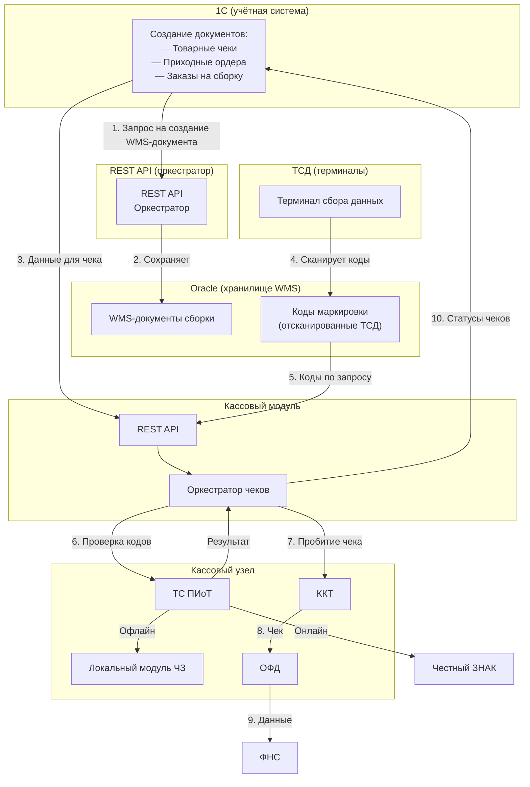
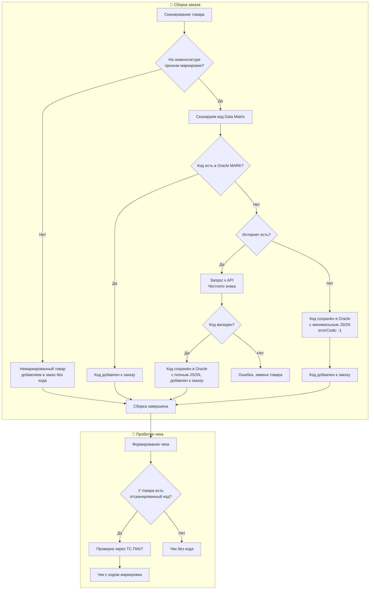
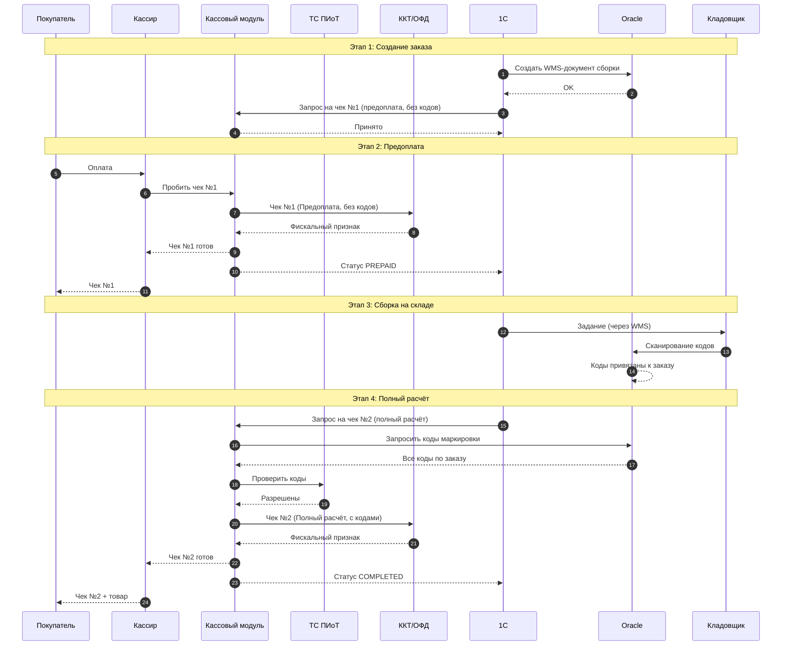
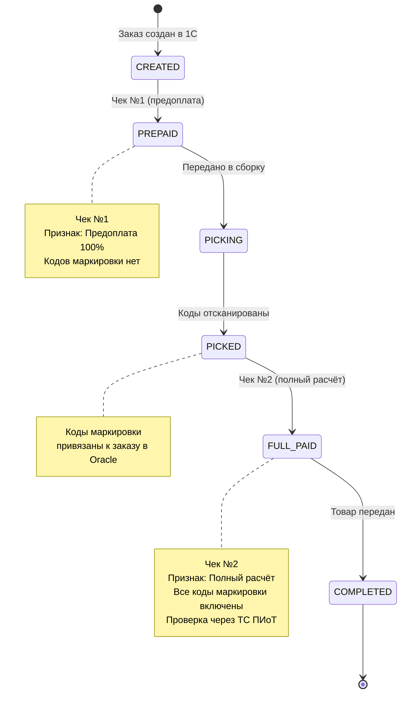

# ТЕХНИЧЕСКОЕ ЗАДАНИЕ

## Кассовый модуль для работы с маркированными товарами

---

**Версия:** 1.0  
**Дата:** 03.07.2026  
**Статус:** ?

---

## Оглавление

1. [Словарь терминов](#1-словарь-терминов)
2. [Цель работы](#2-цель-работы)
3. [Место в общей архитектуре](#3-место-в-общей-архитектуре)
4. [Компоненты и ответственность](#4-компоненты-и-ответственность)
5. [Функциональные требования](#5-функциональные-требования)
6. [Требования к интеграции с 1С](#6-требования-к-интеграции-с-1с)
7. [Требования к интеграции с Oracle](#7-требования-к-интеграции-с-oracle)
8. [Требования к интеграции с ТС ПИоТ](#8-требования-к-интеграции-с-тс-пиот)
9. [Требования к работе с ККТ](#9-требования-к-работе-с-ккт)
10. [Требования к работе с ОФД](#10-требования-к-работе-с-офд)
11. [Требования к фискальным чекам](#11-требования-к-фискальным-чекам)
12. [Сценарии работы](#12-сценарии-работы)
13. [Требования к надёжности](#13-требования-к-надёжности)
14. [Требования к логированию и мониторингу](#14-требования-к-логированию-и-мониторингу)
15. [Критерии приёмки](#15-критерии-приёмки)
16. [Риски](#16-риски)

> Qreal - учетная система в дальнейшем 1С

---

## 1. Словарь терминов

| Термин                  | Определение                                                                                                          |
|-------------------------|----------------------------------------------------------------------------------------------------------------------|
| **1С** (Qreal)          | Учётная система, создающая товарные чеки, приходные ордера и заказы на сборку                                        |
| **Oracle**              | Хранилище WMS-документов и отсканированных кодов маркировки                                                          |
| **ТСД**                 | Терминал сбора данных (Android), используемый кладовщиками для сканирования кодов                                    |
| **WMS-документ**        | Документ сборки/наборки, создаваемый на основе заказа из 1С                                                          |
| **Код маркировки**      | Data Matrix, сканируется ТСД и сохраняется в Oracle                                                                  |
| **Кассовый модуль**     | Сервис, пробивающий чеки, интегрированный с ККТ, ОФД и ТС ПИоТ                                                       |
| **ТС ПИоТ**             | Технические средства получения информации о товаре — сертифицированный программный модуль, обязательный с 01.07.2026 |
| **Локальный модуль ЧЗ** | Локальная база «Честного ЗНАКа» для офлайн-проверки кодов                                                            |
| **ККТ**                 | Контрольно-кассовая техника — кассовый аппарат                                                                       |
| **ОФД**                 | Оператор фискальных данных — компания, передающая чеки в ФНС                                                         |
| **ФНС**                 | Федеральная налоговая служба                                                                                         |
| **ФН**                  | Фискальный накопитель — защищённый модуль внутри ККТ                                                                 |
| **Фискальный признак**  | Уникальный код, присваиваемый каждому чеку ФН                                                                        |
| **Честный ЗНАК**        | Государственная система маркировки товаров                                                                           |
| **Предоплата 100%**     | Признак расчёта — деньги получены, товар ещё не передан                                                              |
| **Полный расчёт**       | Признак расчёта — товар передан покупателю                                                                           |
| **Data Matrix**         | Двумерный штрихкод системы маркировки                                                                                |

---

## 2. Цель работы

Реализовать кассовый модуль, обеспечивающий:

1. Пробитие фискальных чеков при продаже маркированных товаров через ККТ с передачей данных в ОФД.
2. Получение от **1С** данных для чеков (товары, суммы, покупатель).
3. Получение от **Oracle** отсканированных кодов маркировки для включения в чеки.
4. Интеграцию с **ТС ПИоТ** для обязательной проверки кодов маркировки перед пробитием чека.
5. Поддержку **двухэтапной схемы продажи**: сначала чек с признаком «Предоплата 100%» (без кодов), затем чек с признаком «Полный расчёт» (с кодами).
6. Возврат статусов чеков в **1С** для закрытия заказов.
7. Работу в офлайн-режиме при отсутствии связи с внешними сервисами.
8. Поддержку выдачи чеков в бумажном и/или электронном виде (по e-mail или SMS) в соответствии с 54-ФЗ.

---

## 3. Место в общей архитектуре

Кассовый модуль является **самостоятельным сервисом**, который интегрируется с:

- **1С** — получение данных для чеков, передача статусов.
- **REST API (оркестратор)** — получение отсканированных кодов маркировки через Oracle.
- **ТС ПИоТ** — проверка кодов перед пробитием чека.
- **ККТ** — пробитие фискальных чеков.
- **ОФД** — передача чеков в ФНС.

**Принципы работы:**

- 1С создаёт заказ и через REST API передаёт запрос на создание WMS-документа сборки. REST API сохраняет документ в Oracle.
- Кладовщик через ТСД сканирует коды маркировки, которые сохраняются в Oracle (с проверкой через API «Честного знака» при наличии интернета или с минимальным JSON при его отсутствии).
- Кассовый модуль получает от 1С данные для чека.
- Кассовый модуль получает от Oracle (через REST API) коды маркировки для второго чека.
- Кассовый модуль проверяет коды через ТС ПИоТ.
- Кассовый модуль пробивает чеки через ККТ.
- Кассовый модуль передаёт статусы чеков в 1С.
- Кассовый модуль НЕ общается напрямую с «Честным ЗНАКом» — вся проверка идёт через ТС ПИоТ.
- Кассовый модуль НЕ хранит коды маркировки — он получает их из Oracle.

---

## 4. Компоненты и ответственность

| Компонент               | Роль                       | Ответственность                                                                                                        |
|-------------------------|----------------------------|------------------------------------------------------------------------------------------------------------------------|
| **1С**                  | Учётная система            | Создание товарных чеков, приходных ордеров, заказов на сборку. Передача данных в кассовый модуль. Приём статусов чеков |
| **Oracle**              | Хранилище WMS              | Хранение WMS-документов сборки, отсканированных кодов маркировки, статусов сборки                                      |
| **ТСД**                 | Терминал                   | Сканирование кодов маркировки, работа с WMS-документами, обновление статусов                                           |
| **Кассовый модуль**     | Фискальный оркестратор     | Пробитие чеков, интеграция с ККТ, ОФД, ТС ПИоТ, обмен данными с 1С и Oracle                                            |
| **ТС ПИоТ**             | Проверка кодов             | Проверка кодов маркировки в «Честном ЗНАКе» (онлайн/офлайн)                                                            |
| **Локальный модуль ЧЗ** | Офлайн-база                | Обеспечение работы ТС ПИоТ в офлайн-режиме (версия 2.5.1 и выше)                                                       |
| **ККТ**                 | Кассовый аппарат           | Печать чеков, фискализация                                                                                             |
| **ОФД**                 | Оператор фискальных данных | Передача чеков в ФНС                                                                                                   |

---

## 5. Функциональные требования

### 5.1. Базовые функции

| Функция | Описание |
|---------|----------|
| Открытие смены | Открытие рабочей смены на ККТ |
| Закрытие смены | Закрытие рабочей смены с формированием Z-отчёта |
| Пробитие чека | Формирование и печать фискального чека |
| Пробитие чека возврата | Формирование чека возврата |
| Отмена чека | Отмена последнего чека (если разрешено ККТ) |
| X-отчёт | Промежуточный отчёт без закрытия смены |
| Проверка состояния ККТ | Запрос статуса (готова/занята/ошибка) |

### 5.2. Работа с маркированными товарами

| Функция                     | Описание                                                                                  |
|-----------------------------|-------------------------------------------------------------------------------------------|
| Получение кодов             | Запрос отсканированных кодов маркировки из Oracle по идентификатору заказа                |
| Проверка кодов              | Отправка кодов в ТС ПИоТ для проверки перед чеком                                         |
| Включение в чек             | Передача кодов в фискальный чек через ККТ                                                 |
| Контроль срока              | Мониторинг превышения 3 рабочих дней между предоплатой и полным расчётом                  |
| Связывание чеков            | Возможность привязать два чека (предоплата и полный расчёт) к одному заказу               |
| Управление очередью заказов | Обработка конкурентных запросов от нескольких наборщиков, завершивших сборку одновременно |

### 5.3. Двухэтапная продажа

| Этап | Чек | Признак расчёта | Коды маркировки |
|------|-----|-----------------|-----------------|
| 1 | Чек №1 (предоплата) | Предоплата 100% | **НЕ добавляются** |
| 2 | Чек №2 (финальный) | Полный расчёт | **Добавляются все коды** |

**Важно:** Между этапами допустимо до 3 рабочих дней.

---

## 6. Требования к интеграции с 1С

### 6.1. Интерфейс 1С → Кассовый модуль

1С передаёт в кассовый модуль данные для пробития чека:

- Идентификатор заказа (из 1С)
- Список товаров (номенклатура, количество, цена, ставка НДС)
- Общая сумма
- Тип оплаты (наличные/безналичные)
- Телефон покупателя (для электронного чека)
- Этап операции (`PREPAY` — первый чек, `FULL_PAY` — второй чек)
- Способ выдачи чека	PAPER — бумажный чек, EMAIL — на e-mail, SMS — на телефон, BOTH — бумажный + электронный

### 6.2. Интерфейс Кассовый модуль → 1С

Кассовый модуль возвращает в 1С:

- Статус операции (`SUCCESS` / `FAILED`)
- Идентификаторы чеков
- Фискальные признаки чеков
- Номера фискальных документов
- Текст ошибки (при неудаче)

### 6.3. Порядок взаимодействия

1. 1С создаёт заказ и через REST API передаёт запрос на создание WMS-документа сборки. REST API сохраняет документ в Oracle.

2. 1С передаёт в кассовый модуль запрос на чек №1 (предоплата) **без кодов маркировки**.

3. Кассовый модуль пробивает чек №1 с признаком «Предоплата 100%», возвращает статус в 1С.

4. **Сборка на складе с проверкой через ТС ПИоТ (первая проверка):**
   - 4.1. Кладовщик через ТСД сканирует коды маркировки.
   - 4.2. ТСД отправляет каждый код в Кассовый модуль.
   - 4.3. Кассовый модуль обрабатывает код согласно разделу 7.4
   - 4.4. После сканирования всех кодов статус сборки обновляется.

5. Когда сборка завершена, 1С передаёт в кассовый модуль запрос на чек №2 (полный расчёт).

6. **Финальная проверка через ТС ПИоТ при пробитии чека:**
    - 6.1. Кассовый модуль запрашивает коды маркировки из Oracle.
    - 6.2. Кассовый модуль отправляет коды в ТС ПИоТ для фискальной проверки.
    - 6.3. ТС ПИоТ возвращает результат:
        - Если **все коды разрешены** — кассовый модуль формирует отраслевой реквизит (тег 1260) и пробивает чек №2 с признаком «Полный расчёт».
        - Если **хотя бы один код запрещён** — продажа блокируется, кассовый модуль возвращает ошибку в 1С.
    - 6.4. Чек №2 отправляется в ОФД → ФНС → Честный ЗНАК.
    - 6.5. Кассовый модуль возвращает статус чека в 1С.

7. 1С закрывает заказ.

---

## 7. Требования к интеграции с Oracle

### 7.1. Интерфейс Кассовый модуль → Oracle

Кассовый модуль запрашивает у Oracle:

- Коды маркировки по идентификатору заказа (отсканированные ТСД)
- Статус сборки (собрано/не собрано)

### 7.2. Интерфейс Oracle → Кассовый модуль

Oracle возвращает:

- Список кодов маркировки (Data Matrix) по каждой позиции заказа
- Статус сборки

### 7.3. Порядок взаимодействия

1. Перед пробитием второго чека кассовый модуль запрашивает у Oracle коды маркировки по заказу.
2. Oracle возвращает все коды, отсканированные ТСД.
3. Кассовый модуль проверяет коды через ТС ПИоТ и включает их в чек.

### 7.4. Обработка кодов маркировки при сборке

**Общий принцип:** обязательность сканирования кода определяется признаком маркировки на номенклатуре.

**Порядок действий при сборке:**

1. Сотрудник сканирует товар.
2. Если на номенклатуре **нет** признака маркировки:
    - Товар добавляется к заказу без кода.
    - При чеке проверка через ТС ПИоТ не выполняется.
3. Если на номенклатуре **есть** признак маркировки:
    - Сотрудник **обязан** отсканировать код Data Matrix.
    - Кассовый модуль проверяет наличие кода в Oracle (таблица `MARK`).
    - **Код найден** → добавляется к заказу.
    - **Код не найден** → кассовый модуль проверяет доступность интернета:
        - **Интернет есть** → выполняется проверка через API «Честного знака»:
            - Код валиден → сохраняется в Oracle с полным JSON, добавляется к заказу.
            - Код невалиден → ТСД показывает ошибку, сотрудник заменяет товар.
        - **Интернета нет** → код сохраняется в Oracle с **минимальным JSON**, где:
            - `km` — код маркировки.
            - `json` — минимальный json.
            - Пример: `[{"cisInfo":{"cis":"0207613287073969373","gtin":"07613287073969","errorCode":"-1"}}]`
        - Код добавляется к заказу.
4. При пробитии чека **все коды** проходят обязательную проверку через ТС ПИоТ (независимо от наличия `errorCode`).

**Важно:** Наличие `errorCode: "-1"` в JSON означает, что код был сохранён в офлайн-режиме без проверки. Это не является ошибкой и не блокирует продажу — проверка будет выполнена через ТС ПИоТ при пробитии чека.
---

## 8. Требования к интеграции с ТС ПИоТ

### 8.1. Общие требования

| Требование         | Описание                                                                            |
|--------------------|-------------------------------------------------------------------------------------|
| **Обязательность** | Интеграция с ТС ПИоТ обязательна для всех продаж маркированных товаров с 01.07.2026 |
| **Поставщики**     | Поддерживаются модули от ЕСП и Инвенты                                              |
| **Лицензирование** | На каждую ККТ требуется отдельная годовая лицензия                                  |
| **Офлайн-режим**   | ТС ПИоТ использует Локальный модуль ЧЗ версии 2.5.1 и выше                          |

### 8.3. Проверка кодов на этапе пробития чека

1. Кассовый модуль получает коды из Oracle.
2. Кассовый модуль отправляет коды в ТС ПИоТ для повторной проверки.
3. ТС ПИоТ проверяет актуальный статус кодов.
4. Если все коды `ALLOWED` — кассовый модуль пробивает чек.
5. Если хотя бы один код `FORBIDDEN` — продажа блокируется.
6. При успешной проверке кассовый модуль формирует отраслевой реквизит (тег 1260).

### 8.4. Обработка ошибок ТС ПИоТ

| Ситуация                            | Действие кассового модуля                                                    |
|-------------------------------------|------------------------------------------------------------------------------|
| ТС ПИоТ недоступен на кассе         | Блокировка продажи, уведомление в ИТ                                         |
| Код не найден в системе             | Блокировка продажи, вывод ошибки                                             |
| Истекла лицензия ТС ПИоТ            | Блокировка продажи, уведомление администратора                               |
| Превышено время ожидания ответа     | Повторная попытка (до 3 раз), затем блокировка                               |
| **Нет интернета при сборке**        | Код сохраняется с минимальным JSON (`errorCode: "-1"`), добавляется к заказу |
| **Нет интернета при пробитии чека** | Использование Локального модуля ЧЗ (офлайн-проверка) или блокировка продажи  |

### 8.5. Схема двухэтапной проверки

**Описание схемы:**

| Этап         | Действие                                                            | Результат                                                                               |
|--------------|---------------------------------------------------------------------|-----------------------------------------------------------------------------------------|
| **1. Склад** | ТСД сканирует код → обработка согласно разделу 7.4                  | Валидный → сохранение в Oracle Невалидный (при онлайн-проверке) → ошибка, замена товара |
| **2. Касса** | Кассовый модуль запрашивает коды из Oracle → проверка через ТС ПИоТ | Все ALLOWED → чек пробит Хотя бы один FORBIDDEN → продажа заблокирована                 |

---

## 9. Требования к работе с ККТ

### 9.1. Поддерживаемые модели ККТ

Кассовый модуль должен поддерживать не менее двух моделей ККТ (на выбор):

| Производитель | Модели |
|---------------|--------|
| **АТОЛ** | АТОЛ 30Ф, АТОЛ 91Ф, АТОЛ 55Ф |
| **ШТРИХ-М** | ШТРИХ-М-01Ф, ШТРИХ-М-02Ф |
| **Эвотор** | Эвотор 7.2, Эвотор 7.3 |

### 9.2. Режимы работы

| Режим | Описание |
|-------|----------|
| **Фискальный** | Штатная работа — пробитие чеков с передачей в ОФД |
| **Тестовый** | Пробитие чеков без отправки в ОФД (для отладки) |
| **Офлайн** | Работа при отсутствии связи с ОФД (чеки сохраняются в буфере) |

### 9.3. Управление ККТ

| Операция | Описание |
|----------|----------|
| Открытие смены | Выполняется ежедневно перед началом работы |
| Закрытие смены | Выполняется ежедневно после окончания работы |
| Проверка состояния | Запрос статуса ККТ (готова/занята/ошибка) |
| Перезагрузка | Перезапуск драйвера ККТ при зависании |

---

## 10. Требования к работе с ОФД

### 10.1. Поддерживаемые ОФД

Кассовый модуль должен поддерживать не менее двух операторов:

| Оператор |
|----------|
| Ярус |
| Такском |
| Сбис |

### 10.2. Режимы работы с ОФД

Взаимодействие кассового модуля с ОФД опирается на возможности ККТ и встроенного в нее **фискального накопителя (ФН)**.

| Режим         | Описание                                                                                                                                                                                                                                                                                                                              |
|---------------|---------------------------------------------------------------------------------------------------------------------------------------------------------------------------------------------------------------------------------------------------------------------------------------------------------------------------------------|
| **Онлайн**    | Является основным режимом работы. Все фискальные чеки в момент расчета записываются в ФН и незамедлительно передаются в ОФД для последующей отправки в ФНС.                                                                                                                                                                           |
| **Офлайн**    | Активируется автоматически при потере связи с интернетом. В этом режиме все чеки накапливаются и защищенно хранятся в фискальном накопителе ККТ. Законодательно допустимый срок работы в таком режиме — не более 30 календарных дней. После восстановления соединения накопитель автоматически передает все накопленные данные в ОФД. |
| **Смешанный** | По сути, это алгоритм работы современной ККТ, которая по умолчанию работает в режиме «Онлайн», но способна автоматически переключаться в режим «Офлайн» при сбоях сети и так же автоматически возвращаться к обычной работе после восстановления связи.                                                                               |

**Важно:** кассовый модуль **не участвует** в хранении и управлении очередью чеков при потере связи. Эта функция полностью возложена на фискальный накопитель ККТ, что гарантирует сохранность фискальных данных без участия внешнего ПО.

### 10.3. Взаимодействие с ОФД

| Операция | Описание |
|----------|----------|
| Регистрация ККТ | Первичная регистрация кассы в ОФД |
| Отправка чека | Передача фискального чека в ОФД |
| Получение подтверждения | Ожидание ответа от ОФД о приёме чека |
| Переотправка | Автоматическая переотправка чеков при сбоях (выполняется ККТ) |
| Мониторинг | Проверка статуса отправки чеков |
---

## 11. Требования к фискальным чекам

### 11.1. Соответствие требованиям

Все чеки должны соответствовать:

- 54-ФЗ — федеральный закон о применении ККТ
- Приказ ФНС № ЕД-7-20/662@ — форматы фискальных документов
- ФФД 1.2 — текущая версия формата фискальных данных

### 11.2. Признаки расчёта

| Признак | Код | Когда используется |
|---------|-----|-------------------|
| Предоплата 100% | `1` | Первый чек (деньги получены, товар ещё не передан) |
| Полный расчёт | `4` | Второй чек (товар передан покупателю) |

### 11.3. Особенности для маркированных товаров

| Требование          | Описание                                                                        |
|---------------------|---------------------------------------------------------------------------------|
| Код обязателен      | Для всех маркированных товаров код Data Matrix должен присутствовать в чеке     |
| Один чек — один код | Каждая единица товара передаётся отдельной строкой с уникальным кодом           |
| Формат передачи     | Код передаётся в формате GS1 (начинается с `01`)                                |
| Срок передачи       | Код должен быть передан в Честный ЗНАК не позднее 3 рабочих дней после отгрузки |

### 11.4. Способы выдачи чеков

Кассовый модуль должен поддерживать следующие способы выдачи фискальных чеков:

| Способ | Описание |
|--------|----------|
| **Бумажный чек** | Печать на ККТ. Используется по умолчанию, если не указан иной способ. |
| **Электронный чек (e-mail)** | Отправка чека на электронную почту покупателя. Адрес передаётся в запросе от 1С. |
| **Электронный чек (SMS)** | Отправка чека в виде SMS-сообщения с ссылкой на электронный чек. Номер телефона передаётся в запросе от 1С. |
| **Комбинированный** | Одновременная печать бумажного чека и отправка электронной копии (по требованию покупателя или по настройкам). |

**Требования:**
- Выбор способа выдачи чека определяется в запросе от 1С.
- При отправке электронного чека кассовый модуль должен:
    - Сформировать фискальный чек на ККТ (учесть печать чека как то).
    - Передать данные для отправки в ОФД (ОФД обеспечивает доставку чека покупателю).
- Бумажный чек печатается только при явном указании способа `PAPER` или `BOTH`.
- При отсутствии параметра используется способ по умолчанию — `PAPER`.

**Юридическое основание:** п. 2 ст. 1.2 54-ФЗ — чек может быть выдан в электронной форме при наличии e-mail или номера телефона покупателя.

---

## 12. Сценарии работы

### 12.1. Сценарий А: Продажа маркированного товара с удалённого склада

**Участники:** Кассир, Кладовщик, Покупатель

**Шаг 1. Создание заказа в 1С**
- 1С создаёт заказ и WMS-документ сборки в Oracle.
- 1С передаёт в кассовый модуль запрос на чек №1 (предоплата) — без кодов.

**Шаг 2. Предоплата**
- Кассир принимает оплату.
- Кассовый модуль пробивает чек №1 с признаком «Предоплата 100%», без кодов.
- Чек отправляется в ОФД.
- Кассовый модуль возвращает статус в 1С.
- 1С переводит заказ в статус `PREPAID`.

**Шаг 3. Сборка на складе**
- 1С отправляет задание на ТСД кладовщику (через WMS).
- Кладовщик сканирует коды маркировки.
- Коды обрабатываются согласно разделу 7.4.
- Статус сборки обновляется.

**Шаг 4. Полный расчёт с повторной проверкой**
- Когда сборка завершена, 1С передаёт в кассовый модуль запрос на чек №2 с указанием способа выдачи чека.
- Кассовый модуль запрашивает коды маркировки из Oracle.
- Кассовый модуль проверяет коды через ТС ПИоТ.
- При успешной проверке формирует отраслевой реквизит и пробивает чек.
- Кассовый модуль пробивает чек №2 и выдаёт его покупателю в указанном формате:
    - Бумажный чек — печать на ККТ.
    - Электронный чек — отправка на e-mail/SMS через ОФД.
    - Комбинированный — бумажный + электронный.- 
- Если код запрещён — продажа блокируется.
- Чек отправляется в ОФД → ФНС → Честный ЗНАК.
- Кассовый модуль возвращает статус в 1С.
- 1С переводит заказ в статус `COMPLETED`.
- Товар передаётся покупателю.

---

### 12.2. Сценарий Б: Продажа маркированного товара из магазина

**Участники:** Кассир, Покупатель

**Шаг 1. Сканирование**
- Кассир сканирует товар и код маркировки.
- Кассовый модуль отправляет код в ТС ПИоТ на проверку.
- ТС ПИоТ подтверждает разрешение.

**Шаг 2. Пробитие чека**
- Кассир принимает оплату.
- Кассовый модуль формирует чек с признаком «Полный расчёт».
- Код маркировки включён в чек.
- Чек отправляется в ОФД.

**Шаг 3. Передача товара**
- Кассир отдаёт товар покупателю.

---

### 12.3. Сценарий В: Смешанный заказ (часть товара в магазине, часть на складе)

**Участники:** Кассир, Кладовщик, Покупатель

**Шаг 1. Создание заказа в 1С**
- 1С создаёт заказ и WMS-документ сборки для товаров со склада.
- 1С передаёт в кассовый модуль запрос на чек №1 (предоплата) на все товары — без кодов.

**Шаг 2. Предоплата**
- Кассир принимает полную оплату.
- Кассовый модуль пробивает чек №1 с признаком «Предоплата 100%», без кодов.
- Чек отправляется в ОФД.
- Кассовый модуль возвращает статус в 1С.
- 1С переводит заказ в статус `PREPAID`.
- Товары, которые есть в магазине, передаются покупателю сразу.

**Шаг 3. Сборка на складе**
- 1С отправляет задание на ТСД кладовщику (только для товаров со склада).
- Кладовщик сканирует коды маркировки.
- Коды обрабатываются согласно разделу 7.4.
- Статус сборки обновляется.

**Шаг 4. Полный расчёт**
- Когда сборка завершена, 1С передаёт в кассовый модуль запрос на чек №2 с указанием способа выдачи чека.
- Кассовый модуль запрашивает коды маркировки из Oracle (все коды по заказу — и для товаров из магазина, и для товаров со склада).
- Кассовый модуль проверяет коды через ТС ПИоТ.
- Кассовый модуль пробивает чек №2 с признаком «Полный расчёт», со всеми кодами.
- Чек отправляется в ОФД → ФНС → Честный ЗНАК.
- Кассовый модуль возвращает статус в 1С.
- 1С переводит заказ в статус `COMPLETED`.
- Товары со склада передаются покупателю.

---

### 12.4. Сценарий Г: Возврат маркированного товара

**Участники:** Кассир, Покупатель

**Шаг 1. Проверка**
- Кассир сканирует код маркировки возвращаемого товара.
- Кассовый модуль проверяет, что товар был продан в этой организации.

**Шаг 2. Пробитие чека возврата**
- Кассовый модуль формирует чек возврата.
- Код маркировки включён в чек возврата.
- Чек отправляется в ОФД → ФНС → Честный ЗНАК (товар возвращается в оборот).

**Шаг 3. Возврат денег**
- Кассир возвращает деньги покупателю.

### 12.5. Жизненный цикл заказа

---

## 13. Требования к надёжности

| Требование | Описание |
|------------|----------|
| **Очередь заказов на фискализацию** | Кассовый модуль должен вести внутреннюю очередь заказов, ожидающих пробития чека №2 (полный расчёт). Это необходимо для обработки случаев, когда несколько наборщиков одновременно завершают сборку разных заказов. |
| **Обработка одновременных запросов** | Модуль должен корректно обрабатывать конкурентные запросы от разных наборщиков, сохраняя все заказы в очередь и обрабатывая их последовательно, без потери данных. |
| **Персистентность очереди** | Очередь должна быть персистентной (сохраняться на диске или в БД), чтобы заказы не терялись при перезапуске кассового модуля или его временной недоступности. |
| **Приоритезация** | Очередь должна поддерживать механизм приоритетов (например, заказы, ожидающие дольше всего, обрабатываются в первую очередь) либо обрабатываться по принципу FIFO (First In, First Out). |
| **Ретраи** | При ошибке отправки чека в ККТ — автоматические повторные попытки (до 5 раз) с экспоненциальной задержкой. |
| **Лимит времени** | Максимальное время ожидания ответа от ККТ/ОФД — 30 секунд. |
| **Защита от дублей** | Защита от повторной отправки одного чека (идемпотентность). |
| **Ручное вмешательство** | При невозможности автоматической обработки заказа — уведомление администратора. |
| **Мониторинг ККТ** | Автоматический мониторинг состояния ККТ (смена открыта/закрыта, ошибки). |
| **Мониторинг ТС ПИоТ** | Автоматический мониторинг доступности ТС ПИоТ и срока лицензии. |
| **Контроль срока 3 дня** | Автоматическое уведомление о превышении 3 рабочих дней между чеками. |
---

## 14. Требования к логированию и мониторингу

### 14.1. Что логировать

| Событие | Описание |
|---------|----------|
| Пробитие чека | Содержимое, сумма, статус, фискальные данные |
| Ошибки ККТ | Отказ печати, занятость, нет бумаги |
| Ошибки ОФД | Отказ, таймаут |
| Ошибки ТС ПИоТ | Отказ проверки, истекла лицензия |
| Переотправки чеков | Время и причина переотправки |
| Открытие/закрытие смены | Время, оператор |
| Действия оператора | Все операции с указанием кассира |

### 14.2. Требования к логам

| Требование | Описание |
|------------|----------|
| **Хранение** | Не менее 30 дней |
| **Формат** | Структурированный (JSON) |
| **Доступ** | Только для администратора |

### 14.3. Метрики для мониторинга

| Метрика | Описание |
|---------|----------|
| Количество чеков в смену | Статистика по кассам |
| Время ответа ОФД | Среднее и максимальное время |
| Доступность ТС ПИоТ | Процент доступности |
| Ошибки ККТ | Количество ошибок по типам |
| Буфер офлайн-чеков | Текущий размер очереди |

---

## 15. Критерии приёмки

- [ ] Кассовый модуль успешно открывает и закрывает смену на ККТ.
- [ ] Чек №1 (предоплата) пробивается **без кодов маркировки** по данным из 1С и принимается ОФД.
- [ ] Чек №2 (полный расчёт) пробивается **с кодами маркировки** (полученными из Oracle) после проверки через ТС ПИоТ и принимается ОФД.
- [ ] Для смешанного заказа коды из Oracle включаются в чек №2 (все коды, включая отсканированные на складе).
- [ ] Коды маркировки передаются в Честный ЗНАК через ОФД.
- [ ] При недоступности ТС ПИоТ продажа маркированного товара блокируется с понятной ошибкой.
- [ ] При потере связи с ОФД чеки сохраняются и отправляются автоматически после восстановления.
- [ ] Время между предоплатой и полным расчётом контролируется (не более 3 рабочих дней).
- [ ] Возврат маркированного товара формирует корректный чек возврата.
- [ ] Все операции логируются.
- [ ] Интеграция с 1С работает корректно (приём данных, передача статусов).
- [ ] Интеграция с Oracle работает корректно (получение кодов маркировки).
- [ ] При пробитии чека №2 выполняется повторная проверка кодов через ТС ПИоТ, при запрете хотя бы одного кода продажа блокируется.
- [ ] При отсутствии интернета код сохраняется в Oracle с минимальным JSON, содержащим `errorCode: "-1"` как признак того, что проверка не выполнялась.
- [ ] При пробитии чека все коды (включая сохранённые с `errorCode: "-1"`) проходят проверку через ТС ПИоТ.
- [ ] Кассовый модуль поддерживает выдачу чеков в бумажном и электронном виде (e-mail/SMS) в зависимости от параметра в запросе от 1С.
---

## 16. Риски

| Риск | Вероятность | Решение |
|------|-------------|---------|
| **ТС ПИоТ недоступен** | Средняя | Блокировка продаж, уведомление администратора |
| **Истекла лицензия ТС ПИоТ** | Низкая | Мониторинг срока действия, уведомление за 30 дней |
| **ККТ недоступна** | Средняя | Буфер чеков, уведомление администратора |
| **ОФД недоступен** | Низкая | Офлайн-режим, автоматическая переотправка |
| **Некорректные коды маркировки** | Средняя | Валидация через ТС ПИоТ, понятная ошибка кассиру |
| **Сбой фискального накопителя** | Низкая | Замена ФН, восстановление данных |
| **Превышение срока 3 дня** | Низкая | Автоматическое уведомление ответственного |
| **Несовместимость драйверов ККТ** | Низкая | Предварительное тестирование с поставщиком |
| **Задержка синхронизации с Oracle** | Средняя | Автоматический повтор запроса, уведомление |

---

## Конец документа