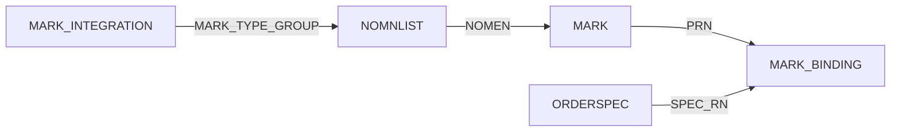
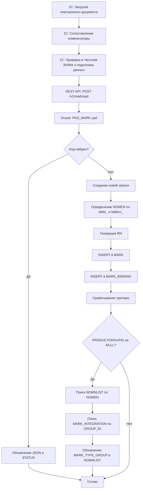

# Описание процесса загрузки кодов маркировки из 1С в Oracle

## 1. Общее описание

Процесс загрузки кодов маркировки из 1С в Oracle представляет собой многоэтапный процесс, 
в результате которого коды маркировки сохраняются в таблицу MARK с автоматическим извлечением ключевых полей 
из JSON-ответа Честного ЗНАКа через виртуальные столбцы.

**Основные участники процесса:**
- **1С** — источник кодов маркировки, сопоставление номенклатуры
- **REST API (Oracle)** — приём кодов через эндпоинт /v1/mark/upd
- **Честный ЗНАК API** — внешний сервис проверки подлинности кодов
- **Oracle (пакет PKG_MARK)** — логика сохранения и управления кодами
- **Триггер на таблице MARK** — автоматическое обновление номенклатуры

## 1.1. Суть процесса

Процесс решает задачу автоматической загрузки кодов маркировки из 1С в Oracle с проверкой через Честный ЗНАК.

**Что происходит кратко:**

1. В 1С поступает электронный документ с кодами маркировки от поставщика
2. Товаровед вручную сопоставляет номенклатуру поставщика с нашей (то, что не сопоставилось автоматом)
3. 1С проверяет каждый код через API Честного ЗНАКа и получает JSON-ответ
4. Коды вместе с JSON-ответом сохраняются в буфер (временное хранилище) для отправки в Oracle
5. Oracle сохраняет код и JSON в таблицу MARK
6. При необходимости автоматически обновляется номенклатура (проставляется группа маркировки)

**Результат:** Все коды маркировки хранятся в Oracle с актуальным статусом, что позволяет отслеживать их жизненный цикл.

---

## 2. Структура таблицы MARK

Таблица MARK содержит следующие основные поля:

| Поле | Тип | Описание |
|------|-----|----------|
| RN | NUMBER | Уникальный идентификатор записи |
| DATE_ADD | DATE | Дата добавления записи |
| KM | VARCHAR2(256) | Код маркировки (Data Matrix) |
| STATUS | NUMBER(2) | Статус кода (0-9) |
| NOMEN | NUMBER(17) | ID номенклатуры (ссылка на NOMNLIST.RN) |
| STATE_MARK | DATE | Дата выбытия кода |
| JSON | CLOB | Полный JSON-ответ от Честного ЗНАКа |

**Виртуальные столбцы (вычисляются автоматически из JSON):**
- **CIS** — код идентификации (из $[0].cisInfo.cis или $[0].cisInfo.requestedCis)
- **GTIN** — GTIN товара (из $[0].cisInfo.gtin)
- **ERR** — код ошибки (из $[0].cisInfo.errorCode)
- **PRODUCTGROUPID** — ID группы товара (из $[0].cisInfo.productGroupId)

---

## 3. Связанные таблицы

### 3.1. Таблица NOMNLIST (номенклатура)

| Поле | Описание |
|------|----------|
| RN | Уникальный идентификатор номенклатуры |
| MARK_TYPE_GROUP | Ссылка на MARK_INTEGRATION.RN |

### 3.2. Таблица MARK_INTEGRATION

| Поле | Описание |
|------|----------|
| RN | Уникальный идентификатор |
| GROUP_ID | ID группы товара из Честного ЗНАКа |

## 3.3. Таблица MARK_BINDING (привязка кодов к документам)

| Поле | Тип | Описание |
|------|-----|----------|
| RN | NUMBER(17) | Уникальный идентификатор записи |
| PRN | NUMBER(17) | Код маркировки (ссылка на MARK.RN) |
| SPEC_RN | NUMBER(17) | Строка документа (спецификация) |
| DOC_TABLE_NAME | VARCHAR2(64) | Имя таблицы спецификации (например, 'ORDERSPEC') |
| BINDING_DATE | DATE | Дата привязки (по умолчанию SYSDATE) |

**Назначение:** Хранит связь между кодом маркировки и конкретной строкой документа (спецификацией).

## 3.4. Связи между таблицами


---

## 4. REST API Эндпоинт /v1/mark/upd

### 4.1. Описание эндпоинта

**Эндпоинт:** POST /v1/mark/upd

**Назначение:** Приём одного кода маркировки и сохранение в таблицу MARK через пакет PKG_MARK.upd.

**Тело запроса (JSON):**

```json
{
   "km": "0104601234567890",
   "json": [
      {
         "cisInfo": {
            "cis": "0104601234567890",
            "gtin": "4601234567890",
            "productGroupId": 5,
            "errorCode": null
         },
         "valid": true,
         "verified": true,
         "found": true,
         "realizable": true,
         "isBlocked": false,
         "sold": false,
         "expireDate": "2026-12-31",
         "productName": "Молоко"
      }
   ],
   "table": "ORDERSPEC",
   "tablern": 1234567,
   "status": 0,
   "note": "Загрузка из 1С по заказу №123"
}
```

**Параметры:**

| Поле | Тип | Обязательное | Описание |
|------|-----|--------------|----------|
| km | string | Да | Код маркировки (Data Matrix) |
| json | array | Да | JSON-ответ от Честного ЗНАКа |
| table | string | Да | Имя таблицы документа (например, 'ORDERSPEC') |
| tablern | number | Да | RN строки документа |
| status | number | Да | Статус кода (0-9) |
| note | string | Нет | Примечание к коду маркировки |

---

## 5. Пакет PKG_MARK (процедура upd)

### 5.1. Процедура upd

Вызывается из REST API для сохранения кода маркировки.

**Сигнатура:**
```sql
   procedure upd(
      km_      varchar2,
      json_    clob,
      table_   varchar2,
      tablern_ number,
      status_  int,
      note_    note.note%type default null
   );
```

**Параметры:**

| Параметр | Описание                     |
|----------|------------------------------|
| km_      | Код маркировки               |
| json_    | JSON-ответ от Честного ЗНАКа |
| table_   | Имя таблицы документа        |
| tablern_ | RN строки документа          |
| status_  | Статус кода (0-9)            |
| note_    | Примечание (опционально)     |

### 5.2. Алгоритм работы процедуры upd

1. Поиск существующего кода по полю KM

2. Если код НАЙДЕН:
    - Обновляется JSON, STATUS
    - Возвращается RN существующей записи

3. Если код НЕ НАЙДЕН:
    - Определение NOMEN по table_ и tablern_
    - Создание новой записи
    - Генерация RN
    - Возвращается RN новой записи

4. Если note_ не NULL → добавление примечания

**Исключения:**

| Код    | Сообщение                                      |
|--------|------------------------------------------------|
| -20000 | Ошибка кода маркировки. Не удалось получить КИ |
| -20000 | Код маркировки выбыл                           |
| -20000 | Не удалось определить номенклатуру             |

---

## 6. Триггер на таблице MARK

### 6.1. Назначение триггера

При добавлении новой записи в таблице MARK с непустым значением PRODUCTGROUPID (виртуальный столбец), 
триггер автоматически обновляет запись в таблице NOMNLIST.

### 6.2. Алгоритм работы триггера

1. Срабатывает при INSERT или UPDATE в таблице MARK

2. Проверяет, что поле PRODUCTGROUPID не NULL

3. По полю NOMEN находит запись в NOMNLIST

4. Обновляет поле MARK_TYPE_GROUP в NOMNLIST только если MARK_TYPE_GROUP был NULL:
    - Ищет в MARK_INTEGRATION запись с GROUP_ID = PRODUCTGROUPID
    - Устанавливает MARK_TYPE_GROUP = RN из MARK_INTEGRATION

5. Если связь не найдена, фиксируется предупреждение в лог, обновление не выполняется

### 6.3. Триггер TRG_MARK_FILL_GROUP

**Назначение:** Автоматическое заполнение поля MARK_TYPE_GROUP в таблице NOMNLIST при появлении новой записи в MARK с непустым PRODUCTGROUPID.

**Событие:** AFTER INSERT на таблицу MARK

**Алгоритм работы:**

1. Проверка, что поле PRODUCTGROUPID у новой записи не NULL
2. Поиск в MARK_INTEGRATION записи с GROUP_ID = PRODUCTGROUPID
3. Если запись найдена:
    - Обновление поля MARK_TYPE_GROUP в NOMNLIST для указанной номенклатуры
    - Обновление выполняется только если MARK_TYPE_GROUP был NULL
4. Если запись не найдена:
    - Фиксируется предупреждение в лог (WARNING)
5. В случае ошибки:
    - Фиксируется ошибка в лог (ERROR)

**Логирование:**
- `pkg_clerrorlog.warning` — для ситуаций, когда не найдено соответствие в MARK_INTEGRATION
- `pkg_clerrorlog.error_` — для критических ошибок выполнения

**Исключения:**
- NO_DATA_FOUND — соответствие в MARK_INTEGRATION не найдено
- OTHERS — прочие ошибки (логируются, транзакция не откатывается)

---

## 7. Детальное описание бизнес-процесса

### 7.1. Загрузка электронного документа в 1С

1С загружает электронный документ от поставщика, содержащий коды маркировки.

**Источники:**
- СБИС (ЭДО) — основной источник

### 7.2. Сопоставление номенклатуры

В 1С выполняется автоматическое сопоставление номенклатуры поставщика с нашей номенклатурой и спецификацией документа с заказом. То, что не сопоставилось автоматически, доводит товаровед вручную.

**Что сопоставляется в 1С:**
- Номенклатура поставщика → наша номенклатура (NOMEN)
- Строки документа → строки заказа (tablern)

| Действие                             | Описание                     | Результат в 1С       |
|--------------------------------------|------------------------------|----------------------|
| Сопоставление номенклатуры           | Автоматически, затем вручную | Определяется NOMEN   |
| Сопоставление спецификации с заказом | Автоматически, затем вручную | Определяется tablern |

**Результат сопоставления в 1С:**
- Коды маркировки привязаны к конкретной строке заказа и номенклатуре
- Формируется буфер для отправки в Oracle

**Важно:** Логика сопоставления в 1С и Oracle отличается. В Oracle нет отдельной логики сопоставления — он получает уже готовый буфер от 1С, в котором все коды предварительно сопоставлены с номенклатурой и строками заказов. Oracle только сохраняет данные в таблицы MARK и MARK_BINDING.

### 7.3. Проверка в Честном ЗНАКе и подготовка данных для отправки в Oracle

После сопоставления 1С проверяет каждый код маркировки через API Честного ЗНАКа:

1. Отправляет запрос в Честный ЗНАК для проверки кода
2. Получает полный JSON-ответ
3. Сохраняет код вместе с JSON-ответом в буфер (временное хранилище) для отправки в Oracle

### 7.4. Отправка в Oracle и сохранение в таблицы

- 1С отправляет коды маркировки из буфера в Oracle через REST API эндпоинт /v1/mark/upd.

**Тело запроса:**

```json
{
   "km": "0104601234567890",
   "json": [{}],
   "table": "ORDERSPEC",
   "tablern": 1234567,
   "status": 0,
   "note": "Загрузка из 1С по заказу №123"
}
```

REST API вызывает пакет PKG_MARK.upd для сохранения кода. Oracle не выполняет дополнительного сопоставления — он сохраняет данные в том виде, в котором их прислала 1С.

Результат:
- MARK: создаётся/обновляется запись с кодом и JSON
- MARK_BINDING: создаётся запись с привязкой к спецификации (данные от 1С)
- Виртуальные столбцы (CIS, GTIN, ERR, PRODUCTGROUPID) заполняются автоматически

### 7.5. Автоматическое обновление номенклатуры (триггер)

После сохранения записи в MARK срабатывает триггер:

1. Извлекается значение PRODUCTGROUPID из виртуального столбца
2. Если значение не NULL:
    - По полю NOMEN находится запись в NOMNLIST
    - В таблице MARK_INTEGRATION ищется запись с GROUP_ID = PRODUCTGROUPID
    - Поле MARK_TYPE_GROUP в NOMNLIST обновляется на RN из MARK_INTEGRATION

---

## 8. Схема процесса



## 9. Обработка ошибок

| Ситуация | Действие |
|----------|----------|
| Честный ЗНАК недоступен | Код сохраняется с status_ = 0, JSON содержит информацию об ошибке, виртуальные столбцы могут быть NULL. Повторная проверка по расписанию |
| Код уже существует | Выполняется обновление (Upsert), JSON перезаписывается, статус обновляется |
| Не удалось определить номенклатуру | Исключение "Не удалось определить номенклатуру", код не сохраняется |
| Не удалось получить CIS | Исключение "Ошибка кода маркировки. Не удалось получить КИ" |
| JSON невалидный | Ограничение CHECK (JSON IS JSON) не даст сохранить запись |
| Не найдена MARK_INTEGRATION для GROUP_ID | Триггер фиксирует предупреждение в лог, NOMNLIST не обновляется |

---

## 10. Преимущества текущей реализации

1. Автоматическое извлечение данных через виртуальные столбцы — не нужно писать дополнительный код для парсинга JSON
2. Единая точка входа — пакет PKG_MARK инкапсулирует всю логику работы с кодами
3. Upsert-логика — автоматическое создание или обновление записи
4. Управление жизненным циклом — статусы и дата выбытия позволяют отслеживать состояние каждого кода
5. JSON-валидация — на уровне таблицы проверяется корректность JSON
6. Обработка ошибок — понятные исключения с кодами ошибок
7. Автоматическое обновление номенклатуры — триггер на MARK обновляет NOMNLIST без участия внешних систем