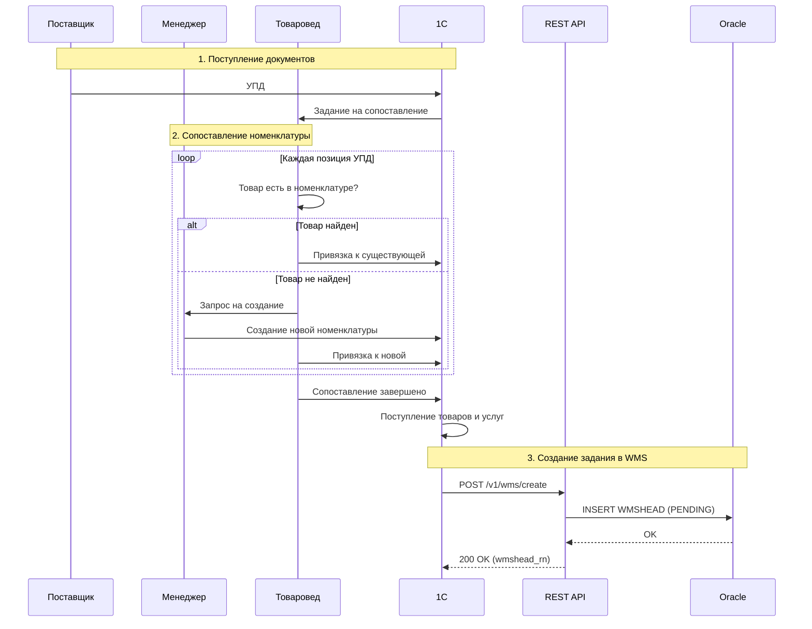
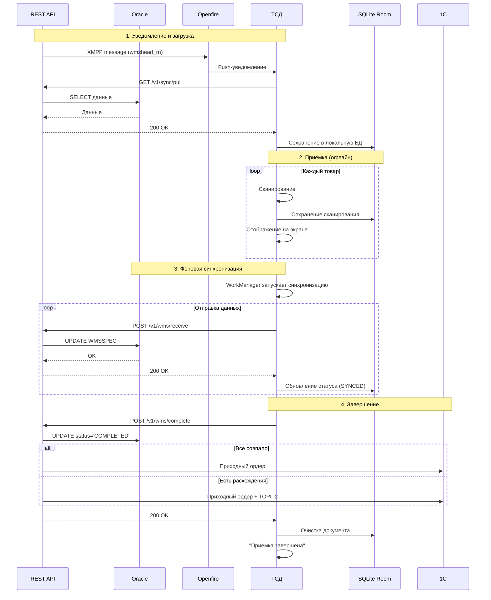
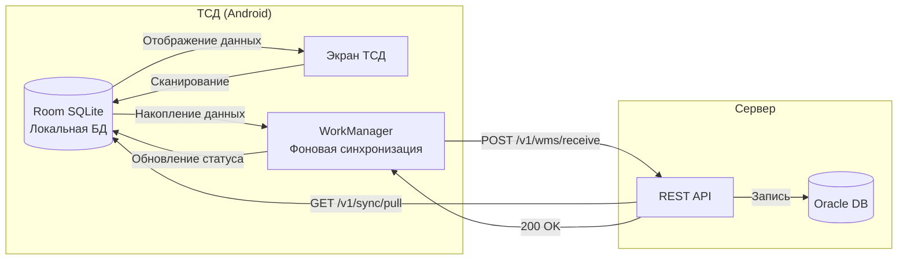

## Cхема приёмки товара (с offline-first)

---
### Схема 1. Подготовительная часть (Офис)

```mermaid
sequenceDiagram
    participant Поставщик
    participant Менеджер
    participant Товаровед
    participant 1С
    participant API as REST API
    participant Oracle as Oracle

    Note over Поставщик,1С: 1. Поступление документов
    
    Поставщик->>1С: УПД
    1С->>Товаровед: Задание на сопоставление
    
    Note over Товаровед,Менеджер: 2. Сопоставление номенклатуры
    
    loop Каждая позиция УПД
        Товаровед->>Товаровед: Товар есть в номенклатуре?
        
        alt Товар найден
            Товаровед->>1С: Привязка к существующей
        else Товар не найден
            Товаровед->>Менеджер: Запрос на создание
            Менеджер->>1С: Создание новой номенклатуры
            Товаровед->>1С: Привязка к новой
        end
    end
    
    Товаровед->>1С: Сопоставление завершено
    1С->>1С: Поступление товаров и услуг
    
    Note over 1С,Oracle: 3. Создание задания в WMS
    
    1С->>API: POST /v1/wms/create
    API->>Oracle: INSERT WMSHEAD (PENDING)
    Oracle-->>API: OK
    API-->>1С: 200 OK (wmshead_rn)
```
---
### Схема 2. Исполнительная часть (Склад)

```mermaid
sequenceDiagram
    participant API as REST API
    participant Oracle as Oracle
    participant OF as Openfire
    participant ТСД as ТСД
    participant Room as SQLite Room
    participant 1С

    Note over API,ТСД: 1. Уведомление и загрузка
    
    API->>OF: XMPP message (wmshead_rn)
    OF-->>ТСД: Push-уведомление
    
    ТСД->>API: GET /v1/sync/pull
    API->>Oracle: SELECT данные
    Oracle-->>API: Данные
    API-->>ТСД: 200 OK
    ТСД->>Room: Сохранение в локальную БД
    
    Note over ТСД,Room: 2. Приёмка (офлайн)
    
    loop Каждый товар
        ТСД->>ТСД: Сканирование
        ТСД->>Room: Сохранение сканирования
        ТСД->>ТСД: Отображение на экране
    end
    
    Note over ТСД,Oracle: 3. Фоновая синхронизация
    
    ТСД->>ТСД: WorkManager запускает синхронизацию
    
    loop Отправка данных
        ТСД->>API: POST /v1/wms/receive
        API->>Oracle: UPDATE WMSSPEC
        Oracle-->>API: OK
        API-->>ТСД: 200 OK
        ТСД->>Room: Обновление статуса (SYNCED)
    end
    
    Note over ТСД,1С: 4. Завершение
    
    ТСД->>API: POST /v1/wms/complete
    API->>Oracle: UPDATE status='COMPLETED'
    
    alt Всё совпало
        API->>1С: Приходный ордер
    else Есть расхождения
        API->>1С: Приходный ордер + ТОРГ-2
    end
    
    API-->>ТСД: 200 OK
    ТСД->>Room: Очистка документа
    ТСД->>ТСД: "Приёмка завершена"
```
---

## Офлайн-синхронизация (Room)

```mermaid
flowchart LR
    subgraph ТСД["ТСД (Android)"]
        Room[("Room SQLite<br/>Локальная БД")]
        UI[Экран ТСД]
        WorkManager[WorkManager<br/>Фоновая синхронизация]
    end

    subgraph Сервер
        API[REST API]
        Oracle[("Oracle DB")]
    end

%% При загрузке задания
    API -->|GET /v1/sync/pull| Room
    Room -->|Отображение данных| UI

%% При сканировании (офлайн)
    UI -->|Сканирование| Room
    Room -->|Накопление данных| WorkManager

%% Фоновая синхронизация
    WorkManager -->|POST /v1/wms/receive| API
    API -->|Запись| Oracle
    API -->|200 OK| WorkManager
    WorkManager -->|Обновление статуса| Room
```