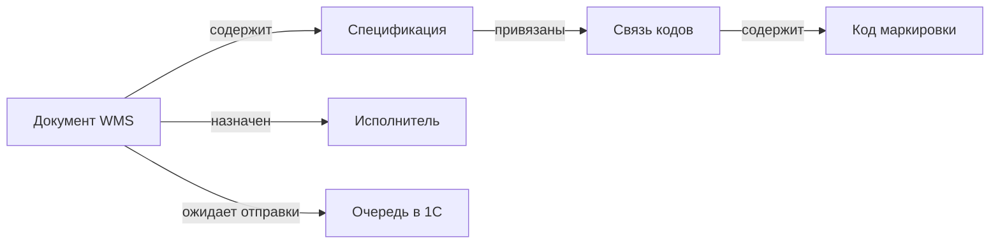
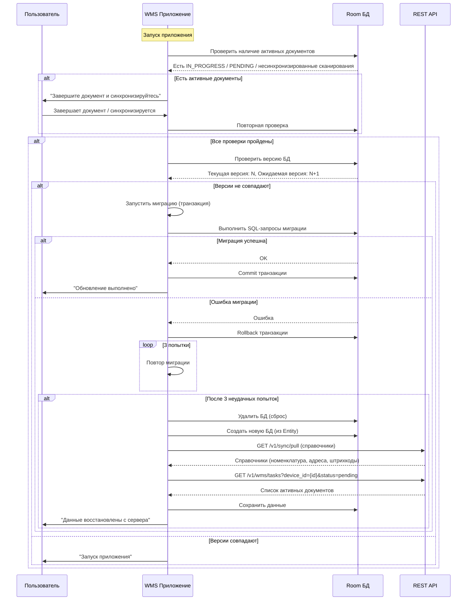
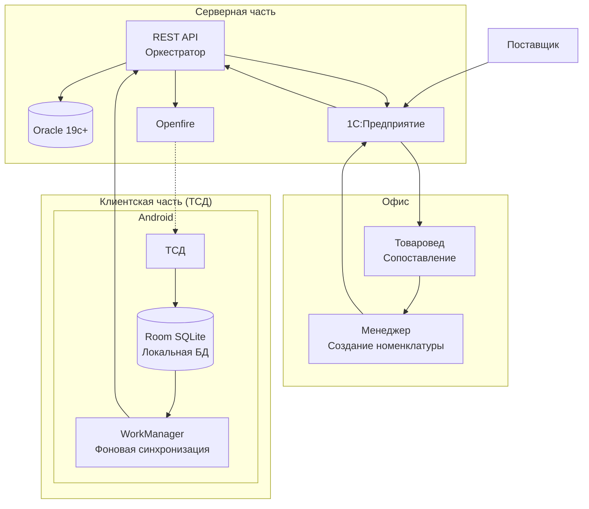
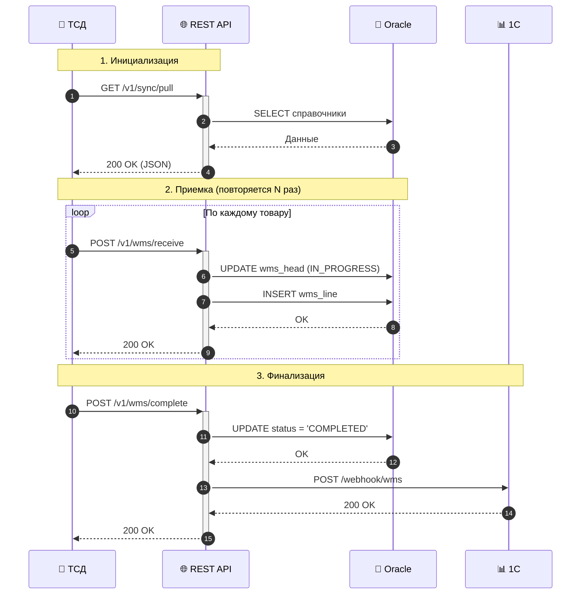
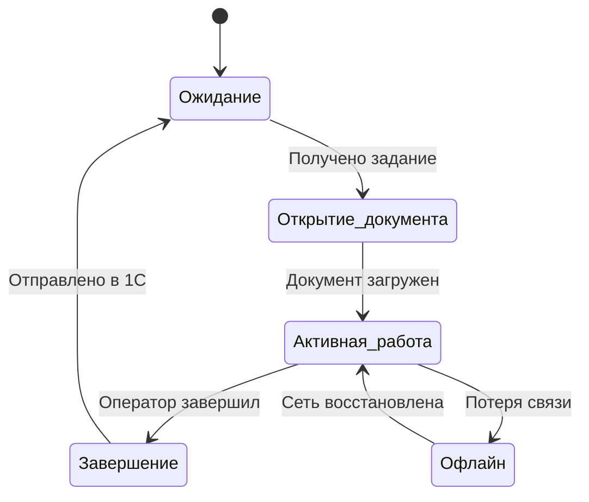
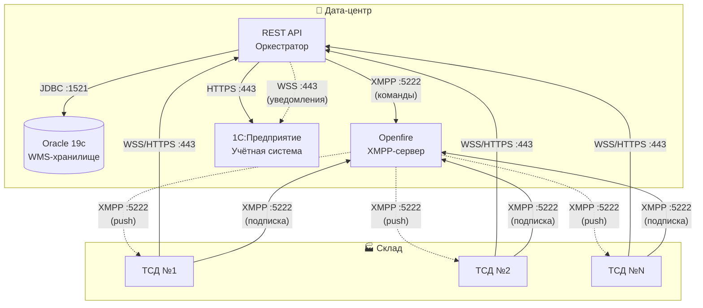
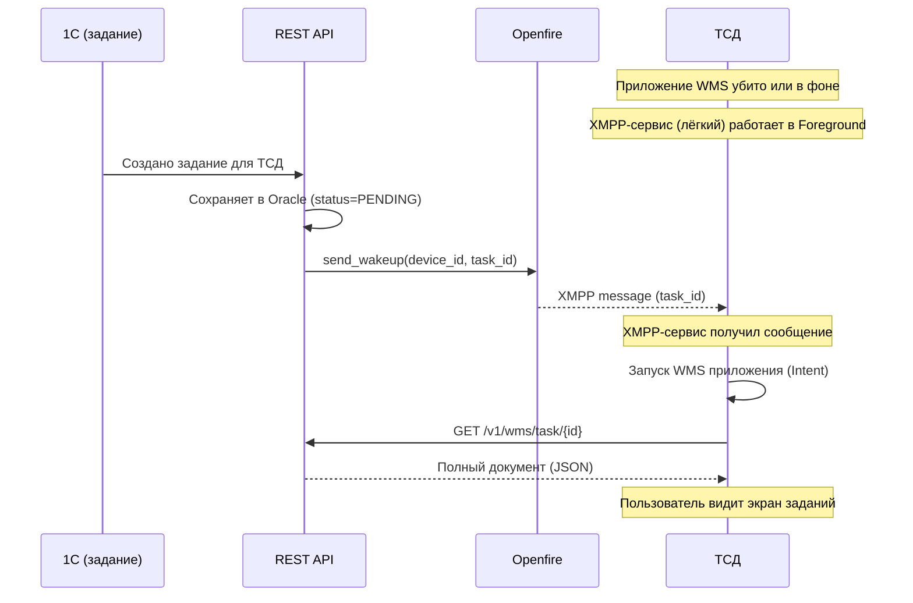

# ТЕХНИЧЕСКОЕ ЗАДАНИЕ
## Универсальный складской документ WMS
### (Приёмка / Наборка / Перемещение / Списание)

**Версия:** 1.0  
**Дата:** xx.xx.2026  
**Основание:** Архитектурная схема «Компоненты архитектуры»

**Авторы:**
- Полушин Д.Н. — программист

**Документ подготовлен в рамках проекта "Универсальный складской документ WMS"**

---

## Словарь терминов

| Термин                 | Определение                                                                                                               |
|------------------------|---------------------------------------------------------------------------------------------------------------------------|
| **WMS**                | Warehouse Management System - система управления складом                                                                  |
| **ТСД**                | Терминал сбора данных - мобильное устройство для сканирования                                                             |
| **WSS**                | WebSocket Secure - защищённое WebSocket-соединение                                                                        |
| **XMPP**               | Extensible Messaging and Presence Protocol - протокол обмена сообщениями                                                  |
| **Offline-first**      | Подход, при котором приложение работает с локальными данными и синхронизируется при появлении сети                        |
| **Идемпотентность**    | Свойство операции, при котором многократное выполнение даёт тот же результат, что и однократное                           |
| **WakeUp-сервис**      | Легковесный XMPP-клиент, работающий в Foreground Service, предназначенный только для пробуждения основного WMS-приложения |
| **Foreground Service** | Сервис Android, который отображает постоянное уведомление в статус-баре и имеет повышенный приоритет выживания            |
| **WakeLock**           | Механизм Android, предотвращающий переход устройства в спящий режим                                                       |
| **WorkManager**        | Библиотека Android для планирования фоновых задач с гарантированным выполнением                                           |
| **Партиционирование**  | Разбиение большой таблицы на физические сегменты (партиции) для улучшения производительности                              |
| **ACK**                | Подтверждение (Acknowledgment) — ответное сообщение о получении данных                                                    |
| **Retry policy**       | Стратегия повторных попыток при ошибках с экспоненциальной задержкой                                                      |

## 1. Цель работы

Реализовать распределённую систему, обеспечивающую:
- Работу терминалов сбора данных (ТСД) на Android в составе складского/логистического комплекса.
- Обмен данными с Oracle (хранилище WMS), 1С (учётная система), сервисом REST API (оркестратор) и Openfire (коммуникации).
- Работу в условиях нестабильной связи с гарантированной доставкой данных (offline-first).

---

## 2. Состав и ответственность компонентов

| Компонент         | Роль                       | Ответственность                                                                                                                                             | Технологии                                                                      |
|-------------------|----------------------------|-------------------------------------------------------------------------------------------------------------------------------------------------------------|---------------------------------------------------------------------------------|
| **Oracle**        | Хранилище данных           | Адресная система, справочник номенклатур, документы WMS                                                                                                     | Oracle 19c+, PL/SQL, JSON                                                       |
| **REST API**      | Оркестратор (ядро системы) | Приём данных от ТСД, валидация, управление статусами, маршрутизация, отправка уведомлений через Openfire (только для пробуждения), передача документов в 1С, управление очередью `WMS_TO_1C`, уведомление 1С через WebSocket | Spring Boot 3+, Kotlin/Java 17+, Spring Data JPA, Hibernate 6+, WebSocket, JDBC |
| **1С**            | Учётная система            | Завершённые документы приёмки, проводки и остатки, бизнес-отчёты, интеграция с внешними сервисами                                                           | 1С:Предприятие 8.3 + 1С Управление торговлей 11.5                               |
| **Openfire**      | Коммуникационный сервер    | Только wake-up уведомления на ТСД (без гарантий доставки, без статусов, без чата). Офлайн-очередь НЕ настраивается. REST API отправляет XMPP только если ТСД онлайн. Основной канал данных — REST API. | Openfire (XMPP), Smack                                                          |
| **ТСД (Android)** | Клиентское приложение      | **Основное WMS-приложение:** UI, работа с документами, локальное хранилище, фоновая синхронизация, WebSocket для активной работы. <br>**WakeUp-сервис:** лёгкий XMPP-клиент в Foreground Service для приёма wake-up уведомлений и пробуждения основного приложения. | Android, Kotlin, Room, WorkManager, OkHttp, Smack, CameraX, Foreground Service, BroadcastReceiver |
---

## 2.1. Основные сущности системы

Система оперирует следующими сущностями:

### 2.1.1. Документ WMS (WMSHEAD)

**Что это:** Основной документ, который содержит задание для склада.

**Примеры:**
- Приёмка товара от поставщика
- Наборка заказа для клиента
- Перемещение между складами
- Списание товара

---

#### Свойства документа

| Свойство                             | Описание                                                        | Подробнее                                                  |
|--------------------------------------|-----------------------------------------------------------------|------------------------------------------------------------|
| **Номер документа**                  | Уникальный идентификатор (например, PR-2026-01-001)             | —                                                          |
| **Дата создания**                    | Дата и время создания документа                                 | —                                                          |
| **Тип документа**                    | Определяет операцию: Приёмка / Наборка / Перемещение / Списание | —                                                          |
| **Статус**                           | Текущее состояние жизненного цикла документа                    | [см. таблицу статусов](#статусы-документа)                 |
| **Приоритет**                        | Очерёдность выполнения и количество ресурсов                    | [см. таблицу приоритетов](#приоритет-документа)            |
| **Отсрочка (scheduled_at)**          | Дата и время, когда документ становится доступен                | [см. описание](#отсрочка-выполнения)                       |
| **Дедлайн (deadline)**               | Крайний срок выполнения                                         | [см. описание](#дедлайн--время-на-выполнение)              |
| **Расчётное время (estimated_time)** | Сколько времени нужно на выполнение в норме                     | [см. описание](#расчётное-время)                           |
| **Исполнители**                      | Кто назначен на документ                                        | [см. раздел 2.1.5](#215-назначенные-исполнители-wmspicker) |

---

#### Статусы документа

| Статус | Что значит |
|--------|------------|
| `SCHEDULED` | Запланирован на будущее, ещё не доступен для выполнения |
| `PENDING` | Время наступило, доступен для выполнения |
| `IN_PROGRESS` | Выполняется на ТСД |
| `COMPLETED` | Выполнен успешно |
| `FAILED` | Ошибка выполнения |
| `OVERDUE` | Просрочен — время выполнения вышло, документ не выполнен |

---

#### Приоритет документа

Определяет очерёдность выполнения и количество выделяемых ресурсов.

| Уровень | Название | Описание | Цвет на ТСД |
|---------|----------|----------|-------------|
| **1** | Критичный | Выполняется вне очереди, максимальное количество исполнителей | 🔥 Красный |
| **2** | Срочный (VIP) | В начало очереди, может быть увеличено количество исполнителей | ⚡ Оранжевый |
| **3** | Обычный | В порядке очереди, стандартное количество исполнителей | ⚪ Белый |
| **4** | Низкий | Откладывается, если есть более приоритетные | 🔵 Синий |

**Влияние на работу:**

| Что меняется | Обычный | Срочный | Критичный |
|--------------|---------|---------|-----------|
| Очерёдность | В очереди | В начало очереди | Вне очереди |
| Количество исполнителей | 1 | 2-3 | Все доступные |
| Уведомления | Стандартные | Менеджеру + кладовщикам | Всем + звук |

**Автоматическое повышение приоритета:**

| Условие | Действие |
|---------|----------|
| Время до дедлайна < 2 × расчётное время | Повысить до "Срочный" |
| Время до дедлайна < 1 × расчётное время | Повысить до "Критичный" |
| Клиент из списка VIP | "Срочный" по умолчанию |
| Документ "висит" > 4 часов | Повысить до "Срочный" |
| Документ "висит" > 8 часов | Повысить до "Критичный" |

---

#### Отсрочка выполнения (scheduled_at)

**Что это:** Дата и время, **начиная с которого** документ становится доступен для выполнения.

**Зачем нужна:**
- Заказ создан сегодня, а отгрузка завтра или через n дней
- Приёмка запланирована на конкретное время (например, машина приедет в 10:00)
- Позволяет распределять нагрузку на складе (не всё сразу)

**Когда отсрочка имеет смысл:**

| Приоритет | Можно ли задавать отсрочку? | Почему |
|-----------|----------------------------|--------|
| 🔥 Критичный | ❌ Нет | Должен выполняться немедленно |
| ⚡ Срочный | ❌ Нет | Должен выполняться немедленно |
| ⚪ Обычный | ✅ Да | Можно запланировать на будущее |
| 🔵 Низкий | ✅ Да | Можно запланировать на будущее |

**Как работает:**

| Ситуация | Видимость на ТСД | Можно начать? |
|----------|------------------|---------------|
| Отсрочка не задана | ✅ Виден сразу | ✅ Да |
| Отсрочка задана (будущая дата) | ✅ **Виден заранее** (за 1-2 дня) | ❌ Нет (только досрочно, если свободен) |
| Дата наступила | ✅ Виден | ✅ Да |

**Досрочное выполнение (опережающая сборка):**

Если у кладовщика **нет активных документов**, он может взять документ из будущего и начать его выполнять **досрочно**.

---

#### Дедлайн / Время на выполнение (deadline)

**Что это:** Крайний срок, до которого документ должен быть выполнен.

**Зачем нужен:**
- Контроль соблюдения сроков отгрузки
- Автоматическое оповещение о риске срыва сроков
- Предотвращение простоев

**Как работает (сравнение с расчётным временем):**

| Зона | Условие | Что происходит |
|------|---------|----------------|
| 🟢 Зелёная | Время до дедлайна ≥ 2 × расчётное время | Обычный режим |
| 🟡 Жёлтая | Время до дедлайна < 2 × расчётное время | Повысить до "Срочный", уведомить кладовщика |
| 🔴 Красная | Время до дедлайна < 1 × расчётное время | Повысить до "Критичный", подключить доп. исполнителей, уведомить менеджера |
| ❌ Просрочен | Время до дедлайна = 0 или отрицательное | Статус `OVERDUE`, уведомление менеджеру |

---

#### Расчётное время (estimated_time)

**Что это:** Сколько времени **в норме** требуется на выполнение документа.

**Как рассчитывается:**

| Способ                | Описание                                                                                   |
|-----------------------|--------------------------------------------------------------------------------------------|
| Автоматический расчёт | Количество позиций × норма времени на 1 позицию (настраивается для каждого типа документа) |
| Исторические данные   | Среднее время выполнения аналогичных документов                                            |
| Ручной ввод           | Менеджер может задать время вручную (переопределить автоматический расчёт)                 |
---

### 2.1.2. Спецификация документа (WMSSPEC)

**Что это:** Список товаров в документе.

**Назначение:**
- Хранит перечень товаров, которые нужно принять/собрать/переместить/списать
- Фиксирует плановое и фактическое количество
- Отслеживает статус каждой позиции

---

#### Свойства строки спецификации

| Свойство                      | Описание                                                             |
|-------------------------------|----------------------------------------------------------------------|
| **Артикул**                   | Код товара в учётной системе                                         |
| **Плановое количество**       | Сколько должно быть по документу                                     |
| **Фактическое количество**    | Сколько отсканировано/подтверждено                                   |
| **Признак брака/расхождения** | `true` — разбор, `false` — кондиция                                  |
| **Причина расхождения**       | Причина расхождения                                                  |
| **Детали приёмки (JSON)**     | Распределение фактического количества по объектам хранения и статусы |

** Пример Json
```json
{
  "receiving_details": [
    {
      "object_type": "PALLET",
      "object_id": "P-123",
      "quantity": 10,
      "status": "GOOD"
    },
    {
      "object_type": "PALLET",
      "object_id": "P-124",
      "quantity": 3,
      "status": "DEFECT",
      "reason": "Повреждена упаковка"
    },
    {
      "object_type": "CELL",
      "object_id": "A-01-01",
      "quantity": 2,
      "status": "GOOD"
    }
  ]
}
```

---

### 2.1.3. Код маркировки (MARK)

**Что это:** Уникальный код на товаре (Data Matrix), который сканирует кладовщик.

**Где используется:**
- В документах **приёмки**
- В документах **наборки**
- В документах **перемещения**
- В документах **списания**
---

### 2.1.4. Связь кодов со спецификацией (MARK_BINDING)

**Что это:** Привязка конкретных кодов маркировки к конкретным строкам документа.

### 2.1.5. Назначенные исполнители (WMSPICKER)

**Что это:** Распределение документа между исполнителями и контроль выполнения.

**Принцип:** Документ может быть разделён между несколькими кладовщиками **по разным признакам** в зависимости от типа документа и организации работы на складе.

---

### Способы распределения документа

| Способ                  | Описание                                                                   | Пример                                                                  |
|-------------------------|----------------------------------------------------------------------------|-------------------------------------------------------------------------|
| **По зонам склада**     | Каждый кладовщик работает в своей физической зоне (стеллажи, ряды, секции) | Кладовщик А → стеллажи 1-10, кладовщик Б → стеллажи 11-20               |
| **По товарным группам** | Каждый кладовщик работает с определёнными категориями товаров              | Кладовщик А → электроника, кладовщик Б → мебель, кладовщик В → продукты |
| **По весу/объёму**      | Тяжёлые товары распределяются на сильных сотрудников                       | Кладовщик А → товары > 50 кг, кладовщик Б → товары < 50 кг              |
| **По партиям**          | Документ разбивается на партии, каждая партия — отдельному исполнителю     | 1-100 позиций → Иванов, 101-200 → Петров, 201-300 → Сидоров             |
| **По статусу товара**   | Отдельно маркированные и немаркированные товары                            | Кладовщик А → маркированные товары, кладовщик Б → немаркированные       |
| **Смешанный**           | Комбинация признаков                                                       | Зона А + электроника → Иванов, зона Б + крупногабарит → Петров          |

---

#### Как назначаются исполнители

**Способы назначения:**

| Способ             | Описание                                                                 | Кто выполняет |
|--------------------|--------------------------------------------------------------------------|---------------|
| **Автоматическое** | Система сама назначает исполнителя на основе загрузки, зоны, компетенций | REST API      |
| **Ручное**         | Товаровед в 1С или в интерфейсе управления назначает исполнителей        | Товаровед     |
| **Самозапись**     | Кладовщик сам берёт документ в работу через ТСД                          | Кладовщик     |

---

#### Приоритет назначения

| Приоритет     | Как назначается                                   |
|---------------|---------------------------------------------------|
| **Критичный** | Автоматическое или ручное                         |
| **Срочный**   | Автоматическое или ручное                         |
| **Обычный**   | Может быть автоматическим, ручным или самозаписью |
| **Низкий**    | Преимущественно самозапись, когда нет других дел  |

---

#### Автоматическое назначение при смене статуса

**Правило:** При переходе документа в статус, требующий исполнителя, если исполнитель не назначен — система назначает автоматически.

| Переход статуса           | Действие                                                                           |
|---------------------------|------------------------------------------------------------------------------------|
| `SCHEDULED` → `PENDING`   | Если исполнитель не назначен → автоматическое назначение                           |
| `PENDING` → `IN_PROGRESS` | Если исполнитель не назначен → автоматическое назначение (если кладовщик взял сам) |
| `PENDING` → `OVERDUE`     | Если исполнитель не назначен → уведомление менеджеру                               |

---

#### Изменение исполнителей

| Ситуация                   | Что происходит                                               |
|----------------------------|--------------------------------------------------------------|
| **Замена исполнителя**     | Товаровед может переназначить документ на другого сотрудника |
| **Добавление исполнителя** | На большой документ можно добавить ещё одного сотрудника     |
| **Освобождение**           | Если исполнитель заболел или ушёл, то переназначаем          |

---

#### Технические требования

| Требование                    | Описание                                                             |
|-------------------------------|----------------------------------------------------------------------|
| **Автоматическое назначение** | При переходе `SCHEDULED` → `PENDING`, если исполнитель не назначен   |
| **Уведомления**               | При назначении — push-уведомление на ТСД                             |
| **Контроль**                  | Один документ может быть назначен на несколько исполнителей          |
| **Очередь**                   | Если документ назначен на нескольких, каждый видит только свою часть |
| **Логирование**               | Все назначения и изменения логируются                                |

### 2.1.6. Очередь отправки в 1С (WMS_TO_1C)

**Что это:** Таблица-буфер для передачи данных из WMS в 1С.

**Зачем нужна:**
- 1С может быть недоступна
- Нужно гарантировать доставку
- Позволяет 1С забирать документы в своём темпе

### 2.1.7. Схема связей между сущностями



## 3. Функциональные требования

### 3.1. Общие принципы (обязательны к выполнению)

| Принцип                        | Реализация                              | Почему важно               |
|--------------------------------|-----------------------------------------|----------------------------|
| **Single Source of Truth**     | Room на ТСД, Oracle на сервере          | Нет расхождений данных     |
| **Offline-first**              | Все данные сначала в Room               | Работа при любой связи     |
| **Гибридная синхронизация**    | WebSocket (активно) + HTTP (фон)        | Баланс скорости и ресурсов |
| **Push через Openfire**        | Только уведомления, не данные           | Экономия батареи ТСД       |
| **Разделение ответственности** | Каждый компонент делает своё            | Упрощает поддержку         |
| **Асинхронность**              | WorkManager для фона, ACK для WebSocket | Не блокируем UI            |
| **Идемпотентность**            | Все операции можно повторить            | Безопасность при повторах  |

---

### 3.2. Требования к REST API (оркестратор)

**Эндпоинты REST API:**

| Метод  | Эндпоинт                | Назначение                                                                   |
|--------|-------------------------|------------------------------------------------------------------------------|
| `POST` | `/v1/wms/receive`       | Приём данных от ТСД (сканирования, статусы)                                  |
| `POST` | `/v1/wms/complete`      | Завершение документа, отправка результата в 1С                               |
| `GET`  | `	/v1/wms/task/{id}`    | Загрузка полного документа по ID для ТСД                                     |
| `GET`  | `/v1/sync/pull`         | Выгрузка актуальных справочников (адресная система, номенклатура, штрихкоды) |
| `POST` | `/v1/notification/send` | Отправка команды на Openfire для push-уведомления                            |
| `POST` | `/v1/wms/ack`           | Подтверждение получения wake-up от ТСД                                       |

**Поддержка WebSocket (WSS):**
- Порт: 443
- Режим: дуплекс, реальное время
- Назначение: активная работа ТСД (сканирования, подтверждения)

**Интеграции:**
- **С Oracle:** через JDBC Thin (порт 1521), работа с JSON-колонками, вызов PL/SQL
- **С 1С:** через HTTP (REST, порт 443) — отправка завершённых документов
- **С Openfire:** через XMPP (TCP, порт 5222) — отправка уведомлений через бот-пользователя

---

### 3.3. Требования к ТСД (Android-приложение)

| Компонент            | Назначение                                   | Технология                  |
|----------------------|----------------------------------------------|-----------------------------|
| **Room**             | Локальное хранилище (Single Source of Truth) | SQLite, Room                |
| **WorkManager**      | Фоновая синхронизация, статистика            | Android WorkManager         |
| **WebSocketManager** | Активная работа с документами                | OkHttp WebSocket            |
| **XMPPClient**       | Получение push-уведомлений                   | Smack (XMPP)                |
| **Camera/Scanner**   | Сканирование штрих-кодов                     | CameraX / SDK производителя |
| **Repository**       | Единый источник данных для UI                | Kotlin Coroutines, Flow     |
| **ViewModel**        | Хранение состояния UI                        | Android ViewModel           |

**Дополнительные требования:**
- XMPP-клиент: подключение к Openfire (TCP, порт 5222), получение push-уведомлений, поддержка пробуждения приложения через FCM/XMPP.
- Сканирование — через CameraX или SDK вендора, результат сразу отправляется через WebSocket.
- Обработка разрывов связи: данные сохраняются в Room, при восстановлении соединения — автоматическая повторная отправка.

**Фоновая работа и пробуждение:**
- XMPP-клиент должен работать в **Foreground Service** с постоянным уведомлением в статус-баре.
- Приложение должно запрашивать и удерживать **WakeLock** (PARTIAL_WAKE_LOCK) и **WifiLock** на время активного соединения.
- Должен быть реализован **BroadcastReceiver** для автозапуска сервиса после перезагрузки устройства (BOOT_COMPLETED).
- В инструкции для оператора должен быть раздел по **отключению оптимизации батареи** для приложения WMS.

**Обработка XMPP сообщения:**
- XMPP-сервис получил task_id
- НЕМЕДЛЕННО отправить POST /v1/wms/ack со статусом received
- Запустить WMS приложение
- После успешной загрузки задания — отправить ack со статусом opened
- Если WMS приложение не может запуститься — отправить ack со статусом failed и текстом ошибки

#### 3.3.1. WakeUp-сервис (отдельный компонент ТСД)

| Параметр | Описание |
|----------|----------|
| **Режим работы** | Foreground Service с постоянным уведомлением в статус-баре |
| **Назначение** | Только приём XMPP-wake-up сообщений и запуск основного WMS-приложения |
| **Не занимается** | Передачей данных, синхронизацией, работой с документами |
| **Автозапуск** | Через BroadcastReceiver при BOOT_COMPLETED |
| **Энергопотребление** | Минимальное, только поддержание XMPP-соединения |

**Обработка сообщения:**
1. Получен XMPP-пакет с `task_id`
2. НЕМЕДЛЕННО отправить `POST /v1/wms/ack` со статусом `received`
3. Запустить основное WMS-приложение через Intent
4. Основное приложение загружает документ через `GET /v1/wms/task/{id}`
5. После загрузки — отправить `ack` со статусом `opened`

---

### 3.4. Требования к Openfire

- XMPP используется ТОЛЬКО для пробуждения ТСД. Передача данных запрещена.
- Настроить XMPP-сервер (Openfire) с минимальной конфигурацией:
  - Один бот-пользователь для отправки команд
  - Один XMPP-аккаунт на каждый ТСД
- Офлайн-очередь НЕ нужна (при недоступности ТСД — REST API не отправляет XMPP)
- Чат и статусы доставки НЕ настраивать
- REST API отправляет XMPP-сообщение только если ТСД онлайн (определяется по активному WebSocket или последнему ping)

---

### 3.5. Требования к интеграции с 1С

**Роль 1С в системе:**
- 1С не хранит активные и завершённые WMS-документы. Это делает Oracle.
- 1С получает от REST API результат выполнения WMS-документа.

**Схема обмена:**
1. REST API после завершения документа (`POST /v1/wms/complete`) создаёт запись в таблице `WMS_TO_1C` со статусом `PENDING`.
2. REST API отправляет уведомление 1С через **WebSocket (WSS)** о том, что в очереди появился новый документ.
3. 1С, получив уведомление, читает из очереди `WMS_TO_1C` запись со статусом `PENDING` (или несколько записей) и забирает данные документа по `wmshead_rn` из `WMSHEAD` (и связанных таблиц `WMSSPEC`, `MARKLINK` и др.).
4. 1С обрабатывает документ (создаёт приходный ордер, перемещение, списание и т.п.).
5. После успешной обработки 1С обновляет `status` в `WMS_TO_1C` на `PROCESSED` и (опционально) сохраняет `onec_doc_number` — номер созданного документа в 1С.

**Требования к WebSocket-соединению:**
- 1С выступает в роли **WebSocket-клиента** (требуется платформа 1С:Предприятие версии 8.3.27 и выше).
- 1С сама инициирует и поддерживает постоянное WebSocket-соединение к REST API.
- REST API при недоступности 1С (соединение разорвано) продолжает создавать записи в `WMS_TO_1C`, но уведомление не отправляется. 1С при восстановлении соединения должна самостоятельно опросить очередь на наличие `PENDING` записей.

**Контроль доставки и повторные попытки:**
- Основной механизм гарантированной доставки — таблица-очередь `WMS_TO_1C` в Oracle.
- WebSocket-уведомления — это **оптимизация** для сокращения задержки, но не единственный механизм.
- 1С должна периодически (например, раз в 1–5 минут) опрашивать `WMS_TO_1C` на случай, если WebSocket-уведомление не было получено.
- 1С самостоятельно управляет повторными попытками обработки документов из очереди. Oracle и REST API не реализуют ретраи для отправки в 1С.
---

## 4. Протоколы и каналы связи

| Откуда   | Куда     | Протокол        | Порт | Назначение                                       | Режим                   |
|----------|----------|-----------------|------|--------------------------------------------------|-------------------------|
| ТСД      | REST API | WebSocket (WSS) | 443  | Активная работа: сканирования, подтверждения     | Дуплекс, реальное время |
| ТСД      | REST API | HTTPS (REST)    | 443  | Статистика, завершение документов                | Запрос-ответ            |
| ТСД      | Openfire | XMPP (TCP)      | 5222 | Получение push-уведомлений                       | Постоянное соединение   |
| Openfire | ТСД      | XMPP            | 443  | Только wake-up (короткое сообщение с ID задания) | Однонаправленный        |
| REST API | Oracle   | JDBC (Thin)     | 1521 | Чтение/запись данных, вызов PL/SQL               | Синхронный              |
| REST API | 1С       | HTTPS (REST)    | 443  | Отправка завершённых документов                  | Синхронный              |
| REST API | 1С       | WebSocket (WSS) | 443  | Уведомление о появлении документа в очереди      | Асинхронный             |
| REST API | Openfire | XMPP (TCP)      | 5222 | Отправка уведомлений (через бот-пользователя)    | Асинхронный             |
> **Примечание:** WebSocket между REST API и 1С используется только для уведомлений. Основной канал передачи данных — HTTPS и очередь `WMS_TO_1C`.

---

## 5. Жизненные циклы ТСД (обработать все состояния)

| Состояние ТСД          | WebSocket      | XMPP        | Что происходит                                |
|------------------------|----------------|-------------|-----------------------------------------------|
| **Ожидание**           | ❌ Закрыт       | ✅ Подключен | Ожидание уведомлений, XMPP-соединение активно |
| **Открытие документа** | 🔄 Поднимается | ✅ Подключен | Загрузка документа, синхронизация             |
| **Активная работа**    | ✅ Открыт       | ✅ Подключен | Сканирования → WebSocket                      |
| **Завершение**         | ❌ Закрывается  | ✅ Подключен | Отправка в 1С, очистка                        |
| **Офлайн**             | ❌ Закрыт       | ❌ Отключён  | Данные в Room, попытки reconnect              |

> При смене состояний — логирование и показ пользователю только критичных ошибок.

---

## 6. Требования к надёжности

**Retry policy применяется для:**
- HTTP-запросов от ТСД к REST API при таймаутах

Механизм подтверждения wake-up:

- REST API после отправки XMPP переводит задание в статус WAITING
- Сервис WakeUp отправляет http о получении сообщения (Если WakeUp отправит сообщение, значит ТСД разбужен)

**Параметры повторов:**
- экспоненциальная задержка (1с, 2с, 4с, 8с, 30с, 60с)
- максимум 10 попыток, затем документ помечается статусом `FAILED` и требуется ручное вмешательство

>**Offline-first** — приложение работает с локальными данными (Room), синхронизируется автоматически при появлении сети.

>**Идемпотентность** — все операции должны быть идемпотентными.

---

## 7. Требования к мониторингу и логированию

**Логировать (на ТСД и сервере):**
- все переходы между состояниями
- ошибки подключения к Openfire / REST API / 1С
- дубликаты отправок (срабатывание идемпотентности)

**На сервере REST API:**
- эндпоинт `/actuator/health` для проверки статуса всех интеграций (Oracle, 1С, Openfire)
- метрики: количество активных ТСД, количество запросов в секунду, размер очереди в 1С

---

## 8. Что сдаёт разработчик

1. **Исходный код** (бекенд + Android + скрипты БД Oracle).
2. **Документация:**
    - описание API (OpenAPI/Swagger)
    - инструкция по развёртыванию (docker-compose или пошагово)
    - описание конфигурации Openfire (настройки, порты)
    - схема БД Oracle (ER-диаграмма)
3. **Тесты:** сценарий разрыва связи и восстановления
4. **Демо-стенд** (виртуальные машины или контейнеры со всеми компонентами).

---

## 9. Критерии приёмки

- [ ] ТСД работает во всех состояниях из п. 5 без потери данных.
- [ ] При разрыве связи на 5 минут — после восстановления данные синхронизируются корректно.
- [ ] Push-уведомление приходит на ТСД менее чем за 10 секунд с момента отправки из REST API.
- [ ] Документ не может быть дважды обработан (идемпотентность).
- [ ] UI не «зависает» при фоновой синхронизации.
- [ ] XMPP-wake-up сообщение доходит до ТСД (появляется уведомление в статус-баре или приложение просыпается) менее чем за 10 секунд. Само приложение WMS после пробуждения загружает данные через REST API за дополнительные N секунд.


---

## 10. Риски

- Сетевые порты между компонентами должны быть открыты (администратор обеспечивает).
- 1С может отвечать медленно — предусмотреть тайм-ауты и асинхронную очередь.
- Могут возникнуть проблемы с XMPP-пробуждением, связанные с электропитанием на устройстве.

---

## 11. Требования к базе данных Oracle

### 11.1. Состав таблиц (минимальный)

| Таблица        | Назначение                                        |
|----------------|---------------------------------------------------|
| `WMSHEAD`      | WMS-документы                                     |
| `WMSSPEC`      | Спецификация документа                            |
| `WMSPICKER`    | Назначенные пользователи на документ              |
| `MARK`         | Коды маркировки                                   |
| `MARK_BINDING` | Связи кодов маркировки со спецификацией документа |
| `WMS_TO_1C`    | Очередь для отправки в 1С                         |

### 11.2. JSON-колонки

- В таблицах WMS использовать JSON-колонку для хранения переменной части документа.
- Валидация: `CHECK (data_json IS JSON)`.

### 11.3. Партиционирование (секционирование) таблиц

**Таблица `WMSHEAD`**

| Параметр                | Значение                               |
|-------------------------|----------------------------------------|
| Тип партиционирования   | По диапазону (`RANGE`)                 |
| Ключ партиционирования  | `created_at` (дата создания документа) |
| Интервал                | Ежемесячно (партиция на каждый месяц)  |
| Автоматическое создание | Включено                               |

**Таблица `WMSSPEC`**

| Параметр               | Значение                                                     |
|------------------------|--------------------------------------------------------------|
| Тип партиционирования  | По диапазону (`RANGE`) с привязкой к родительскому документу |
| Ключ партиционирования | `created_at` (из `WMSHEAD` через внешний ключ)               |
| Интервал               | Ежемесячно, синхронно с `WMSHEAD`                            |

**Таблица `WMS_TO_1C` (очередь)**

| Параметр               | Значение                                                                                  |
|------------------------|-------------------------------------------------------------------------------------------|
| Тип партиционирования  | По диапазону (`RANGE`)                                                                    |
| Ключ партиционирования | `created_at`                                                                              |
| Интервал               | Ежемесячно                                                                                |
| Стратегия очистки      | После успешной отправки в 1С запись может быть удалена или перемещена в архивную партицию |

> Очередь не должна бесконечно расти. Обработанные записи нужно помещать в отдельную партицию.

### 11.4. Индексы (обязательные)

- Индексы должны быть локальными (`LOCAL`) на каждой партиции. Глобальные индексы допускаются только для уникальных полей (`rn`).
- **Важно:** строки спецификации должны попадать в ту же партицию, что и их родительский документ.

| Индекс              | Назначение                                    |
|---------------------|-----------------------------------------------|
| `WMSHEAD.status`    | Быстрый поиск активных документов             |
| `WMSHEAD.device_id` | Фильтрация по ТСД                             |
| `WMSHEAD.rn`        | Уникальный глобальный индекс (первичный ключ) |
| `WMS_TO_1C.status`  | Выборка сообщений, готовых к отправке         |

### 11.5. Очередь для 1С (таблица `WMS_TO_1C`)

| Поле              | Тип              | Назначение                                                   |
|-------------------|------------------|--------------------------------------------------------------|
| `rn`              | NUMBER PK        | Идентификатор записи                                         |
| `wmshead_rn`      | NUMBER FK UNIQUE | Ссылка на документ в `WMSHEAD` (один документ — одна запись) |
| `status`          | VARCHAR2(20)     | `PENDING` / `PROCESSED` / `FAILED`                           |
| `onec_doc_number` | VARCHAR2(100)    | Номер документа, созданного в 1С (заполняет 1С)              |
| `error_message`   | VARCHAR2(500)    | Сообщение об ошибке (заполняет 1С)                           |
| `created_at`      | TIMESTAMP        | Создание записи (ключ партиционирования)                     |
| `processed_at`    | TIMESTAMP        | Время обработки (заполняет 1С)                               |

**Значения статусов:**
- `PENDING` — документ ожидает обработки 1С
- `PROCESSED` — 1С успешно обработала документ
- `FAILED` — 1С не смогла обработать документ (требуется ручное вмешательство)

**Примечания:**
- 1С сама выбирает записи со статусом `PENDING` и обновляет статус после обработки.

### 11.6. Триггер защиты завершённых документов

**Назначение:** запретить изменения записей в таблице `WMSHEAD` со статусом `COMPLETED` или `FAILED`.

**Требования:**
- Тип триггера: `BEFORE UPDATE ON WMSHEAD`
- Условие: `OLD.status IN ('COMPLETED', 'FAILED')`
- Действие: выброс исключения RAISE_APPLICATION_ERROR с кодом ошибки `-20000`
- Сообщение об ошибке: `"Изменение завершённого документа запрещено. Документ RN = {rn}"`

**Исключения:**
- Ручное изменение статуса с `FAILED` на `COMPLETED` может выполняться только через административную процедуру (отдельная хранимая процедура с повышенными правами), но не через обычное `UPDATE`.

---

## 12. Требования к миграциям базы данных Room (Android)

### 12.1. Общие принципы

| Принцип | Описание |
|---------|----------|
| **Сохраняемость данных** | При миграции данные не теряются |
| **Автоматизация** | Миграции выполняются автоматически при запуске приложения |
| **Версионирование** | Каждое изменение схемы — новая версия БД (`@Database(version = N)`) |
| **Только вперёд** | Room поддерживает только миграцию вперёд (1→2→3). Понижение версии (downgrade) НЕ ДОПУСКАЕТСЯ |

---

### 12.2. Структура базы данных Room (Android)

**Сущности (Entity) ???????? :**

| Класс | Таблица | Назначение |
|-------|---------|------------|
| `WmsDocumentEntity` | `wms_document` | Документы WMS |
| `ScanBufferEntity` | `scan_buffer` | Офлайн-буфер сканирований |
| `MarkingCodeEntity` | `marking_codes` | Коды маркировки |
| `SerialNumberEntity` | `serial_numbers` | Серийные номера |
| `CachedReferenceEntity` | `cached_reference` | Кэш справочников |
| `OperationLogEntity` | `operation_log` | Лог операций |
| `SyncStatsEntity` | `sync_stats` | Статистика синхронизации |

**Индексы:** создаются через аннотацию `@Index` внутри Entity.

---

### 12.3. Когда увеличивать версию БД

| Действие | Новая версия |
|----------|--------------|
| Добавление новой Entity (таблицы) | НЕТ |
| Добавление нового поля в существующую Entity | ДА |
| Изменение типа существующего поля | ДА |
| Удаление поля из существующей Entity | ДА (не рекомендуется) |
| Добавление нового индекса в существующую Entity | НЕТ |
| Изменение первичного ключа | ДА |
| Изменение связей (Foreign Key) | ДА |

**Важно:** Room автоматически создаёт новые таблицы и индексы при первом запуске. Версию нужно увеличивать ТОЛЬКО при изменении структуры существующих таблиц.
---

### 12.4. Правила написания миграций

| Правило | Описание |
|---------|----------|
| **Использовать транзакции** | Все миграции должны быть обёрнуты в транзакцию для атомарности |
| **Проверять существование** | Перед созданием таблицы/колонки проверять, существует ли она уже |
| **Избегать удаления** | Не удалять колонки и таблицы без крайней необходимости |
| **Сохранять индексы** | После сложных миграций пересоздавать индексы |
| **Тестировать** | Каждая миграция тестируется на тестовых данных |

---

### 12.5. Блокировка обновления при активных документах

**Перед применением миграции приложение проверяет:**

| Проверка | Если есть → блокировка |
|----------|----------------------|
| Документы со статусом `IN_PROGRESS` | "Завершите текущий документ" |
| Несинхронизированные сканирования | "Дождитесь синхронизации" |
| Документы со статусом `PENDING` | "Подключитесь к сети для синхронизации" |

После устранения причин блокировки миграция выполняется автоматически.

---

### 12.6. Восстановление при сбое миграции

| Уровень | Действие | Условие |
|---------|----------|---------|
| **1. Повтор** | Повторная попытка миграции | При следующем запуске |
| **2. Сброс + синхронизация** | Удаление БД, создание новой, синхронизация с сервером | После 3 неудачных попыток |

**Важно:**
- Потеря локальной БД **НЕ КРИТИЧНА** — все данные хранятся в Oracle
- Room — только кэш для offline-работы
- После сброса ТСД автоматически синхронизируется с сервером через REST API
- Резервные копии БД **НЕ НУЖНЫ**

---

### 12.7. Критерии приёмки

- [ ] Все миграции работают без потери данных
- [ ] Миграции выполняются за < 5 секунд на 10 000 записях
- [ ] При ошибке после 3 попыток выполняется сброс БД + синхронизация
- [ ] Обновление блокируется при наличии активных документов
- [ ] Тесты покрывают все версии миграций
- [ ] Логирование всех миграций сохранено в `operation_log`

---

**Итог:**
- Room — только кэш, все данные в Oracle
- При сбое → сброс БД → синхронизация с сервером
- Обновление блокируется, если есть активные документы
- Резервные копии БД НЕ НУЖНЫ

### 12.7. Диаграмма последовательности миграции


---

**Итог:**
- Room — только кэш, все данные в Oracle
- При сбое → сброс БД → синхронизация с сервером
- Обновление блокируется, если есть активные документы
- Резервные копии БД НЕ НУЖНЫ

## Диаграммы архитектуры

### 1. Диаграмма компонентов



### 2. Диаграмма последовательности



### 3. Диаграмма состояний ТСД



### 4. ER-диаграмма (текстовое описание)

| Таблица | Связь | Таблица | Описание |
|---------|-------|---------|----------|
| `WMSHEAD` | 1 : N | `WMSSPEC` | Один документ содержит много строк спецификации |
| `WMSHEAD` | 1 : N | `WMSPICKER` | На один документ может быть назначено несколько пользователей |
| `WMSHEAD` | 1 : 1 | `WMS_TO_1C` | Один документ — одна запись в очереди на отправку |
| `WMSSPEC` | 1 : N | `MARK_BINDING` | Одна строка спецификации может содержать много кодов маркировки |

### 5. Диаграмма развёртывания




### Схема работы с учетом работы WakeUp (будилки)

