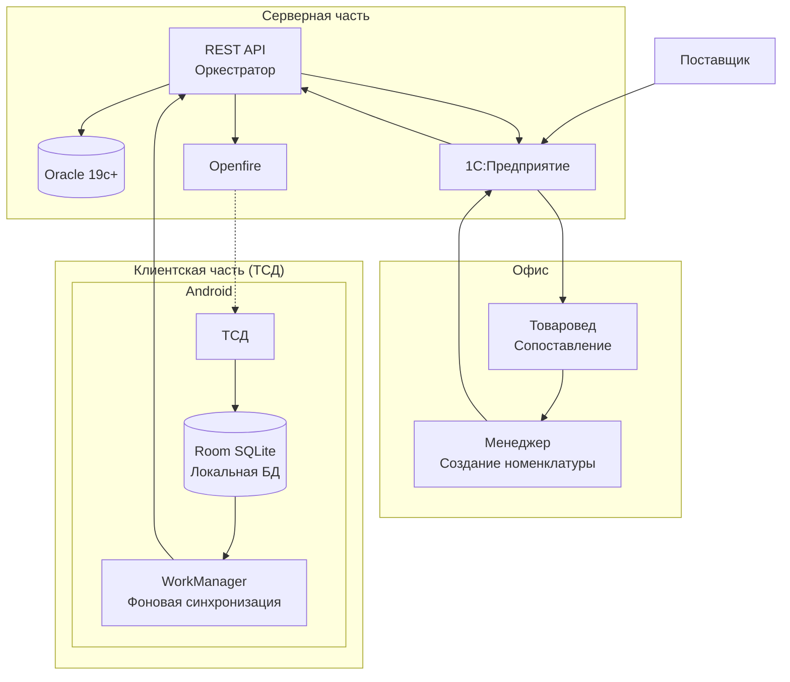
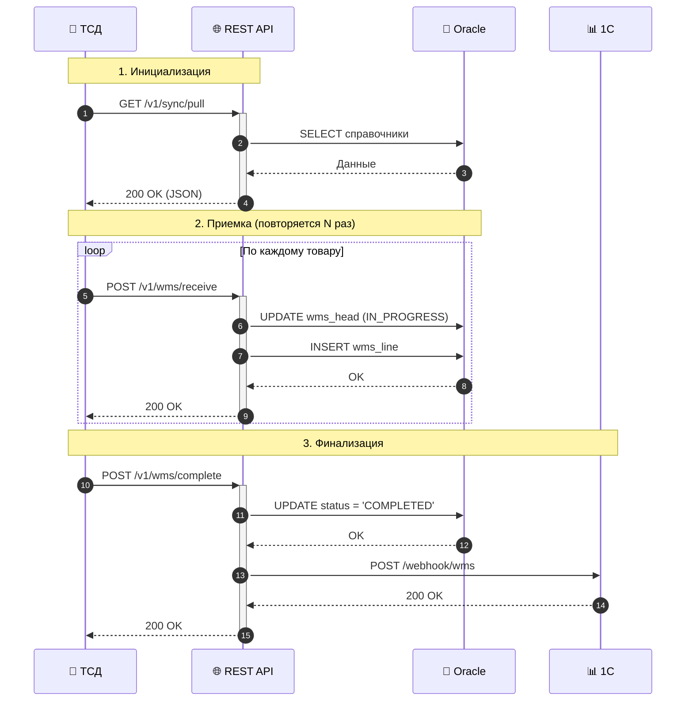
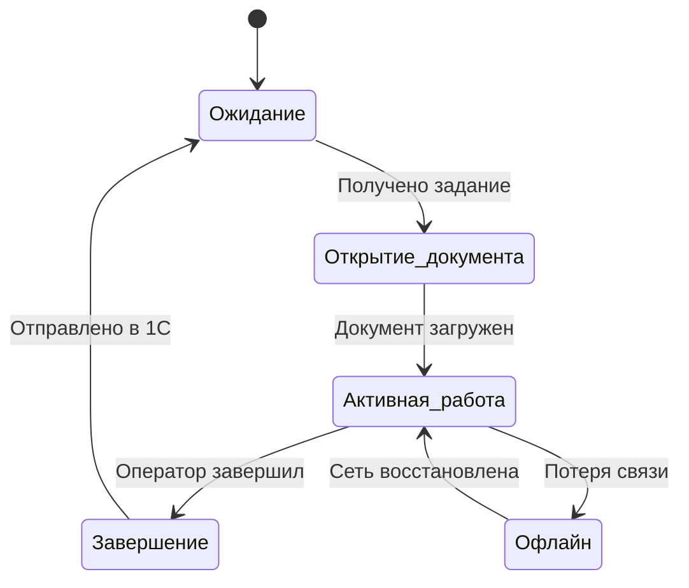
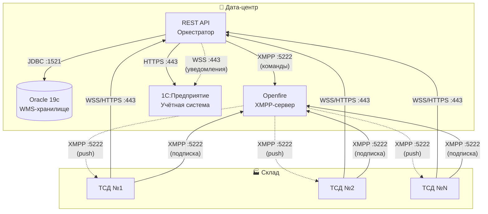

# ТЕХНИЧЕСКОЕ ЗАДАНИЕ
## Универсальный складской документ WMS
### (Приёмка / Наборка / Перемещение / Списание)

**Версия:** 1.0  
**Дата:** xx.xx.2026  
**Основание:** Архитектурная схема «Компоненты архитектуры»

**Авторы:**
- Полушин Д.Н. — программист

**Документ подготовлен в рамках проекта "Универсальный складской документ WMS"**

---

## Словарь терминов

| Термин              | Определение                                                                                        |
|---------------------|----------------------------------------------------------------------------------------------------|
| **WMS**             | Warehouse Management System - система управления складом                                           |
| **ТСД**             | Терминал сбора данных - мобильное устройство для сканирования                                      |
| **WSS**             | WebSocket Secure - защищённое WebSocket-соединение                                                 |
| **XMPP**            | Extensible Messaging and Presence Protocol - протокол обмена сообщениями                           |
| **Offline-first**   | Подход, при котором приложение работает с локальными данными и синхронизируется при появлении сети |
| **Идемпотентность** | Свойство операции, при котором многократное выполнение даёт тот же результат, что и однократное    |

## 1. Цель работы

Реализовать распределённую систему, обеспечивающую:
- Работу терминалов сбора данных (ТСД) на Android в составе складского/логистического комплекса.
- Обмен данными с Oracle (хранилище WMS), 1С (учётная система), сервисом REST API (оркестратор) и Openfire (коммуникации).
- Работу в условиях нестабильной связи с гарантированной доставкой данных (offline-first).

---

## 2. Состав и ответственность компонентов

| Компонент         | Роль                       | Ответственность                                                                                                                                             | Технологии                                                                      |
|-------------------|----------------------------|-------------------------------------------------------------------------------------------------------------------------------------------------------------|---------------------------------------------------------------------------------|
| **Oracle**        | Хранилище данных           | Адресная система, справочник номенклатур, документы WMS                                                                                                     | Oracle 19c+, PL/SQL, JSON                                                       |
| **REST API**      | Оркестратор (ядро системы) | Приём данных от ТСД, валидация, управление статусами, маршрутизация, отправка уведомлений через Openfire (только для пробуждения), передача документов в 1С | Spring Boot 3+, Kotlin/Java 17+, Spring Data JPA, Hibernate 6+, WebSocket, JDBC |
| **1С**            | Учётная система            | Завершённые документы приёмки, проводки и остатки, бизнес-отчёты, интеграция с внешними сервисами                                                           | 1С:Предприятие 8.3 + 1С Управление торговлей 11.5                               |
| **Openfire**      | Коммуникационный сервер    | Push-уведомления на ТСД, офлайн-очередь сообщений, статусы доставки/прочтения, чат между сотрудниками                                                       | Openfire (XMPP), Smack                                                          |
| **ТСД (Android)** | Клиентское приложение      | UI, работа с документами, локальное хранилище, фоновая синхронизация, WebSocket для активной работы, XMPP-клиент для уведомлений                            | Android, Kotlin, Room, WorkManager, OkHttp, Smack, CameraX                      |

---

## 3. Функциональные требования

### 3.1. Общие принципы (обязательны к выполнению)

| Принцип                        | Реализация                              | Почему важно               |
|--------------------------------|-----------------------------------------|----------------------------|
| **Single Source of Truth**     | Room на ТСД, Oracle на сервере          | Нет расхождений данных     |
| **Offline-first**              | Все данные сначала в Room               | Работа при любой связи     |
| **Гибридная синхронизация**    | WebSocket (активно) + HTTP (фон)        | Баланс скорости и ресурсов |
| **Push через Openfire**        | Только уведомления, не данные           | Экономия батареи ТСД       |
| **Разделение ответственности** | Каждый компонент делает своё            | Упрощает поддержку         |
| **Асинхронность**              | WorkManager для фона, ACK для WebSocket | Не блокируем UI            |
| **Идемпотентность**            | Все операции можно повторить            | Безопасность при повторах  |

---

### 3.2. Требования к REST API (оркестратор)

**Эндпоинты REST API:**

| Метод  | Эндпоинт                | Назначение                                                                   |
|--------|-------------------------|------------------------------------------------------------------------------|
| `POST` | `/v1/wms/receive`       | Приём данных от ТСД (сканирования, статусы)                                  |
| `POST` | `/v1/wms/complete`      | Завершение документа, отправка результата в 1С                               |
| `GET`  | `/v1/sync/pull`         | Выгрузка актуальных справочников (адресная система, номенклатура, штрихкоды) |
| `POST` | `/v1/notification/send` | Отправка команды на Openfire для push-уведомления                            |

**Поддержка WebSocket (WSS):**
- Порт: 443
- Режим: дуплекс, реальное время
- Назначение: активная работа ТСД (сканирования, подтверждения)

**Интеграции:**
- **С Oracle:** через JDBC Thin (порт 1521), работа с JSON-колонками, вызов PL/SQL
- **С 1С:** через HTTP (REST, порт 443) — отправка завершённых документов
- **С Openfire:** через XMPP (TCP, порт 5222) — отправка уведомлений через бот-пользователя

---

### 3.3. Требования к ТСД (Android-приложение)

| Компонент            | Назначение                                   | Технология                  |
|----------------------|----------------------------------------------|-----------------------------|
| **Room**             | Локальное хранилище (Single Source of Truth) | SQLite, Room                |
| **WorkManager**      | Фоновая синхронизация, статистика            | Android WorkManager         |
| **WebSocketManager** | Активная работа с документами                | OkHttp WebSocket            |
| **XMPPClient**       | Получение push-уведомлений                   | Smack (XMPP)                |
| **Camera/Scanner**   | Сканирование штрих-кодов                     | CameraX / SDK производителя |
| **Repository**       | Единый источник данных для UI                | Kotlin Coroutines, Flow     |
| **ViewModel**        | Хранение состояния UI                        | Android ViewModel           |

**Дополнительные требования:**
- XMPP-клиент: подключение к Openfire (TCP, порт 5222), получение push-уведомлений, поддержка пробуждения приложения через FCM/XMPP.
- Сканирование — через CameraX или SDK вендора, результат сразу отправляется через WebSocket.
- Обработка разрывов связи: данные сохраняются в Room, при восстановлении соединения — автоматическая повторная отправка.

**Фоновая работа и пробуждение:**
- XMPP-клиент должен работать в **Foreground Service** с постоянным уведомлением в статус-баре.
- Приложение должно запрашивать и удерживать **WakeLock** (PARTIAL_WAKE_LOCK) и **WifiLock** на время активного соединения.
- Должен быть реализован **BroadcastReceiver** для автозапуска сервиса после перезагрузки устройства (BOOT_COMPLETED).
- В инструкции для оператора должен быть раздел по **отключению оптимизации батареи** для приложения WMS.
---

### 3.4. Требования к Openfire

- Настроить XMPP-сервер с поддержкой офлайн-очереди сообщений.
- Обеспечить отправку сообщений от REST API к ТСД (через бот-пользователя).
- Реализовать пробуждение приложения.
- Поддержка статусов доставки/прочтения.
- Поддержка чата между сотрудниками.

---

### 3.5. Требования к интеграции с 1С

**Роль 1С в системе:**
- 1С не хранит активные и завершённые WMS-документы. Это делает Oracle.
- 1С получает от REST API результат выполнения WMS-документа.

**Схема обмена:**
1. REST API после завершения документа (`POST /v1/wms/complete`) создаёт запись в таблице `WMS_TO_1C` со статусом `PENDING`.
2. REST API отправляет уведомление 1С через **WebSocket (WSS)** о том, что в очереди появился новый документ.
3. 1С, получив уведомление, читает из очереди `WMS_TO_1C` запись со статусом `PENDING` (или несколько записей) и забирает данные документа по `wmshead_rn` из `WMSHEAD` (и связанных таблиц `WMSSPEC`, `MARKLINK` и др.).
4. 1С обрабатывает документ (создаёт приходный ордер, перемещение, списание и т.п.).
5. После успешной обработки 1С обновляет `status` в `WMS_TO_1C` на `PROCESSED` и (опционально) сохраняет `onec_doc_number` — номер созданного документа в 1С.

**Требования к WebSocket-соединению:**
- 1С выступает в роли **WebSocket-клиента** (требуется платформа 1С:Предприятие версии 8.3.27 и выше).
- 1С сама инициирует и поддерживает постоянное WebSocket-соединение к REST API.
- REST API при недоступности 1С (соединение разорвано) продолжает создавать записи в `WMS_TO_1C`, но уведомление не отправляется. 1С при восстановлении соединения должна самостоятельно опросить очередь на наличие `PENDING` записей.

**Контроль доставки и повторные попытки:**
- Основной механизм гарантированной доставки — таблица-очередь `WMS_TO_1C` в Oracle.
- WebSocket-уведомления — это **оптимизация** для сокращения задержки, но не единственный механизм.
- 1С должна периодически (например, раз в 1–5 минут) опрашивать `WMS_TO_1C` на случай, если WebSocket-уведомление не было получено.
- 1С самостоятельно управляет повторными попытками обработки документов из очереди. Oracle и REST API не реализуют ретраи для отправки в 1С.
---

## 4. Протоколы и каналы связи

| Откуда   | Куда     | Протокол        | Порт | Назначение                                    | Режим                   |
|----------|----------|-----------------|------|-----------------------------------------------|-------------------------|
| ТСД      | REST API | WebSocket (WSS) | 443  | Активная работа: сканирования, подтверждения  | Дуплекс, реальное время |
| ТСД      | REST API | HTTPS (REST)    | 443  | Статистика, завершение документов             | Запрос-ответ            |
| ТСД      | Openfire | XMPP (TCP)      | 5222 | Получение push-уведомлений                    | Постоянное соединение   |
| Openfire | ТСД      | FCM / XMPP      | 443  | Пробуждение приложения при офлайн-сообщениях  | Push                    |
| REST API | Oracle   | JDBC (Thin)     | 1521 | Чтение/запись данных, вызов PL/SQL            | Синхронный              |
| REST API | 1С       | HTTPS (REST)    | 443  | Отправка завершённых документов               | Синхронный              |
| REST API | 1С       | WebSocket (WSS) | 443  | Уведомление о появлении документа в очереди   | Асинхронный             |
| REST API | Openfire | XMPP (TCP)      | 5222 | Отправка уведомлений (через бот-пользователя) | Асинхронный             |
> **Примечание:** WebSocket между REST API и 1С используется только для уведомлений. Основной канал передачи данных — HTTPS и очередь `WMS_TO_1C`.

---

## 5. Жизненные циклы ТСД (обработать все состояния)

| Состояние ТСД          | WebSocket      | XMPP        | Что происходит                                |
|------------------------|----------------|-------------|-----------------------------------------------|
| **Ожидание**           | ❌ Закрыт       | ✅ Подключен | Ожидание уведомлений, XMPP-соединение активно |
| **Открытие документа** | 🔄 Поднимается | ✅ Подключен | Загрузка документа, синхронизация             |
| **Активная работа**    | ✅ Открыт       | ✅ Подключен | Сканирования → WebSocket                      |
| **Завершение**         | ❌ Закрывается  | ✅ Подключен | Отправка в 1С, очистка                        |
| **Офлайн**             | ❌ Закрыт       | ❌ Отключён  | Данные в Room, попытки reconnect              |

> При смене состояний — логирование и показ пользователю только критичных ошибок.

---

## 6. Требования к надёжности

**Retry policy применяется для:**
- HTTP-запросов от ТСД к REST API при таймаутах
- HTTP-запросов от REST API к 1С при недоступности сервиса

**Параметры повторов:**
- экспоненциальная задержка (1с, 2с, 4с, 8с, 30с, 60с)
- максимум 10 попыток, затем документ помечается статусом `FAILED` и требуется ручное вмешательство

>**Offline-first** — приложение работает с локальными данными (Room), синхронизируется автоматически при появлении сети.

>**Идемпотентность** — все операции должны быть идемпотентными.

---

## 7. Требования к мониторингу и логированию

**Логировать (на ТСД и сервере):**
- все переходы между состояниями
- ошибки подключения к Openfire / REST API / 1С
- дубликаты отправок (срабатывание идемпотентности)

**На сервере REST API:**
- эндпоинт `/actuator/health` для проверки статуса всех интеграций (Oracle, 1С, Openfire)
- метрики: количество активных ТСД, количество запросов в секунду, размер очереди в 1С

---

## 8. Что сдаёт разработчик

1. **Исходный код** (бекенд + Android + скрипты БД Oracle).
2. **Документация:**
    - описание API (OpenAPI/Swagger)
    - инструкция по развёртыванию (docker-compose или пошагово)
    - описание конфигурации Openfire (настройки, порты)
    - схема БД Oracle (ER-диаграмма)
3. **Тесты:** сценарий разрыва связи и восстановления
4. **Демо-стенд** (виртуальные машины или контейнеры со всеми компонентами).

---

## 9. Критерии приёмки

- [ ] ТСД работает во всех состояниях из п. 5 без потери данных.
- [ ] При разрыве связи на 5 минут — после восстановления данные синхронизируются корректно.
- [ ] Push-уведомление приходит на ТСД менее чем за 10 секунд с момента отправки из REST API.
- [ ] Документ не может быть дважды обработан (идемпотентность).
- [ ] UI не «зависает» при фоновой синхронизации.

---

## 10. Риски

- Сетевые порты между компонентами должны быть открыты (администратор обеспечивает).
- 1С может отвечать медленно — предусмотреть тайм-ауты и асинхронную очередь.
- Могут возникнуть проблемы с XMPP-пробуждением, связанные с электропитанием на устройстве.

---

## 11. Требования к базе данных Oracle

### 11.1. Состав таблиц (минимальный)

| Таблица     | Назначение                                        |
|-------------|---------------------------------------------------|
| `WMSHEAD`   | WMS-документы                                     |
| `WMSSPEC`   | Спецификация документа                            |
| `WMSPICKER` | Назначенные пользователи на документ              |
| `MARK`      | Коды маркировки                                   |
| `MARKLINK`  | Связи кодов маркировки со спецификацией документа |
| `WMS_TO_1C` | Очередь для отправки в 1С                         |

### 11.2. JSON-колонки

- В таблицах WMS использовать JSON-колонку для хранения переменной части документа.
- Валидация: `CHECK (data_json IS JSON)`.

### 11.3. Партиционирование (секционирование) таблиц

**Таблица `WMSHEAD`**

| Параметр                | Значение                               |
|-------------------------|----------------------------------------|
| Тип партиционирования   | По диапазону (`RANGE`)                 |
| Ключ партиционирования  | `created_at` (дата создания документа) |
| Интервал                | Ежемесячно (партиция на каждый месяц)  |
| Автоматическое создание | Включено                               |

**Таблица `WMSSPEC`**

| Параметр               | Значение                                                     |
|------------------------|--------------------------------------------------------------|
| Тип партиционирования  | По диапазону (`RANGE`) с привязкой к родительскому документу |
| Ключ партиционирования | `created_at` (из `WMSHEAD` через внешний ключ)               |
| Интервал               | Ежемесячно, синхронно с `WMSHEAD`                            |

**Таблица `WMS_TO_1C` (очередь)**

| Параметр               | Значение                                                                                  |
|------------------------|-------------------------------------------------------------------------------------------|
| Тип партиционирования  | По диапазону (`RANGE`)                                                                    |
| Ключ партиционирования | `created_at`                                                                              |
| Интервал               | Ежемесячно                                                                                |
| Стратегия очистки      | После успешной отправки в 1С запись может быть удалена или перемещена в архивную партицию |

> Очередь не должна бесконечно расти. Обработанные записи нужно помещать в отдельную партицию.

### 11.4. Индексы (обязательные)

- Индексы должны быть локальными (`LOCAL`) на каждой партиции. Глобальные индексы допускаются только для уникальных полей (`rn`).
- **Важно:** строки спецификации должны попадать в ту же партицию, что и их родительский документ.

| Индекс              | Назначение                                    |
|---------------------|-----------------------------------------------|
| `WMSHEAD.status`    | Быстрый поиск активных документов             |
| `WMSHEAD.device_id` | Фильтрация по ТСД                             |
| `WMSHEAD.rn`        | Уникальный глобальный индекс (первичный ключ) |
| `WMS_TO_1C.status`  | Выборка сообщений, готовых к отправке         |

### 11.5. Очередь для 1С (таблица `WMS_TO_1C`)

| Поле              | Тип              | Назначение                                                   |
|-------------------|------------------|--------------------------------------------------------------|
| `rn`              | NUMBER PK        | Идентификатор записи                                         |
| `wmshead_rn`      | NUMBER FK UNIQUE | Ссылка на документ в `WMSHEAD` (один документ — одна запись) |
| `status`          | VARCHAR2(20)     | `PENDING` / `PROCESSED` / `FAILED`                           |
| `onec_doc_number` | VARCHAR2(100)    | Номер документа, созданного в 1С (заполняет 1С)              |
| `error_message`   | VARCHAR2(500)    | Сообщение об ошибке (заполняет 1С)                           |
| `created_at`      | TIMESTAMP        | Создание записи (ключ партиционирования)                     |
| `processed_at`    | TIMESTAMP        | Время обработки (заполняет 1С)                               |

**Значения статусов:**
- `PENDING` — документ ожидает обработки 1С
- `PROCESSED` — 1С успешно обработала документ
- `FAILED` — 1С не смогла обработать документ (требуется ручное вмешательство)

**Примечания:**
- 1С сама выбирает записи со статусом `PENDING` и обновляет статус после обработки.

### 11.6. Триггер защиты завершённых документов

**Назначение:** запретить изменения записей в таблице `WMSHEAD` со статусом `COMPLETED` или `FAILED`.

**Требования:**
- Тип триггера: `BEFORE UPDATE ON WMSHEAD`
- Условие: `OLD.status IN ('COMPLETED', 'FAILED')`
- Действие: выброс исключения RAISE_APPLICATION_ERROR с кодом ошибки `-20000`
- Сообщение об ошибке: `"Изменение завершённого документа запрещено. Документ RN = {rn}"`

**Исключения:**
- Ручное изменение статуса с `FAILED` на `COMPLETED` может выполняться только через административную процедуру (отдельная хранимая процедура с повышенными правами), но не через обычное `UPDATE`.

---

## Диаграммы архитектуры

### 1. Диаграмма компонентов

### 2. Диаграмма последовательности

### 3. Диаграмма состояний ТСД

### 4. ER-диаграмма (текстовое описание)

| Таблица | Связь | Таблица | Описание |
|---------|-------|---------|----------|
| `WMSHEAD` | 1 : N | `WMSSPEC` | Один документ содержит много строк спецификации |
| `WMSHEAD` | 1 : N | `WMSPICKER` | На один документ может быть назначено несколько пользователей |
| `WMSHEAD` | 1 : 1 | `WMS_TO_1C` | Один документ — одна запись в очереди на отправку |
| `WMSSPEC` | 1 : N | `MARKLINK` | Одна строка спецификации может содержать много кодов маркировки |

### 5. Диаграмма развёртывания

