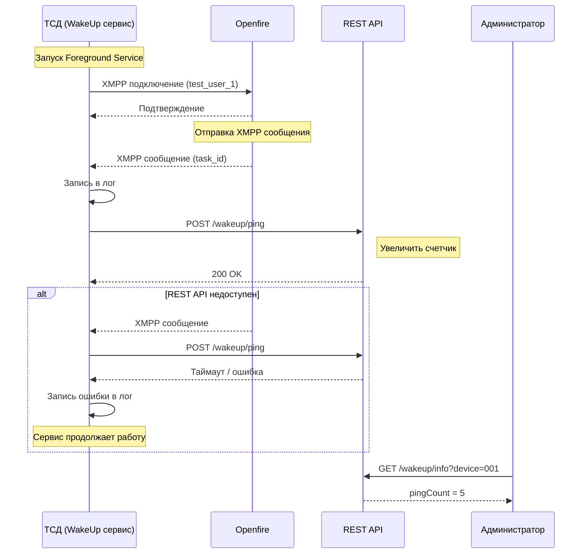
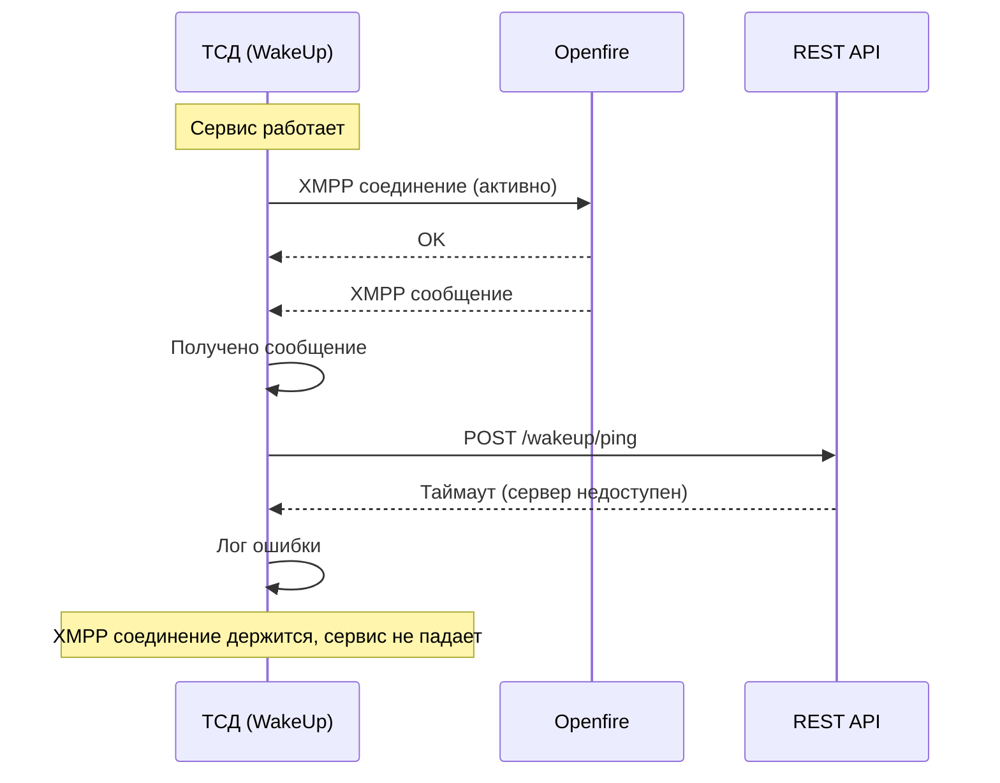
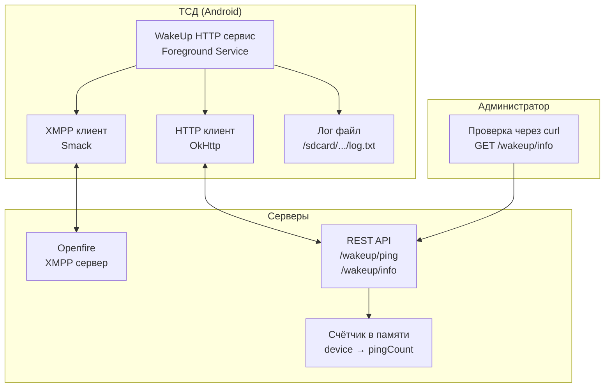

# ТЕХНИЧЕСКОЕ ЗАДАНИЕ
## WakeUpTest-HTTP (Тест HTTP возможностей сервиса пробуждения)

**Версия:** 0.1  
**Цель:** Проверка возможности отправки HTTP запросов из Foreground Service

**Авторы:**
- Полушин Д.Н. — программист

---

## Основные понятия

| Термин                 | Определение                                                                                                                                           |
|------------------------|-------------------------------------------------------------------------------------------------------------------------------------------------------|
| **Foreground Service** | Сервис, который работает с постоянным уведомлением в шторке. Система не может его убить при нехватке памяти                                           |
| **XMPP**               | Протокол для обмена сообщениями. Используется для пробуждения ТСД                                                                                     |
| **Openfire**           | XMPP сервер                                                                                                                                           |
| **REST API**           | HTTP сервер, который принимает запросы от ТСД                                                                                                         |
| **HTTP пинг**          | HTTP запрос, который сервис отправляет на REST API при получении XMPP сообщения                                                                       |
| **WakeLock**           | Механизм Android, который удерживает процессор от сна на время выполнения важной операции                                                             |
| **OkHttp**             | Библиотека для HTTP запросов на Android                                                                                                               |
| **Smack**              | Библиотека для XMPP на Android                                                                                                                        |
| **Таймаут**            | Максимальное время ожидания ответа на HTTP запрос (3 секунды)                                                                                         |
| **Логирование**        | Запись событий в файл на устройстве                                                                                                                   |
| **device**             | Идентификатор ТСД (в тесте используется любое буквенное обозначение)                                                                                  |
| **pingCount**          | Счётчик успешных HTTP пингов на REST API                                                                                                              |
| **Ongoing**            | Флаг уведомления, который запрещает пользователю смахнуть его. Уведомление висит в шторке, пока работает сервис. Нужно, чтобы система не убила сервис |
| **PARTIAL_WAKE_LOCK**  | Тип WakeLock, который удерживает процессор активным, но НЕ включает экран. Используется для фоновых операций, когда экран выключен                    |
| **BOOT_COMPLETED**     | Системное событие Android, которое отправляется после полной загрузки устройства. Позволяет приложению запустить сервис автоматически                 |
| **QUICKBOOT_POWERON**  | Системное событие для быстрой загрузки (режим гибернации). Нужно для китайских устройств и некоторых ТСД, которые не отправляют BOOT_COMPLETED        |

## Зависимость от первого этапа

Данный тест выполняется **только после успешного завершения** `Первого этапа`.

**Первый тест уже подтвердил:**
- Сервис живёт в фоне
- XMPP стабилен
- Сервис просыпается при получении сообщения


  `**Теперь проверяем:** может ли этот же сервис отправлять HTTP запросы.`

## 1. Цель работы

Создать тестовый сервис, который позволит ответить на вопросы:

| Вопрос                                              | Как проверяем                                                                      |
|-----------------------------------------------------|------------------------------------------------------------------------------------|
| Может ли Foreground Service отправлять HTTP запросы | При получении XMPP сервис отправляет HTTP запрос, счетчик на сервере увеличивается |
| Не падает ли сервис при недоступном сервере         | Отключаем REST API, сервис продолжает работать                                     |
| Влияют ли HTTP запросы на расход батареи            | Замеряем расход за ночь                                                            |

---

## 2. Что делает сервис

| Функция                 | Описание                                              |
|-------------------------|-------------------------------------------------------|
| Постоянная работа       | Foreground Service, висит в шторке                    |
| XMPP соединение         | Подключено к Openfire                                 |
| HTTP при получении XMPP | При получении любого сообщения отправляет HTTP запрос |
| Логирование             | Все действия в файл                                   |

---

## 3. Технические параметры

### 3.1. XMPP

| Параметр | Значение      |
|----------|---------------|
| Хост     | 192.168.2.201 |
| Порт     | 5222          |
| Логин    | test_user_1   |
| Пароль   | test_password |

### 3.2. REST API эндпоинты

**Сервер:**

| Параметр          | Значение                                         |
|-------------------|--------------------------------------------------|
| Хост              | oracle-rest-api.ars                              |
| Стабильный порт   | 3000 (всегда отвечает)                           |
| Нестабильный порт | 3001 (периодически недоступен, таймауты, ошибки) |

**Авторизация:** ❌ Не требуется (все эндпоинты публичные для теста)

**Эндпоинты:**

| Эндпоинт      | Метод  | Назначение               |
|---------------|--------|--------------------------|
| /wakeup/ping  | POST   | Увеличить счетчик device |
| /wakeup/info  | GET    | Получить счетчик device  |
| /wakeup/reset | DELETE | Сбросить счетчик device  |

**Параметры запроса /ping:** device (string)  
**Параметры запроса /info:** device (string, query param)  
**Ответ /info:** device, pingCount, lastPingAt

**Увеличить счетчик /ping:**
```json
{
  "device": "001"
}
```

**Ответ /info:**
```json
{
  "device": "test_user_1",
  "pingCount": 47,
  "lastPingAt": "2026-06-15 10:30:00"
}
```

**Ответ /reset:**
```json
{
  "device": "test_user_1",
  "reset": true,
  "oldPingCount": 47
}
```

**Назначение портов:**

| Порт | Режим        | Для чего в тесте                                       |
|------|--------------|--------------------------------------------------------|
| 3000 | Стабильный   | Проверка нормальной работы HTTP                        |
| 3001 | Нестабильный | Проверка поведения сервиса при ошибках (таймауты, 500) |

### 3.3. HTTP запросы

| Тип          | Таймаут   |
|--------------|-----------|
| Пинг по XMPP | 3 секунды |

**Правила:**
- HTTP запрос отправляется при получении каждого XMPP сообщения
- При ошибке — логируем, не повторяем
- Все запросы асинхронные, не блокируют XMPP поток

### 3.4. HTTP клиент

| Параметр           | Значение  |
|--------------------|-----------|
| Библиотека         | OkHttp    |
| Таймаут соединения | 3 секунды |
| Таймаут чтения     | 3 секунды |
| Таймаут записи     | 3 секунды |

### 3.5. Логирование

**Путь:** `/sdcard/Android/data/com.waketest.http/files/log.txt`

**Что логируется:**
- Запуск и остановка сервиса
- Статус XMPP подключения
- Получение XMPP сообщения
- Отправка HTTP запроса (время, результат, длительность)
- Ошибки (таймауты, недоступность сервера)

**Ротация:** При достижении 10 МБ — переименовать в log.old.txt, создать новый

### 3.6. Уведомление в шторке

| Параметр  | Значение               |
|-----------|------------------------|
| Заголовок | Wake Up Test           |
| Текст     | Активен, ожидание XMPP |
| Ongoing   | Да (не смахнуть)       |


### 3.7. Автозапуск

| Параметр | Значение                          |
|----------|-----------------------------------|
| События  | BOOT_COMPLETED, QUICKBOOT_POWERON |
| Действие | Запустить Foreground Service      |

### 3.8. WakeLock

| Параметр  | Значение                     |
|-----------|------------------------------|
| Тип       | PARTIAL_WAKE_LOCK            |
| Удержание | Только на время HTTP запроса |
| Максимум  | 5 секунд                     |

---

## 4. Тестирование

### 4.1. Функциональные тесты

| № | Что делаем                  | Ожидаем                                        |
|---|-----------------------------|------------------------------------------------|
| 1 | Установить и запустить      | Уведомление в шторке, сервис запущен           |
| 2 | Отправить XMPP сообщение    | В логе запись о получении + HTTP пинг          |
| 3 | Отправить 10 XMPP сообщений | В логе 10 записей о получении + 10 HTTP пингов |
| 4 | Остановить REST API         | В логе ошибки, сервис не падает                |
| 5 | Запустить REST API обратно  | Следующие пинги снова успешны                  |
| 6 | Выключить Wi-Fi на ТСД      | В логе ошибки подключения                      |
| 7 | Включить Wi-Fi              | Пинги восстановились                           |
| 8 | Перезагрузить ТСД           | Сервис запустился автоматически                |

### 4.2. Проверка счетчика

| № | Что делаем                              | Ожидаем                             |
|---|-----------------------------------------|-------------------------------------|
| 0 | Вызвать DELETE /wakeup/reset            | pingCount = 0                       |
| 1 | Вызвать GET /wakeup/info                | pingCount = 0                       |
| 2 | Отправить 5 XMPP сообщений              |                                     |
| 3 | Вызвать GET /wakeup/info                | pingCount = 5                       |
| 4 | Отправить еще 3 XMPP сообщения          |                                     |
| 5 | Вызвать GET /wakeup/info                | pingCount = 8                       |
| 6 | Вызвать DELETE /wakeup/reset?device=001 | pingCount сброшен, oldPingCount = 8 |
| 7 | Вызвать GET /wakeup/info                | pingCount = 0                       |

### 4.3. Тесты энергопотребления

**Условия:** Экран выключен, Wi-Fi включён, 15 часов (с 18:00 до 09:00)

| № | Сценарий                           | Что измеряем   |
|---|------------------------------------|----------------|
| 1 | Сервис остановлен                  | Базовый расход |
| 2 | Только XMPP (без HTTP)             | Расход XMPP    |
| 3 | XMPP + HTTP (при каждом сообщении) | Расход HTTP    |

**Допустимое отклонение:** Расход с HTTP не должен превышать базовый более чем на 10%

### 4.4. Устройства для тестирования

| Устройство          | Тип      |
|---------------------|----------|
| Atol SmartPrime     | ТСД      |
| Atol SmartSlim      | ТСД      |
| Смартфон Android 11 | Тестовый |
| Смартфон Android 12 | Тестовый |

---

## 5. Схема работы



### 5.1. Взаимодействие компонентов при недоступном REST API



### 5.2. Архитектура компонентов теста



---

## 6. Критерии успеха

- [ ] Сервис отправляет HTTP пинг при каждом XMPP сообщении
- [ ] При недоступном REST API сервис не падает и не выгружается
- [ ] После восстановления REST API пинги снова успешны
- [ ] После перезагрузки ТСД сервис запускается автоматически
- [ ] Счетчик на REST API соответствует количеству отправленных пингов
- [ ] Расход батареи за ночь с HTTP не более +10% к базовому

---

## 7. Что сдаётся

1. Исходный код сервиса (XMPP + HTTP)
2. APK файл
3. Лог-файл за время теста
4. Скриншот или curl запрос /info с увеличенным счетчиком
5. Отчёт по энергопотреблению (три замера по 15 часов)

---

## 8. Результаты тестирования (заполняется после выполнения)

### 8.1. Функциональные тесты

| № | Тест                         | Результат | Комментарий |
|---|------------------------------|-----------|-------------|
| 1 | Запуск сервиса               | ⬜         |             |
| 2 | Отправка XMPP (1 сообщение)  | ⬜         |             |
| 3 | Отправка XMPP (10 сообщений) | ⬜         |             |
| 4 | Остановка REST API           | ⬜         |             |
| 5 | Восстановление REST API      | ⬜         |             |
| 6 | Отключение Wi-Fi             | ⬜         |             |
| 7 | Включение Wi-Fi              | ⬜         |             |
| 8 | Перезагрузка ТСД             | ⬜         |             |

### 8.2. Проверка счетчика

| Действие                    | pingCount (из /info) |
|-----------------------------|----------------------|
| После запуска (0 сообщений) | __                   |
| После 5 XMPP сообщений      | __                   |
| После 10 XMPP сообщений     | __                   |

### 8.3. Энергопотребление (15 часов ночью)

| Сценарий    | Потрачено заряда | Разница с базовым |
|-------------|------------------|-------------------|
| Без сервиса | __ %             | —                 |
| Только XMPP | __ %             | + __ %            |
| XMPP + HTTP | __ %             | + __ %            |

### 8.4. Результаты на устройствах

| Устройство          | HTTP работает | Сервис жив | Расход |
|---------------------|---------------|------------|--------|
| Atol SmartPrime     | ⬜             | ⬜          | __ %   |
| Atol SmartSlim      | ⬜             | ⬜          | __ %   |
| Смартфон Android 11 | ⬜             | ⬜          | __ %   |
| Смартфон Android 12 | ⬜             | ⬜          | __ %   |

---

**Итог:** После выполнения этого ТЗ мы будем знать:
- Может ли WakeUp сервис отправлять HTTP при получении XMPP
- Что происходит при потере сети или недоступности сервера
- Насколько HTTP увеличивает расход батареи

## Следующий этап

Если тест успешен — это означает, что WakeUp сервис:
- ✅ Стабильно работает в фоне (XMPP)
- ✅ Может отправлять HTTP запросы при пробуждении
- ✅ Корректно обрабатывает ошибки сети и недоступность сервера


  **Переходим к финальной версии WakeUp сервиса:**