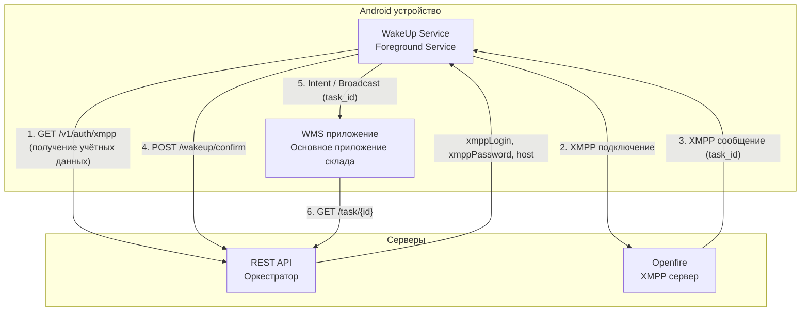
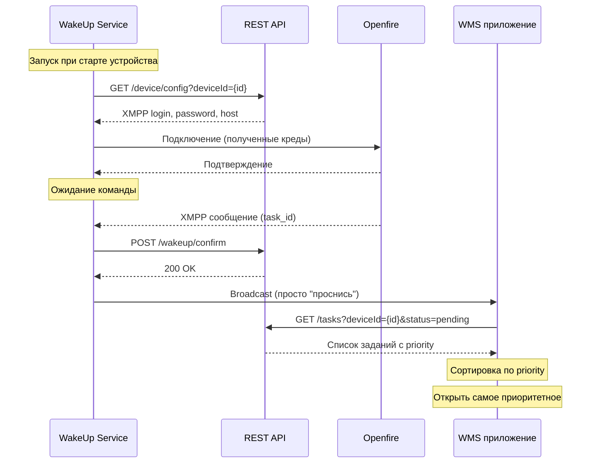

# ТЕХНИЧЕСКОЕ ЗАДАНИЕ
## WakeUp Service (Финальная версия сервиса пробуждения)

**Версия:** 1.0  
**Цель:** Создать финальную версию WakeUp сервиса, который работает в фоне, получает XMPP команды, подтверждает пробуждение через HTTP и запускает WMS приложение

**Авторы:**
- Полушин Д. Н. — программист

---

## Основные понятия

| Термин                 | Определение                                                                                              |
|------------------------|----------------------------------------------------------------------------------------------------------|
| **WakeUp Service**     | Фоновый сервис на Android, который постоянно работает и ждёт команду пробуждения                         |
| **WMS приложение**     | Основное складское приложение, которое занимается приёмкой, наборкой, перемещением товаров               |
| **Foreground Service** | Сервис с постоянным уведомлением в шторке. Система не может его убить                                    |
| **XMPP**               | Протокол для обмена сообщениями. Используется для отправки команды пробуждения                           |
| **Openfire**           | XMPP сервер                                                                                              |
| **REST API**           | HTTP сервер, от которого WakeUp получает учётные данные и отправляет подтверждения                       |
| **HTTP подтверждение** | HTTP запрос от WakeUp к REST API о том, что ТСД проснулся                                                |
| **Intent**             | Механизм Android для запуска активности в другом приложении и передачи данных                            |
| **Broadcast**          | Способ отправить сообщение от сервиса к приложению, которое уже работает                                 |
| **deviceId**           | Уникальный идентификатор ТСД (Android ID)                                                                |
| **WakeLock**           | Механизм удержания процессора от сна                                                                     |
| **Ongoing**            | Флаг уведомления — нельзя смахнуть                                                                       |
| **Приоритет задания**  | Целое число, определяющее срочность. Чем выше число, тем срочнее. Может быть любым: 1, 5, 10, 100 и т.д. |
---

## 1. Цель работы

Создать финальную версию WakeUp сервиса, который:

| Задача                   | Описание                                                   |
|--------------------------|------------------------------------------------------------|
| Постоянная работа        | Foreground Service, всегда в памяти                        |
| Получение учётных данных | Запрашивает у REST API логин/пароль для XMPP при запуске   |
| XMPP соединение          | Подключается к Openfire и ждёт команду                     |
| HTTP подтверждение       | При получении команды отправляет подтверждение на REST API |
| Запуск WMS               | Будит WMS приложение через Intent и передаёт task_id       |
| Автозапуск               | Запускается после перезагрузки устройства                  |

---

## 2. Архитектура

**Компоненты:**

- WakeUp Service (Android) — Foreground Service, XMPP клиент, HTTP клиент, Broadcast/Intent
- REST API (сервер) — оркестратор, выдаёт учётные данные, принимает подтверждения
- Openfire (сервер) — XMPP сервер
- WMS приложение (Android) — основное приложение склада

**Связи:**

- WakeUp Service → REST API: GET /v1/auth/xmpp (получение учётных данных)
- WakeUp Service → REST API: POST /wakeup/confirm (подтверждение пробуждения)
- WakeUp Service ← Openfire: XMPP сообщение (команда с task_id)
- WakeUp Service → WMS приложение: Intent или Broadcast (запуск с task_id)

---

## 3. Технические параметры

### 3.1. Получение учётных данных

**Эндпоинт REST API:**

| Параметр  | Значение          |
|-----------|-------------------|
| Метод     | GET               |
| URL       | /v1/auth/xmpp     |
| Параметры | deviceId (string) |

**Ответ:**

| Поле         | Тип    | Описание             |
|--------------|--------|----------------------|
| xmppHost     | string | Хост Openfire        |
| xmppPort     | int    | Порт Openfire (5222) |
| xmppLogin    | string | Логин для XMPP       |
| xmppPassword | string | Пароль для XMPP      |
| apiHost      | string | Хост REST API        |
| apiPort      | int    | Порт REST API        |

**Правила:**

- Запрос при каждом запуске WakeUp сервиса
- При ошибке — повторить через 10 секунд (максимум 5 раз)
- XMPP подключается только после успешного получения учётных данных
- Учётные данные хранятся только в памяти (не сохраняются на диск)

**Безопасность пароля:**

| Требование      | Описание                                                                 |
|-----------------|--------------------------------------------------------------------------|
| Передача        | Только по HTTP                                                           |
| Логирование     | Пароль не должен попадать в логи                                         |
| Хранение        | Только в памяти (переменная), не сохранять на диск                       |
| Переподключение | При ошибке авторизации — запросить новый пароль через /device/config     |
| Ротация         | При смене пароля на сервере — WakeUp получит новый при следующем запуске |

### 3.2. XMPP

| Параметр | Значение |
|----------|----------|
| Библиотека | Smack 4.4.6+ |
| Хост | из ответа API |
| Порт | 5222 |
| Логин | из ответа API |
| Пароль | из ответа API |

**Правила:**

- Подключение после получения учётных данных
- Автоматическое переподключение при обрыве
- Поддержка офлайн-сообщений (XMPP очередь)

### 3.3. HTTP подтверждение

**Эндпоинт REST API:**

| Параметр | Значение             |
|----------|----------------------|
| Метод | POST                 |
| URL | /v1/wakeup/confirm   |
| Авторизация | По deviceId (в теле) |

**Тело запроса:**

| Поле      | Тип    | Описание              |
|-----------|--------|-----------------------|
| deviceId  | string | Идентификатор ТСД     |
| taskId    | string | Идентификатор задания |
| timestamp | long   | Unix timestamp        |

**Ответ (200 OK):**

| Поле   | Тип    | Описание    |
|--------|--------|-------------|
| status | string | "confirmed" |

**Правила:**

- Отправлять сразу после получения XMPP
- Таймаут 3 секунды
- При ошибке — логировать, не повторять
- WakeLock на время запроса

### 3.4. Запуск WMS приложения

**Способ 1 — если WMS не запущено:**
- Создать Intent с component name = com.example.qshop/.MainActivity
- Добавить флаг FLAG_ACTIVITY_NEW_TASK
- Вызвать startActivity

**Способ 2 — если WMS уже работает:**
- Создать Intent с action = "com.qshop.WAKEUP"
- Вызвать sendBroadcast

**Передаваемые данные:**

| Поле      | Тип    | Описание                       |
|-----------|--------|--------------------------------|
| action    | string | "wakeup" (постоянное значение) |
| timestamp | long   | Время отправки                 |

**Никаких task_id, priority, title, message не передается!**

**Логика в WMS приложении:**
1. После пробуждения загрузить все свои задания через GET /v1/tasks
2. Отсортировать по приоритету
3. Принять решение: звук, уведомление или открытие задания

**Преимущества:**
- WMS сам управляет приоритетами
- WakeUp не нужно знать о структуре заданий
- WMS всегда имеет актуальные данные
- Простота и надежность WakeUp

### 3.5. Foreground Service

| Параметр | Значение |
|----------|----------|
| Заголовок | WakeUp Service |
| Текст | Активен, ожидание команд |
| Ongoing | Да (не смахнуть) |
| WakeLock | PARTIAL_WAKE_LOCK (на время HTTP) |
| Иконка | Стандартная иконка приложения |

### 3.6. Автозапуск

| Параметр | Значение |
|----------|----------|
| События | BOOT_COMPLETED, QUICKBOOT_POWERON |
| Действие | Запустить Foreground Service |

### 3.7. Логирование

**Путь:** `пример` /sdcard/Android/data/com.wakeup.service/files/log.txt

**Что логируется:**

- Запуск и остановка
- Получение учётных данных (успех/ошибка)
- XMPP подключение (успех/ошибка)
- Получение XMPP сообщения (task_id)
- Отправка HTTP подтверждения (результат)
- Запуск WMS приложения (каким способом)
- Ошибки (тайм-ауты, недоступность сервера)

**Ротация:** При достижении 10 МБ — переименовать в log.old.txt, создать новый

---

## 4. Последовательность работы

### 4.1. Схема

### 4.2. Описание шагов

| Шаг | Действие                   | Описание                                                                                                                                                                      |
|-----|----------------------------|-------------------------------------------------------------------------------------------------------------------------------------------------------------------------------|
| 1   | Запуск                     | WakeUp Service запускается при старте устройства (автозапуск)                                                                                                                 |
| 2   | Получение конфигурации     | Запрашивает у REST API XMPP учётные данные по deviceId                                                                                                                        |
| 3   | XMPP подключение           | Подключается к Openfire с полученными логином и паролем                                                                                                                       |
| 4   | Ожидание                   | Сервис находится в режиме ожидания, XMPP соединение активно                                                                                                                   |
| 5   | Получение команды          | Openfire отправляет XMPP сообщение с task_id                                                                                                                                  |
| 6   | Подтверждение              | WakeUp отправляет HTTP подтверждение на REST API                                                                                                                              |
| 7   | Загрузка задания           | WMS приложение самостоятельно загружает задание через REST API                                                                                                                |

### 4.3. Правила

| Правило | Описание |
|---------|----------|
| Асинхронность | Все HTTP запросы асинхронные, не блокируют XMPP поток |
| Таймаут | Таймаут HTTP запросов — 3 секунды |
| Повтор при ошибке (шаг 2) | При недоступности REST API — повтор через 10 секунд, максимум 5 раз |
| Повтор при ошибке (шаг 6) | При недоступности REST API — логировать ошибку, WMS всё равно запускается |
| WakeLock | Удерживается только на время HTTP запросов |

---

## 5. Настройка исключений энергосбережения

При первом запуске открывается Activity с настройкой:

| Элемент | Описание |
|---------|----------|
| Текст | "Для работы сервиса необходимо отключить оптимизацию батареи" |
| Кнопка | "Открыть настройки" (открывает системные настройки батареи для приложения) |
| Кнопка | "Проверить снова" (перепроверяет статус и закрывает Activity) |

**Проверки перед запуском сервиса:**

| Проверка | Если не пройдена |
|----------|------------------|
| Приложение добавлено в исключения энергосбережения | → открыть Activity |
| Разрешён автозапуск (для китайских устройств) | → открыть Activity |
| Разрешена фоновая активность | → открыть Activity |

**Если все проверки пройдены** → Activity не показывается, сервис запускается автоматически.

**Повторное открытие Activity:** Если пользователь закрыл Activity, но настройки не сделал — при следующем запуске приложения Activity откроется снова.

---

## 6. Требования к REST API (для разработчика сервера)

REST API должен предоставлять:

| Эндпоинт           | Метод | Назначение                             |
|--------------------|-------|----------------------------------------|
| /v1/auth/xmpp      | GET   | Выдать XMPP учётные данные по deviceId |
| /v1/wakeup/confirm | POST  | Принять подтверждение пробуждения      |
| /v1/tasks          | GET   | Получить список заданий для deviceId   |

**Порты:**

| Среда                   | Порт | Протокол |
|-------------------------|------|----------|
| Тестовая (стабильный)   | 3000 | HTTP     |
| Тестовая (нестабильный) | 3001 | HTTP     |
| Рабочая БД              | 80   | HTTPS    |

**Хранение учётных данных:** в базе данных (Oracle), связь deviceId → XMPP логин/пароль.

**Параметры запроса /v1/auth/xmpp:** deviceId (string, query param)

**Ответ /v1/auth/xmpp:**

| Поле         | Тип    | Описание                        |
|--------------|--------|---------------------------------|
| xmppHost     | string | Хост Openfire                   |
| xmppPort     | int    | Порт Openfire (5222)            |
| xmppLogin    | string | Логин для XMPP                  |
| xmppPassword | string | Пароль для XMPP                 |
| apiHost      | string | Хост REST API                   |
| apiPort      | int    | Порт REST API (80 — рабочая БД) |

**Параметры запроса /v1/wakeup/confirm:** тело JSON с полями deviceId, taskId, timestamp

**Ответ /v1/wakeup/confirm (200 OK):**

| Поле | Тип | Описание |
|------|-----|----------|
| status | string | "confirmed" |

**Параметры запроса /v1/tasks:** deviceId (string, query param), status (string, опционально)

**Ответ /v1/tasks:**

| Поле | Тип | Описание |
|------|-----|----------|
| task_id | string | Идентификатор задания |
| priority | int | Приоритет (чем выше, тем срочнее) |
| title | string | Заголовок для уведомления |
| message | string | Текст для уведомления |
## 7. Тестирование

### 7.1. Функциональные тесты

| №  | Что делаем                                    | Ожидаем                                             |
|----|-----------------------------------------------|-----------------------------------------------------|
| 1  | Первый запуск после установки                 | Activity настройки батареи                          |
| 2  | Настроить исключения                          | Сервис запустился, уведомление в шторке             |
| 3  | Проверить лог: получены учётные данные        | XMPP подключился                                    |
| 4  | Отправить XMPP сообщение                      | В логе: получено + HTTP подтверждение               |
| 5  | Проверить: WMS приложение                     | Запустилось или получило Broadcast                  |
| 6  | Перезагрузить ТСД                             | Сервис запустился автоматически                     |
| 7  | Отключить Wi-Fi, отправить XMPP               | В логе ошибка, сервис не падает                     |
| 8  | Включить Wi-Fi                                | Следующие команды проходят                          |
| 9  | Отправить задание с приоритетом выше текущего | WMS прервал текущую работу и открыл новое задание   |
| 10 | Отправить задание с приоритетом ниже текущего | WMS показал уведомление, текущая работа не прервана |

### 7.2. Тест недоступности API

| № | Что делаем          | Ожидаем                                        |
|---|---------------------|------------------------------------------------|
| 1 | Запустить сервис    | Получил учётные данные, подключился к XMPP     |
| 2 | Остановить REST API |                                                |
| 3 | Перезагрузить ТСД   | WakeUp использует сохранённые креды            |
| 4 | Отправить XMPP      | HTTP подтверждение не отправилось (лог ошибки) |
| 5 | Включить REST API   | Следующая команда отправляет подтверждение     |

### 7.3. Тесты энергопотребления

**Условия:** Экран выключен, Wi-Fi включён, 15 часов (с 18:00 до 09:00)

| Сценарий               | Ожидаемый расход |
|------------------------|------------------|
| Без сервиса            | Базовый          |
| Сервис без нагрузки    | +5% к базовому   |
| Сервис + 10 команд/час | +10% к базовому  |

### 7.4. Устройства для тестирования

| Устройство          | Тип      |
|---------------------|----------|
| Atol SmartPrime     | ТСД      |
| Atol SmartSlim      | ТСД      |
| Смартфон Android 11 | Тестовый |
| Смартфон Android 12 | Тестовый |

---

## 8. Критерии успеха

- [ ] WakeUp сервис получает учётные данные от REST API при запуске
- [ ] XMPP подключение стабильно работает в фоне
- [ ] При получении XMPP отправляется HTTP подтверждение
- [ ] WMS приложение запускается (или получает Broadcast) без передачи данных
- [ ] При недоступности REST API сервис использует сохранённые креды
- [ ] Сервис работает 8+ часов без падения
- [ ] Автозапуск после перезагрузки работает
- [ ] Расход батареи в пределах +10% к базовому
- [ ] WMS приложение после пробуждения самостоятельно загружает список заданий через REST API
- [ ] WMS приложение сортирует задания по приоритету и открывает самое приоритетное

---

## 9. Что сдаётся

1. Исходный код WakeUp Service
2. APK файл
3. Лог-файл за время теста
4. Инструкция по настройке исключений батареи
5. Отчёт по энергопотреблению

---

## 10. Зависимости от других компонентов

| Компонент      | Требование                                                        |
|----------------|-------------------------------------------------------------------|
| REST API       | Должны быть реализованы эндпоинты /v1/auth/xmpp и /wakeup/confirm |
| WMS приложение | Должно обрабатывать Intent и Broadcast с task_id                  |
| Openfire       | Должны быть созданы учётные записи для каждого ТСД                |

---

**Итог:** Финальная версия WakeUp сервиса готова к реализации. После успешного тестирования он интегрируется с WMS приложением.