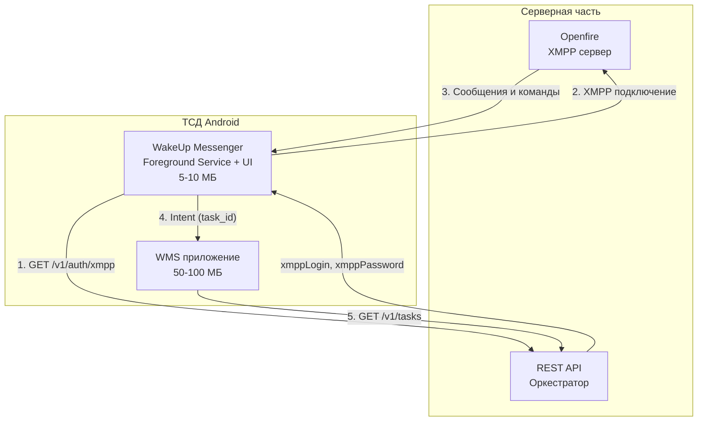
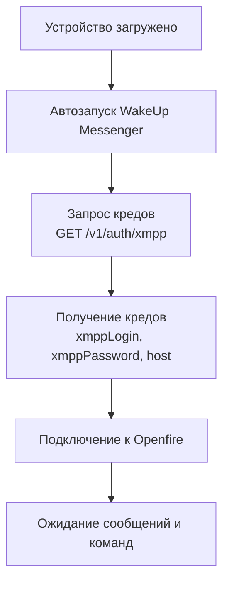
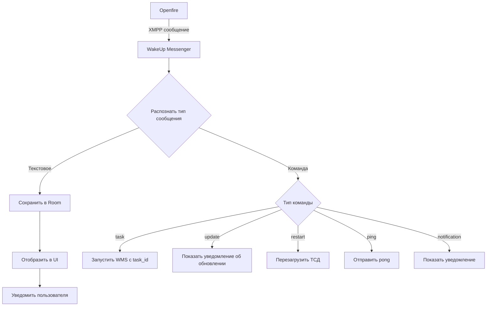
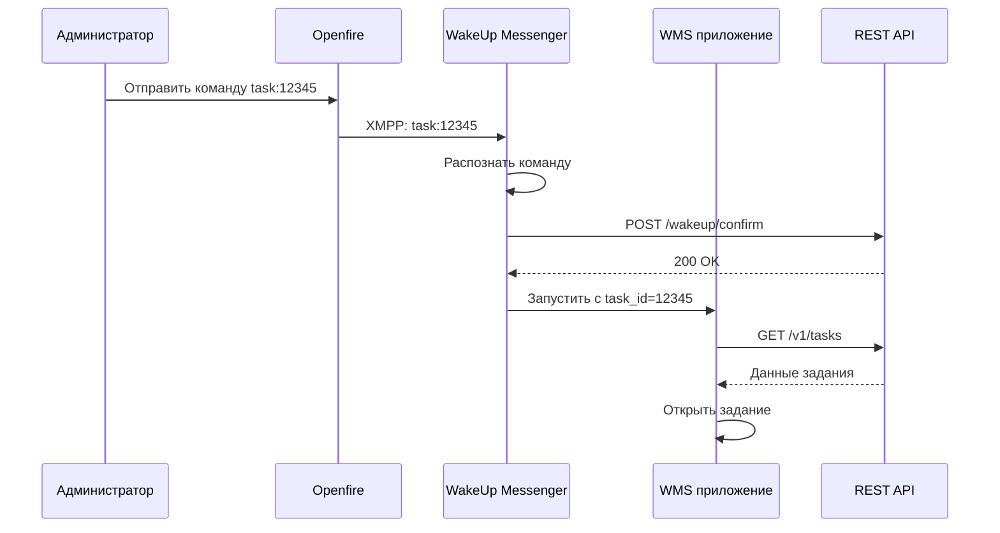
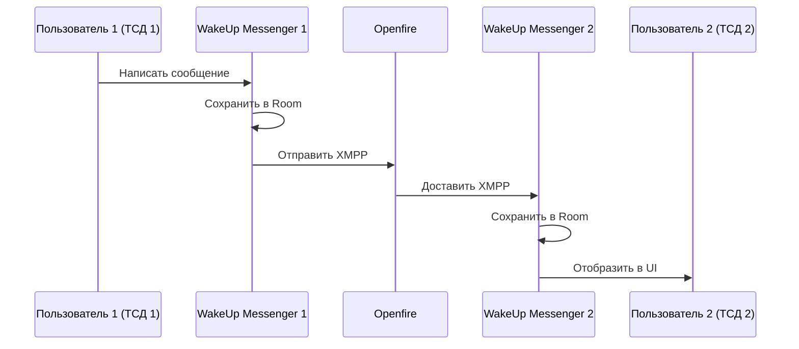
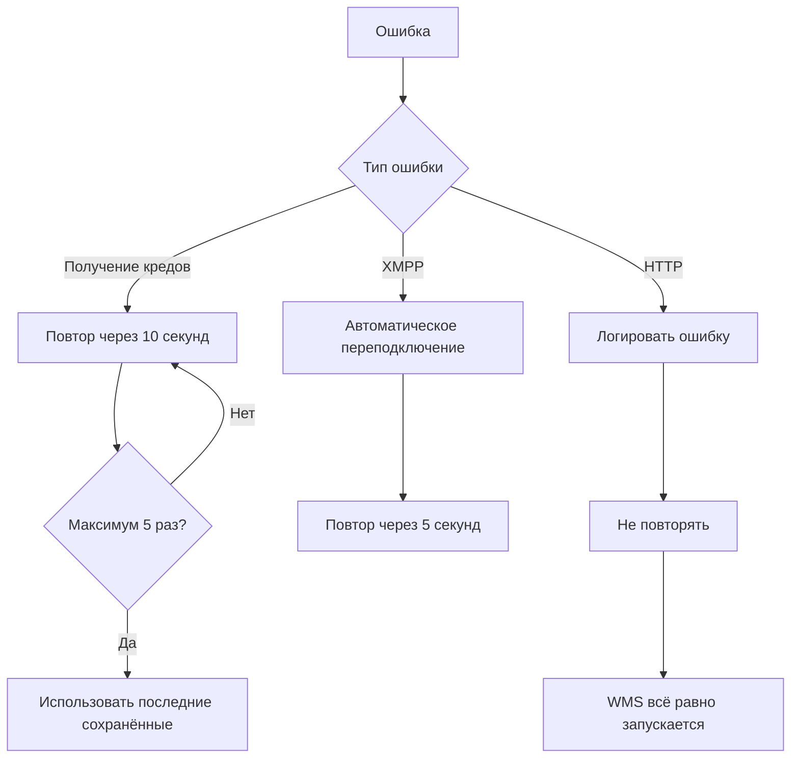
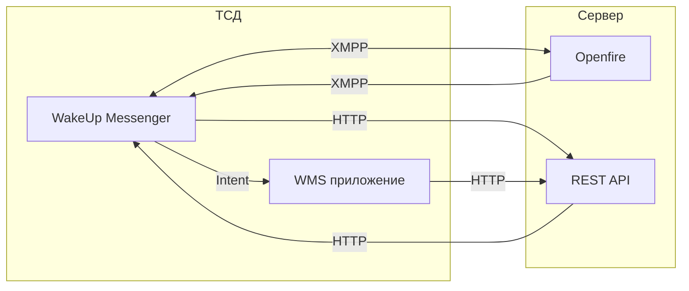

# ТЕХНИЧЕСКОЕ ЗАДАНИЕ
## WakeUp Messenger (Сервис пробуждения + Мессенджер)

**Версия:** 1.0  
**Цель:** Создать легкий сервис для XMPP общения, пробуждения WMS приложения и обмена сообщениями

**Авторы:**
- Полушин Д.Н. — программист

---

## 1. Цель работы

Создать финальную версию WakeUp Messenger, который:

| Задача | Описание |
|--------|----------|
| **Постоянная работа** | Foreground Service, всегда в памяти, легкий (~5-10 МБ) |
| **XMPP соединение** | Подключение к Openfire, получение сообщений и команд |
| **Получение учётных данных** | Запрашивает у REST API логин/пароль для XMPP при запуске |
| **Обмен сообщениями** | Отправка и получение текстовых сообщений между пользователями |
| **Обработка команд** | Распознает команды и запускает WMS приложение |
| **Запуск WMS** | Будит WMS приложение при получении команд task, update, restart и т.д. |
| **Автозапуск** | Запускается после перезагрузки устройства |

---

## 2. Компоненты системы

### 2.1. Серверная часть

| Компонент | Описание | Протокол |
|-----------|----------|----------|
| **Openfire** | XMPP сервер, маршрутизация сообщений и команд | XMPP (TCP 5222) |
| **REST API** | Оркестратор, выдача учётных данных, приём подтверждений | HTTP/HTTPS (80/443) |

### 2.2. Клиентская часть (ТСД Android)

| Компонент | Описание | Память |
|-----------|----------|--------|
| **WakeUp Messenger** | Foreground Service + UI, XMPP клиент, HTTP клиент, Room, UI чата | 5-10 МБ |
| **WMS приложение** | Основное приложение склада, запускается только по команде | 50-100 МБ |

### 2.3. Связи между компонентами

| От | Куда | Протокол | Назначение |
|----|------|----------|------------|
| WakeUp Messenger | REST API | HTTP | GET /v1/auth/xmpp (получение учётных данных) |
| WakeUp Messenger | REST API | HTTP | POST /wakeup/confirm (подтверждение пробуждения) |
| WakeUp Messenger | Openfire | XMPP | Подключение и обмен сообщениями |
| Openfire | WakeUp Messenger | XMPP | Сообщения и команды |
| WakeUp Messenger | WMS | Intent | Запуск с task_id |
| WMS | REST API | HTTP | GET /v1/tasks (загрузка заданий) |

---

## 3. Функциональность

### 3.1. Foreground Service

| Параметр | Значение |
|----------|----------|
| **Заголовок** | "WakeUp Messenger" |
| **Текст** | "Активен, ожидание команд" |
| **Ongoing** | Да (не смахнуть) |
| **Память** | 5-10 МБ |
| **WakeLock** | Только на время HTTP |

### 3.2. UI Мессенджера

**Экран 1: Список чатов**
- Последние сообщения
- Непрочитанные сообщения (значок)
- Онлайн/офлайн статус
- Кнопка "Новый чат"

**Экран 2: Переписка**
- История сообщений
- Отправка текста
- Индикатор набора текста
- Отметка о прочтении

**Экран 3: Настройки**
- Статус подключения
- Смена статуса (онлайн/невидимка)

### 3.3. Обработка команд

| Команда | Пример | Действие |
|---------|--------|----------|
| **task** | task:12345 | Запустить WMS с заданием |
| **update** | update:1.26.80 | Предложить обновить WMS |
| **restart** | restart | Перезагрузить ТСД |
| **ping** | ping | Проверка связи |
| **notification** | notification:Срочно! | Показать уведомление |

### 3.4. Хранилище (Room)

| Таблица | Назначение |
|---------|------------|
| **chat_messages** | История сообщений |
| **chat_users** | Список пользователей |
| **chat_settings** | Настройки |

---

## 4. Порядок работы

### 4.1. Последовательность действий

1. Запуск WakeUp Messenger при старте устройства (автозапуск)
2. Получение XMPP учётных данных от REST API по deviceId
3. Подключение к Openfire с полученными логином и паролем
4. Ожидание сообщений и команд
5. При получении текстового сообщения — отображение в UI чата
6. При получении команды task — запуск WMS приложения с task_id
7. При получении команды update — уведомление об обновлении
8. Отправка HTTP подтверждения на REST API при получении команды

### 4.2. Правила работы

| Правило | Описание |
|---------|----------|
| **Асинхронность** | Все HTTP запросы асинхронные, не блокируют XMPP поток |
| **Таймаут** | Таймаут HTTP запросов — 3 секунды |
| **Повтор при ошибке (креды)** | При недоступности REST API — повтор через 10 секунд, максимум 5 раз |
| **Повтор при ошибке (подтверждение)** | При недоступности REST API — логировать ошибку, WMS всё равно запускается |
| **WakeLock** | Удерживается только на время HTTP запросов |

---

## 5. Технические параметры

### 5.1. XMPP

| Параметр | Значение |
|----------|----------|
| **Библиотека** | Smack 4.4.6+ |
| **Хост** | из ответа API |
| **Порт** | 5222 |
| **Логин** | из ответа API |
| **Пароль** | из ответа API |
| **Автопереподключение** | Да |
| **Офлайн-очередь** | Да (XMPP) |

### 5.2. HTTP клиент

| Параметр | Значение |
|----------|----------|
| **Библиотека** | OkHttp |
| **Таймаут соединения** | 3 секунды |
| **Таймаут чтения** | 3 секунды |
| **Таймаут записи** | 3 секунды |

### 5.3. Логирование

**Путь:** `/sdcard/Android/data/com.wakemessenger/files/log.txt`

**Что логируется:**
- Запуск и остановка
- Получение учётных данных (успех/ошибка)
- XMPP подключение (успех/ошибка)
- Получение XMPP сообщения
- Отправка HTTP подтверждения (результат)
- Запуск WMS приложения
- Ошибки (тайм-ауты, недоступность сервера)

**Ротация:** При достижении 10 МБ — переименовать в log.old.txt, создать новый

---

## 6. REST API (требования к серверу)

| Эндпоинт | Метод | Назначение |
|----------|-------|------------|
| `/v1/auth/xmpp` | GET | Выдать XMPP учётные данные по deviceId |
| `/v1/wakeup/confirm` | POST | Принять подтверждение пробуждения |
| `/v1/tasks` | GET | Получить список заданий для deviceId |

**Параметры запроса /v1/auth/xmpp:** deviceId (string, query param)

**Ответ /v1/auth/xmpp:**

| Поле | Тип | Описание |
|------|-----|----------|
| xmppHost | string | Хост Openfire |
| xmppPort | int | Порт Openfire (5222) |
| xmppLogin | string | Логин для XMPP |
| xmppPassword | string | Пароль для XMPP |
| apiHost | string | Хост REST API |
| apiPort | int | Порт REST API (80 — рабочая БД) |

---

## 7. Критерии успеха

- [ ] WakeUp Messenger запускается после перезагрузки устройства
- [ ] XMPP подключение стабильно работает в фоне
- [ ] Отображается список чатов и история сообщений
- [ ] Отправка и получение текстовых сообщений работает
- [ ] Распознавание команд работает
- [ ] Запуск WMS приложения по команде task работает
- [ ] Хранение истории в Room работает
- [ ] Расход памяти не более 20 МБ
- [ ] Расход батареи не более +5% к базовому
- [ ] Автозапуск после перезагрузки работает

---

## 8. Что сдаётся

1. Исходный код WakeUp Messenger
2. APK файл
3. Лог-файл за время теста
4. Инструкция по настройке исключений батареи
5. Отчёт по энергопотреблению

---

## 9. Зависимости от других компонентов

| Компонент | Требование |
|-----------|------------|
| **REST API** | Должны быть реализованы эндпоинты /v1/auth/xmpp и /wakeup/confirm |
| **WMS приложение** | Должно обрабатывать Intent с task_id |
| **Openfire** | Должны быть созданы учётные записи для каждого ТСД |

---

## 10. Схемы

### 10.1. Архитектура компонентов

## 10.2. Схема работы при запуске

## 10.3. Схема работы при получении сообщения

## 10.4. Схема работы с командой task

## 10.5. Схема обмена сообщениями

## 10.6. Схема обработки ошибок

## 10.7. Сводная схема всех взаимодействий

## 11. Настройка исключений энергосбережения

При первом запуске открывается Activity с настройкой:

| Элемент | Описание |
|---------|----------|
| Текст | "Для работы сервиса необходимо отключить оптимизацию батареи" |
| Кнопка | "Открыть настройки" (открывает системные настройки батареи для приложения) |
| Кнопка | "Проверить снова" (перепроверяет статус и закрывает Activity) |

**Проверки перед запуском сервиса:**

| Проверка | Если не пройдена |
|----------|------------------|
| Приложение добавлено в исключения энергосбережения | → открыть Activity |
| Разрешён автозапуск (для китайских устройств) | → открыть Activity |
| Разрешена фоновая активность | → открыть Activity |

**Если все проверки пройдены** → Activity не показывается, сервис запускается автоматически.

---

## 12. Тестирование

### 12.1. Функциональные тесты

| № | Что делаем | Ожидаем |
|---|------------|---------|
| 1 | Первый запуск после установки | Activity настройки батареи |
| 2 | Настроить исключения | Сервис запустился, уведомление в шторке |
| 3 | Проверить лог: получены учётные данные | XMPP подключился |
| 4 | Отправить XMPP текстовое сообщение | Отобразилось в UI чата |
| 5 | Отправить команду task | Запустилось WMS с заданием |
| 6 | Перезагрузить ТСД | Сервис запустился автоматически |
| 7 | Отключить Wi-Fi, отправить XMPP | В логе ошибка, сервис не падает |
| 8 | Включить Wi-Fi | Следующие команды проходят |

### 12.2. Тесты энергопотребления

**Условия:** Экран выключен, Wi-Fi включён, 15 часов (с 18:00 до 09:00)

| Сценарий | Ожидаемый расход |
|----------|------------------|
| Без сервиса | Базовый |
| Сервис без нагрузки | +5% к базовому |
| Сервис + 10 сообщений/час | +10% к базовому |

### 12.3. Устройства для тестирования

| Устройство | Тип |
|------------|-----|
| Atol SmartPrime | ТСД |
| Atol SmartSlim | ТСД |
| Смартфон Android 11 | Тестовый |
| Смартфон Android 12 | Тестовый |

---

## 13. Что сдаётся по итогу

1. Исходный код WakeUp Messenger
2. APK файл
3. Лог-файл за время теста
4. Инструкция по настройке исключений батареи
5. Отчёт по энергопотреблению
6. Протокол тестирования

---

## 14. Риски

| Риск | Вероятность | Решение |
|------|-------------|---------|
| XMPP блокируется Doze режимом | Средняя | Использовать Foreground Service + WakeLock |
| Китайские устройства убивают сервис | Высокая | Инструкция по настройке автозапуска |
| Openfire не отвечает | Низкая | Переподключение с exponential backoff |
| Расход батареи выше ожидаемого | Средняя | Оптимизация WakeLock, уменьшение HTTP запросов |
| WMS не запускается по команде | Низкая | Логирование, fallback механизм |

---

## 15. Заключение

WakeUp Messenger — это легкий сервис, который всегда на связи. Он принимает сообщения, распознает команды и запускает WMS приложение только когда это действительно нужно. Это экономит батарею, память и ресурсы устройства.