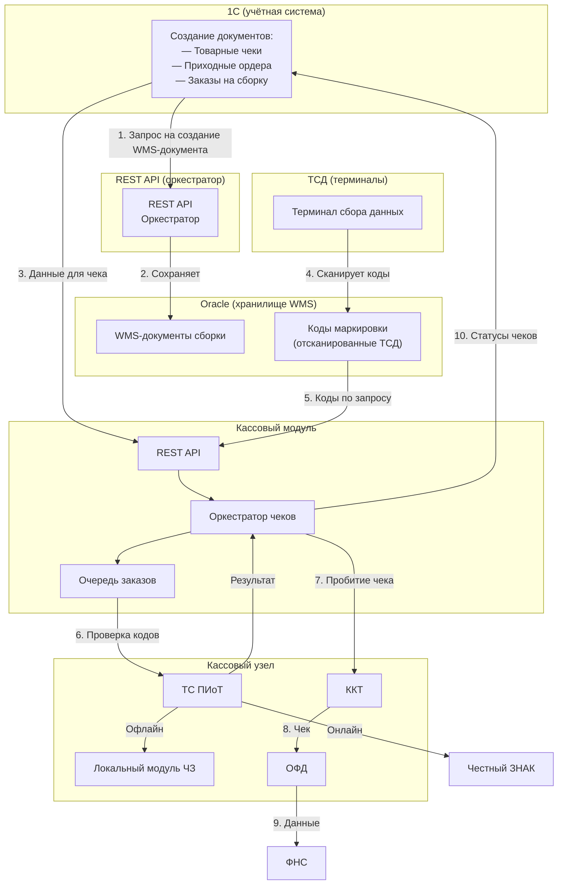
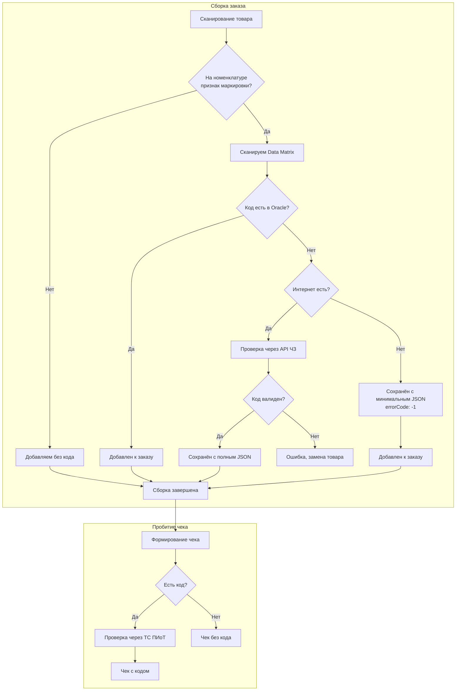
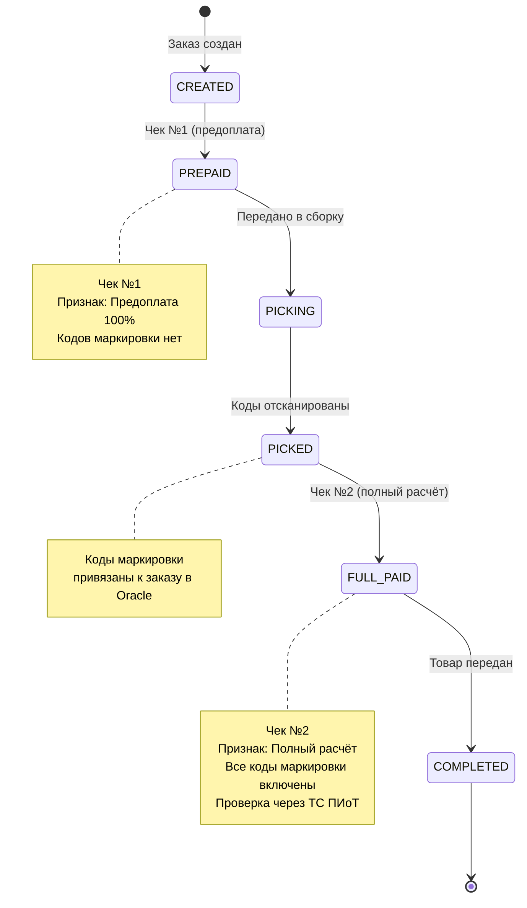

# ТЕХНИЧЕСКОЕ ЗАДАНИЕ

## Кассовый модуль для работы

---

**Версия:** 1.0  
**Дата:** 03.07.2026  
**Статус:** ?

---

## Оглавление

1. [Словарь терминов](#1-словарь-терминов)
2. [Цель работы](#2-цель-работы)
3. [Место в общей архитектуре](#3-место-в-общей-архитектуре)
4. [Компоненты и ответственность](#4-компоненты-и-ответственность)
5. [Функциональные требования](#5-функциональные-требования)
6. [Требования к интеграции с 1С](#6-требования-к-интеграции-с-1с)
7. [Требования к интеграции с Oracle](#7-требования-к-интеграции-с-oracle)
8. [Требования к интеграции с ТС ПИоТ](#8-требования-к-интеграции-с-тс-пиот)
9. [Требования к работе с ККТ](#9-требования-к-работе-с-ккт)
10. [Требования к работе с ОФД](#10-требования-к-работе-с-офд)
11. [Требования к фискальным чекам](#11-требования-к-фискальным-чекам)
12. [Сценарии работы](#12-сценарии-работы)
13. [Требования к надёжности](#13-требования-к-надёжности)
14. [Требования к логированию и мониторингу](#14-требования-к-логированию-и-мониторингу)
15. [Критерии приёмки](#15-критерии-приёмки)
16. [Риски](#16-риски)

> Qreal - учетная система в дальнейшем 1С

---

## 1. Словарь терминов

| Термин | Определение |
|--------|-------------|
| **Код маркировки** | Data Matrix, наносится на товар, сканируется ТСД |
| **WMS-документ** | Документ сборки/наборки на складе |
| **ТСД** | Терминал сбора данных (Android) для сканирования кодов |
| **Кассовый модуль** | Сервис, пробивающий чеки через ККТ |
| **ТС ПИоТ** | Модуль проверки кодов маркировки через «Честный ЗНАК» |
| **Локальный модуль ЧЗ** | Локальная база «Честного ЗНАКа» для офлайн-проверки |
| **ККТ** | Контрольно-кассовая техника — кассовый аппарат |
| **ОФД** | Оператор фискальных данных — передаёт чеки в ФНС |
| **ФНС** | Федеральная налоговая служба |
| **ФН** | Фискальный накопитель — защищённый модуль внутри ККТ |
| **Фискальный признак** | Уникальный код, присваиваемый каждому чеку ФН |
| **Честный ЗНАК** | Государственная система маркировки товаров |
| **Предоплата 100%** | Признак расчёта — деньги получены, товар ещё не передан |
| **Полный расчёт** | Признак расчёта — товар передан покупателю |
| **Data Matrix** | Двумерный штрихкод системы маркировки |
| **Тип оплаты** | Способ оплаты: наличные, карта, смешанная, бонусы, сертификат |
| **Сценарий продажи** | Способ продажи: розница, интернет-магазин, самовывоз, доставка |
| **Тип чека** | Продажа, возврат, коррекция |
| **Термопринтер** | Устройство для печати бумажных копий чеков (не фискальный регистратор). Подключается по USB, Ethernet, Wi-Fi или Bluetooth. Печатает копию чека на основе данных, полученных от кассового модуля после фискализации. |
---

## 2. Цель работы

Реализовать кассовый модуль, обеспечивающий:

1. Пробитие фискальных чеков при продаже товаров через ККТ с передачей данных в ОФД.
2. Поддержку различных типов оплаты (наличные, карта, смешанная, бонусы, сертификаты).
3. Поддержку различных сценариев продажи (розница, интернет-магазин, самовывоз, доставка).
4. Получение от **1С** данных для чеков (товары, суммы, покупатель, способ выдачи).
5. Получение от **Oracle** отсканированных кодов маркировки для включения в чеки.
6. Интеграцию с **ТС ПИоТ** для обязательной проверки кодов маркировки перед пробитием чека, а также при сборке и инвентаризации.
7. Поддержку **двухэтапной схемы продажи** для интернет-заказов: сначала чек с признаком «Предоплата 100%» (без кодов), затем чек с признаком «Полный расчёт» (с кодами).
8. Поддержку **одноэтапной схемы** для розничных продаж: чек с признаком «Полный расчёт» сразу.
9. **Автоматическую отправку чека предоплаты на email/SMS покупателя** при удаленных продажах.
10. Возврат статусов чеков в **1С** для закрытия заказов.
11. Работу в офлайн-режиме при отсутствии связи с внешними сервисами.
12. Поддержку выдачи чеков в бумажном и/или электронном виде (по e-mail или SMS) в соответствии с 54-ФЗ.

---

## 3. Место в общей архитектуре

Кассовый модуль является **самостоятельным сервисом**, который интегрируется с:

- **1С** — получение данных для чеков, передача статусов.
- **REST API (оркестратор)** — получение отсканированных кодов маркировки через Oracle.
- **ТС ПИоТ** — проверка кодов перед пробитием чека, при сборке и инвентаризации.
- **ККТ** — пробитие фискальных чеков.
- **ОФД** — передача чеков в ФНС.

**Принципы работы:**

- 1С создаёт заказ и через REST API передаёт запрос на создание WMS-документа сборки. REST API сохраняет документ в Oracle.
- Кладовщик через ТСД сканирует коды маркировки, которые сохраняются в Oracle (с проверкой через API «Честного знака» при наличии интернета с полным ответов Json или с минимальным JSON при его отсутствии).
- Кассовый модуль получает от 1С данные для чека.
- Кассовый модуль получает от Oracle (через REST API) коды маркировки для второго чека.
- Кассовый модуль проверяет коды через ТС ПИоТ.
- Кассовый модуль пробивает чеки через ККТ.
- При удаленных продажах кассовый модуль автоматически отправляет чек №1 на email/SMS покупателя (осуществляется через ОФД).
- Кассовый модуль передаёт статусы чеков в 1С.
- Кассовый модуль НЕ общается напрямую с «Честным ЗНАКом» — вся проверка идёт через ТС ПИоТ.
- Кассовый модуль НЕ хранит коды маркировки — он получает их из Oracle.

### Схема архитектуры

### 3.1. Как это работает 

Продажа может проходить по двум схемам.

---

**Схема 1. Покупатель платит сейчас, товар получает позже**

Это интернет-заказы, предоплата в магазине, доставка или самовывоз.

**Что происходит:**

1. Покупатель оплачивает заказ (на сайте или на кассе).
2. Модуль печатает первый чек — **предоплата**. В этом чеке нет кодов маркировки, потому что товар ещё не собран.
3. Чек отправляется покупателю на почту или в СМС (если заказ онлайн) или выдаётся на кассе (если оплата в магазине).
4. Кладовщик собирает заказ на складе и сканирует коды маркировки. Маркировка предварительно проверяется через кассовый модуль. Коды сохраняются в базе и привязываются к заказу.
5. Когда товар передают покупателю (курьер, пункт выдачи или склад магазина), модуль:
  - забирает коды из базы,
  - проверяет их через «Честный ЗНАК»,
  - печатает второй чек — **полный расчёт**. В этом чеке уже есть все коды маркировки.
6. Второй чек передаётся покупателю (бумажный или электронный).
7. Модуль сообщает 1С, что заказ завершён.

---

**Схема 2. Покупатель платит и забирает товар сразу**

Это обычная розница — касса в магазине.

**Что происходит:**

1. Кассир сканирует товар на кассе. Если товар маркированный — сканирует код маркировки.
2. Покупатель оплачивает.
3. Модуль проверяет код через «Честный ЗНАК» (если товар с маркировкой).
4. Модуль печатает один чек с признаком **полный расчёт**.
5. Чек выдаётся покупателю, товар передаётся сразу.

---

**Важные принципы работы модуля:**

- Модуль никогда не общается напрямую с «Честным ЗНАКом» — все проверки идут через ТС ПИоТ.
- Модуль не хранит коды маркировки — он получает их из Oracle и передаёт в чек.
- Если интернет недоступен, модуль продолжает работать: коды привязываются к документу, а чеки накапливаются в фискальном накопителе кассы и отправляются после восстановления связи.

### 3.2. Обоснование архитектуры

В классической схеме 1С работает с фискальным регистратором напрямую через «Рабочее место кассира». Однако для этого **на каждом компьютере, где подключена ККТ, должен быть запущен клиент 1С** с активной сессией пользователя.

**В нашей архитектуре это возможно но нецелесообразно, потому что:**

1. **Фискальный регистратор физически находится на складе или в серверной при если печатать электронную копию чека**, в удалённом помещении, где нет и не может быть установлен клиент 1С.
2. **На сервере подразделения запущен только кассовый модуль** (как сервис), который не требует графического интерфейса, постоянной сессии пользователя или лицензии 1С.
3. Для установки ФР с клиентом 1С или Qreal появляется кассир. Это доп. еденица (сотрудник).
4. **ККТ может быть одна** на несколько складов или магазинов — модуль централизованно управляет ею, а 1С просто передаёт данные.

**В чём разница:**

| Подход                                  | Где запущен клиент 1С | Где стоит ККТ | Кто управляет ККТ |
|-----------------------------------------|----------------------|---------------|-------------------|
| **Классический (1С → ККТ)**             | На каждой кассе (нужен клиент 1С) | Рядом с каждой кассой | Клиент 1С |
| **Кассовый модкль (1С → Модуль → ККТ)** | В одном месте (сервер/офис) | На складе, в удалённом помещении | Кассовый модуль (сервис) |

**Таким образом, кассовый модуль — это не просто «ещё один сервис», а необходимость, продиктованная физическим размещением оборудования и отсутствием клиента 1С на складе.**

## 4. Компоненты и ответственность

| Компонент | Роль | Ответственность |
|-----------|------|-----------------|
| **1С** | Учётная система | Создание заказов и документов. Передача данных в кассовый модуль. Приём статусов чеков |
| **Oracle** | Хранилище WMS | Хранение документов сборки, кодов маркировки, статусов сборки |
| **ТСД** | Терминал сбора данных | Сканирование кодов маркировки. Работа с WMS-документами. Обновление статусов |
| **Кассовый модуль** | Фискальный оркестратор | Пробитие чеков. Интеграция с ККТ, ОФД, ТС ПИоТ. Обмен с 1С и Oracle. Управление очередью |
| **ТС ПИоТ** | Проверка кодов | Проверка кодов маркировки в «Честном ЗНАКе» (онлайн/офлайн) |
| **Локальный модуль ЧЗ** | Офлайн-база | Обеспечение работы ТС ПИоТ в офлайн-режиме |
| **ККТ** | Кассовый аппарат | Печать чеков, фискализация |
| **ОФД** | Оператор фискальных данных | Передача чеков в ФНС. Отправка электронных чеков покупателям |                                                                                                         |

---

## 5. Функциональные требования

### 5.1. Базовые функции

| Функция                 | Описание                                        |
|-------------------------|-------------------------------------------------|
| Открытие смены          | Открытие рабочей смены на ККТ                   |
| Закрытие смены          | Закрытие рабочей смены с формированием Z-отчёта |
| Пробитие чека продажи   | Формирование и печать фискального чека продажи  |
| Пробитие чека возврата  | Формирование чека возврата                      |
| Пробитие чека коррекции | Формирование чека коррекции при ошибках         |
| Отмена чека             | Отмена последнего чека (если разрешено ККТ)     |
| X-отчёт                 | Промежуточный отчёт без закрытия смены          |
| Проверка состояния ККТ  | Запрос статуса (готова/занята/ошибка)           |

### 5.2. Поддержка типов оплаты

| Тип оплаты            | Код     | Описание                                 |
|-----------------------|---------|------------------------------------------|
| Наличные              | CASH    | Оплата наличными деньгами                |
| Банковская карта      | CARD    | Оплата банковской картой через эквайринг |
| Смешанная             | MIXED   | Комбинация наличных и карты в одном чеке |
| Бонусы                | BONUS   | Оплата бонусами/баллами лояльности       |
| Подарочный сертификат | GIFT    | Оплата подарочным сертификатом           |
| Безналичный расчёт    | NONCASH | Безналичная оплата для юридических лиц   |

**Требования:**
- Один чек может содержать несколько типов оплаты.
- При смешанной оплате сумма по каждому типу должна быть указана явно.
- Для бонусов и сертификатов требуется передавать идентификатор программы лояльности или номер сертификата.

### 5.3. Схемы фискализации

Кассовый модуль поддерживает две схемы фискализации:

| Схема                | Кол-во чеков | Чек №1                   | Чек №2            | Когда применяется                                                                         |
|----------------------|--------------|--------------------------|-------------------|-------------------------------------------------------------------------------------------|
| **Одноэтапная**      | 1            | —                        | Полный расчёт (4) | Товар передан сразу в момент оплаты                                                       |
| **Двухэтапная**      | 2            | Предоплата 100% (1)      | Полный расчёт (4) | Оплата до получения товара (интернет-заказы, предоплата в магазине, отсроченная передача) |
| Частичная предоплата | 2            | Частичная предоплата (2) | Полный расчёт (4) | Частичная оплата до получения                                                             |
**Коды признаков расчёта (ФФД 1.2):**
- `1` — Предоплата 100%
- `2` — Частичная предоплата
- `4` — Полный расчёт

### 5.4. Работа с маркированными товарами

| Функция                           | Описание                                                                                  |
|-----------------------------------|-------------------------------------------------------------------------------------------|
| Получение кодов                   | Запрос отсканированных кодов маркировки из Oracle по идентификатору заказа                |
| Проверка кодов при сборке         | Отправка кодов в ТС ПИоТ при сканировании на складе                                       |
| Проверка кодов при инвентаризации | Отправка кодов в ТС ПИоТ при проведении инвентаризации                                    |
| Проверка кодов при пробитии чека  | Отправка кодов в ТС ПИоТ для фискальной проверки                                          |
| Включение в чек                   | Передача кодов в фискальный чек через ККТ                                                 |
| Контроль срока                    | Мониторинг превышения 3 рабочих дней между предоплатой и полным расчётом                  |
| Связывание чеков                  | Возможность привязать два чека (предоплата и полный расчёт) к одному заказу               |
| Управление очередью заказов       | Обработка конкурентных запросов от нескольких наборщиков, завершивших сборку одновременно |

### 5.5. Управление очередью заказов

| Функция                        | Описание                                                                 |
|--------------------------------|--------------------------------------------------------------------------|
| **Постановка в очередь**       | Все запросы на пробитие чеков поступают в очередь перед отправкой на ККТ |
| **Последовательная обработка** | Обработка заказов по принципу FIFO (первый пришёл — первый ушёл)         |
| **Персистентность**            | Сохранение очереди на диске для восстановления после перезапуска         |
| **Приоритезация**              | Поддержка приоритетов для срочных заказов                                |
| **Мониторинг**                 | Отслеживание размера очереди и времени ожидания                          |

### 5.6. Офлайн-режим

Кассовый модуль должен поддерживать работу при отсутствии интернета:

| Режим                              | Описание                                                                                                    |
|------------------------------------|-------------------------------------------------------------------------------------------------------------|
| **Сборка (нет интернета)**         | Коды маркировки сохраняются в Oracle с минимальным JSON (`errorCode: "-1"`). Сборка продолжается.           |
| **Пробитие чека (нет интернета)**  | Использование Локального модуля ЧЗ для проверки кодов. Чек сохраняется в буфере ФН до восстановления связи. |
| **Отправка в ОФД (нет интернета)** | Чеки накапливаются в ФН. После восстановления связи отправляются автоматически.                             |

**Важно:** Офлайн-режим не должен блокировать продажу, если товар уже собран и проверен.

---

## 6. Требования к интеграции с 1С

### 6.1. Общий принцип взаимодействия

1С является источником данных для формирования чеков. Кассовый модуль выступает в роли фискального оркестратора, который получает от 1С команды на пробитие чеков и возвращает результаты фискализации.

**Интерфейс взаимодействия:** REST API.

### 6.2. Потоки данных

#### 6.2.1. Входящие данные от 1С (запрос на чек)

1С передаёт в кассовый модуль:

- Идентификатор заказа
- Данные о товарах (номенклатура, количество, цена, ставка НДС)
- Данные об оплате (типы оплаты, суммы)
- Данные о покупателе (телефон, email)
- Признак этапа операции (предоплата / полный расчёт / единственный чек)
- Способ выдачи чека (бумажный / электронный / комбинированный)

> **Примечание:** состав и формат полей будет детализирован на этапе проектирования API.

#### 6.2.2. Исходящие данные от кассового модуля (ответ)

Кассовый модуль возвращает в 1С:

- Статус операции (успешно / ошибка)
- Идентификаторы чеков в системе
- Фискальные признаки чеков
- Номера фискальных документов
- Детали ошибок (при неудаче)

### 6.3. Схема взаимодействия

**Общая логика:**

1. 1С отправляет запрос на пробитие чека.
2. Кассовый модуль обрабатывает запрос, выполняет все необходимые проверки и интеграции.
3. Кассовый модуль возвращает 1С результат операции.
4. 1С обновляет статус заказа в своей системе.

**Сценарии:**

| Сценарий          | Действие                                                                                                                                                                                                            |
|-------------------|---------------------------------------------------------------------------------------------------------------------------------------------------------------------------------------------------------------------|
| Интернет-заказ    | 1С отправляет запрос на чек №1 (предоплата) → кассовый модуль фискализирует → 1С получает статус → после сборки 1С отправляет запрос на чек №2 (полный расчёт) → кассовый модуль фискализирует → 1С закрывает заказ |
| Розничная продажа | 1С отправляет запрос на единственный чек (полный расчёт) → кассовый модуль фискализирует → 1С получает статус и закрывает заказ                                                                                     |
| Возврат           | 1С отправляет запрос на чек возврата → кассовый модуль фискализирует → 1С получает статус                                                                                                                           |

### 6.4. Особенности для удаленных продаж (интернет-заказов)

| Сценарий                                      | Действие                                                                                                                             |
|-----------------------------------------------|--------------------------------------------------------------------------------------------------------------------------------------|
| **Оплата на сайте картой**                    | Кассовый модуль автоматически пробивает чек №1 (предоплата) и отправляет его на email/SMS покупателя. Бумажная версия не печатается. |
| **Оплата при получении (COD)**                | Чек №1 не пробивается. При передаче товара пробивается чек №2 (полный расчёт) с кодами маркировки.                                   |
| **Оплата через ссылку (SberPay, TinkoffPay)** | Аналогично оплате на сайте — автоматический чек №1 на email.                                                                         |

**Требования к автоматической отправке:**

1. В запросе от 1С/сайта обязательно должен быть передан email или телефон покупателя.
2. Если email передан — чек отправляется на email.
3. Если email не передан, но передан телефон — чек отправляется на SMS.
4. Если не передан ни email, ни телефон — бумажный чек печатается на складе/в магазине и вкладывается в заказ.
5. Шаблон письма должен содержать:
    - Сумму оплаты
    - Список товаров
    - QR-код для проверки чека в ФНС
    - Номер заказа
    - Текст: "Это чек предоплаты. Окончательный чек вы получите при получении товара."

**Юридическое обоснование:**
- п. 2 ст. 1.2 54-ФЗ — чек может быть выдан в электронной форме при наличии e-mail или номера телефона покупателя.
- Письмо ФНС от 20.11.2020 № ЕД-4-20/19090@ — подтверждает возможность отправки чека на email без бумажной печати.

### 6.5. Варианты выдачи чека по сценариям

| Сценарий | Способ выдачи | Бумажный чек |
|----------|---------------|--------------|
| **Розница (покупатель у кассы)** | `PAPER` (по умолчанию) | Печатается |
| **Розница (покупатель просит на email)** | `EMAIL` | **Не печатается** |
| **Интернет-заказ (оплата на сайте)** | `EMAIL` (автоматически) | **Не печатается** |
| **Интернет-заказ (оплата при получении)** | `PAPER` (по умолчанию) или `EMAIL` | По желанию |
| **Доставка курьером** | `EMAIL` (автоматически) + `PAPER` (по запросу) | По желанию |
| **Самовывоз** | `PAPER` (по умолчанию) или `EMAIL` | По желанию |

**Принципы:**

1. Если покупатель предоставил email или телефон, он **имеет право** получить электронный чек вместо бумажного.
2. Бумажный чек **не печатается**, если способ выдачи явно указан как `EMAIL` или `SMS`.
3. В интернет-заказах с онлайн-оплатой чек №1 всегда отправляется на email/SMS, бумажная версия не печатается.
4. Чек №2 может быть выдан как бумажный, так и электронный — по выбору покупателя или по настройкам.

---

## 7. Требования к интеграции с Oracle

### 7.1. Интерфейс Кассовый модуль → Oracle

Кассовый модуль запрашивает у Oracle:

- Коды маркировки по идентификатору заказа (отсканированные ТСД)
- Статус сборки (собрано/не собрано)

### 7.2. Интерфейс Oracle → Кассовый модуль

Oracle возвращает:

- Список кодов маркировки (Data Matrix) по каждой позиции заказа
- Статус сборки

### 7.3. Порядок взаимодействия

1. Перед пробитием второго чека (или единственного для розницы) кассовый модуль запрашивает у Oracle коды маркировки по заказу.
2. Oracle возвращает все коды, отсканированные ТСД.
3. Кассовый модуль проверяет коды через ТС ПИоТ и включает их в чек (если товары маркированные).

### 7.4. Обработка кодов маркировки при сборке

**Общий принцип:** обязательность сканирования кода определяется признаком маркировки на номенклатуре.

**Порядок действий при сборке:**

1. Сотрудник сканирует товар.
2. Если на номенклатуре **нет** признака маркировки:
    - Товар добавляется к заказу без кода.
    - При чеке проверка через ТС ПИоТ не выполняется.
3. Если на номенклатуре **есть** признак маркировки:
    - Сотрудник **обязан** отсканировать код Data Matrix.
    - Кассовый модуль проверяет наличие кода в Oracle (таблица `MARK`).
    - **Код найден** → добавляется к заказу.
    - **Код не найден** → кассовый модуль проверяет доступность интернета:
        - **Интернет есть** → выполняется проверка через API «Честного знака»:
            - Код валиден → сохраняется в Oracle с полным JSON, добавляется к заказу.
            - Код невалиден → ТСД показывает ошибку, сотрудник заменяет товар.
        - **Интернета нет** → код сохраняется в Oracle с **минимальным JSON**:
            - `km` — код маркировки.
            - `json` — минимальный json.
            - Пример: `[{"cisInfo":{"cis":"0207613287073969373","gtin":"07613287073969","errorCode":"-1"}}]`
        - Код добавляется к заказу.
4. При пробитии чека **все коды** проходят обязательную проверку через ТС ПИоТ (независимо от наличия `errorCode`).

**Важно:** Наличие `errorCode: "-1"` в JSON означает, что код был сохранён в офлайн-режиме без проверки. Это не является ошибкой и не блокирует продажу — проверка будет выполнена через ТС ПИоТ при пробитии чека.

---

## 8. Требования к интеграции с ТС ПИоТ

### 8.1. Общие требования

| Требование | Описание |
|------------|----------|
| **Обязательность** | Интеграция с ТС ПИоТ обязательна для всех продаж маркированных товаров с 01.07.2026 |
| **Поставщики** | Поддерживаются модули от ЕСП и Инвенты |
| **Лицензирование** | На каждую ККТ требуется отдельная годовая лицензия |
| **Офлайн-режим** | ТС ПИоТ использует Локальный модуль ЧЗ версии 2.5.1 и выше |
| **Применение** | ТС ПИоТ используется для проверки кодов на всех этапах: сборка, инвентаризация, пробитие чека |

### 8.2. Проверка кодов на этапе сборки

1. ТСД сканирует код маркировки.
2. Кассовый модуль отправляет код в ТС ПИоТ на проверку.
3. ТС ПИоТ возвращает результат:
    - `ALLOWED` — код валиден, можно использовать.
    - `FORBIDDEN` — код невалиден, товар нужно заменить.
4. Результат сохраняется в Oracle.

### 8.3. Проверка кодов на этапе инвентаризации

1. ТСД сканирует код маркировки при инвентаризации.
2. Кассовый модуль отправляет код в ТС ПИоТ.
3. ТС ПИоТ возвращает актуальный статус кода.
4. Результат используется для инвентаризационной ведомости.

### 8.4. Проверка кодов на этапе пробития чека

1. Кассовый модуль получает коды из Oracle.
2. Кассовый модуль отправляет коды в ТС ПИоТ для повторной проверки.
3. ТС ПИоТ проверяет актуальный статус кодов.
4. Если все коды `ALLOWED` — кассовый модуль пробивает чек.
5. Если хотя бы один код `FORBIDDEN` — продажа блокируется.
6. При успешной проверке кассовый модуль формирует отраслевой реквизит (тег 1260).

### 8.5. Обработка ошибок ТС ПИоТ

| Ситуация | Действие кассового модуля |
|----------|---------------------------|
| ТС ПИоТ недоступен на кассе | Блокировка продажи, уведомление в ИТ |
| Код не найден в системе | Блокировка продажи, вывод ошибки |
| Истекла лицензия ТС ПИоТ | Блокировка продажи, уведомление администратора |
| Превышено время ожидания ответа | Повторная попытка (до 3 раз), затем блокировка |
| **Нет интернета при сборке** | Код сохраняется с минимальным JSON (`errorCode: "-1"`), добавляется к заказу |
| **Нет интернета при пробитии чека** | Использование Локального модуля ЧЗ (офлайн-проверка) или блокировка продажи |

### Схема двухэтапной проверки

---

## 9. Требования к работе с ККТ

### 9.1. Поддерживаемые модели ККТ

Кассовый модуль должен поддерживать не менее двух моделей ККТ (на выбор):

| Производитель | Модели |
|---------------|--------|
| **АТОЛ** | АТОЛ 30Ф, АТОЛ 91Ф, АТОЛ 55Ф, АТОЛ 60Ф |
| **ШТРИХ-М** | ШТРИХ-М-01Ф, ШТРИХ-М-02Ф |
| **Эвотор** | Эвотор 7.2, Эвотор 7.3 |

### 9.2. Режимы работы

| Режим | Описание |
|-------|----------|
| **Фискальный** | Штатная работа — пробитие чеков с передачей в ОФД |
| **Тестовый** | Пробитие чеков без отправки в ОФД (для отладки) |
| **Офлайн** | Работа при отсутствии связи с ОФД (чеки сохраняются в буфере ФН) |

### 9.3. Управление ККТ

| Операция | Описание |
|----------|----------|
| Открытие смены | Выполняется ежедневно перед началом работы |
| Закрытие смены | Выполняется ежедневно после окончания работы |
| Проверка состояния | Запрос статуса ККТ (готова/занята/ошибка) |
| Перезагрузка | Перезапуск драйвера ККТ при зависании |

### 9.4. Поддержка раздельной архитектуры печати

Кассовый модуль должен поддерживать архитектуру, где функция фискализации и функция печати бумажного чека разделены между разными устройствами.

| Компонент | Функция | Описание |
|-----------|---------|----------|
| **Фискальный регистратор (ККТ)** | Фискализация | Подписание чека фискальным признаком, передача в ОФД. Может быть установлен на виртуальной машине и не иметь собственного принтера |
| **Термопринтер** | Печать копии | Печать бумажной копии чека для покупателя. Подключается к рабочему месту кассира |

**Требования:**
- В настройках модуля должна быть возможность указать два устройства: "Фискальный регистратор" и "Принтер для печати копий чеков".
- Печать копии должна производиться с теми же фискальными данными (ФД, ФП, QR-код), которые были получены от ФР.
- Должна быть предусмотрена обработка ошибок печати: если принтер не отвечает, но чек фискализирован, операция не должна считаться провалившейся.
- Поддерживаемые способы подключения: USB, COM, Ethernet, Wi-Fi.

*Применение в архитектуре:**

1. Фискальный регистратор устанавливается централизованно (например, на сервере или в офисе) и **не имеет принтера** или принтер отключён.
2. На каждом складе, в магазине, у курьера и в ПВЗ устанавливаются **обычные термопринтеры** (подключённые по USB, Ethernet или Bluetooth).
3. Кассовый модуль:
    - При пробитии чека сначала отправляет данные на фискализацию в ФР.
    - Получает от ФР фискальные реквизиты (ФД, ФП, QR-код).
    - Формирует печатную копию чека и отправляет её на указанный термопринтер.
4. Если термопринтер недоступен, кассовый модуль **всё равно фискализирует чек** (продажа не блокируется), а печать копии выполняется позже или заменяется на электронный чек.

### 9.5. Архитектурные варианты печати чеков

Кассовый модуль можно сделать так чтобы он поддерживал два варианта архитектуры печати фискальных чеков.

**Вариант А (основной): несколько ККТ**

Каждая точка продажи (склад, ПВЗ, магазин) оснащается собственной ККТ. Чек печатается непосредственно на ККТ.

| Критерий | Описание |
|----------|----------|
| **Оборудование** | ККТ в каждой точке |
| **Печать** | Оригинал чека на ККТ |
| **Юридический статус** | Все чеки — оригиналы, без отметок |
| **Надёжность** | Каждая точка независима |
| **Администрирование** | Несколько устройств |

**Вариант Б (альтернативный): одна ККТ + термопринтеры**

Одна ККТ фискализирует все чеки централизованно. В каждой точке продажи установлены термопринтеры для печати копий.

| Критерий | Описание |
|----------|----------|
| **Оборудование** | 1 ККТ + N термопринтеров |
| **Печать** | Копия чека на термопринтере |
| **Юридический статус** | Копия с отметкой |
| **Надёжность** | Зависит от доступности ККТ |
| **Администрирование** | Одно устройство |

**Рекомендация:** Для упрощения юридической чистоты и обеспечения независимости точек рекомендуется использовать **Вариант А**. Вариант Б допустим при ограниченном бюджете или большом количестве точек продажи (10+), где стоимость ККТ становится существенной.

---

## 10. Требования к работе с ОФД

### 10.1. Поддерживаемые ОФД

Кассовый модуль должен поддерживать не менее двух операторов:

| Оператор |
|----------|
| Ярус |
| Такском |
| Сбис |

### 10.2. Режимы работы с ОФД

Взаимодействие кассового модуля с ОФД опирается на возможности ККТ и встроенного в нее **фискального накопителя (ФН)**.

| Режим         | Описание                                                                                                                                                                                                                                                                                                                              |
|---------------|---------------------------------------------------------------------------------------------------------------------------------------------------------------------------------------------------------------------------------------------------------------------------------------------------------------------------------------|
| **Онлайн**    | Является основным режимом работы. Все фискальные чеки в момент расчета записываются в ФН и незамедлительно передаются в ОФД для последующей отправки в ФНС.                                                                                                                                                                           |
| **Офлайн**    | Активируется автоматически при потере связи с интернетом. В этом режиме все чеки накапливаются и защищенно хранятся в фискальном накопителе ККТ. Законодательно допустимый срок работы в таком режиме — не более 30 календарных дней. После восстановления соединения накопитель автоматически передает все накопленные данные в ОФД. |
| **Смешанный** | По сути, это алгоритм работы современной ККТ, которая по умолчанию работает в режиме «Онлайн», но способна автоматически переключаться в режим «Офлайн» при сбоях сети и так же автоматически возвращаться к обычной работе после восстановления связи.                                                                               |

**Важно:** кассовый модуль **не участвует** в хранении и управлении очередью чеков при потере связи. Эта функция полностью возложена на фискальный накопитель ККТ, что гарантирует сохранность фискальных данных без участия внешнего ПО.

### 10.3. Взаимодействие с ОФД

| Операция                | Описание                                                      |
|-------------------------|---------------------------------------------------------------|
| Регистрация ККТ         | Первичная регистрация кассы в ОФД                             |
| Отправка чека           | Передача фискального чека в ОФД                               |
| Получение подтверждения | Ожидание ответа от ОФД о приёме чека                          |
| Переотправка            | Автоматическая переотправка чеков при сбоях (выполняется ККТ) |
| Мониторинг              | Проверка статуса отправки чеков                               |

---

## 11. Требования к фискальным чекам

### 11.1. Соответствие требованиям

Все чеки должны соответствовать:

- 54-ФЗ — федеральный закон о применении ККТ
- Приказ ФНС № ЕД-7-20/662@ — форматы фискальных документов
- ФФД 1.2 — текущая версия формата фискальных данных

### 11.2. Признаки расчёта

| Признак | Код | Когда используется |
|---------|-----|-------------------|
| Предоплата 100% | `1` | Первый чек (деньги получены, товар ещё не передан) |
| Частичная предоплата | `2` | Частичная оплата до передачи товара |
| Аванс | `3` | Авансовый платёж |
| Полный расчёт | `4` | Второй чек (товар передан покупателю) |

### 11.3. Типы чеков

| Тип чека | Код | Описание |
|----------|-----|----------|
| Продажа | SALE | Продажа товара покупателю |
| Возврат прихода | RETURN | Возврат товара, купленного в магазине |
| Коррекция прихода | CORRECTION_IN | Коррекция ошибок кассира (приход) |
| Коррекция расхода | CORRECTION_OUT | Коррекция ошибок кассира (расход) |

### 11.4. Особенности для маркированных товаров

| Требование | Описание |
|------------|----------|
| Код обязателен | Для всех маркированных товаров код Data Matrix должен присутствовать в чеке |
| Один чек — один код | Каждая единица товара передаётся отдельной строкой с уникальным кодом |
| Формат передачи | Код передаётся в формате GS1 (начинается с `01`) |
| Срок передачи | Код должен быть передан в Честный ЗНАК не позднее 3 рабочих дней после отгрузки |

### 11.5. Способы выдачи чеков

Кассовый модуль должен поддерживать следующие способы выдачи фискальных чеков:

| Способ | Описание |
|--------|----------|
| **Бумажный чек** | Печать на ККТ или термопринтере. Используется по умолчанию, если не указан иной способ или покупатель явно не запросил электронный чек. |
| **Электронный чек (e-mail)** | Отправка чека на электронную почту покупателя. Адрес передаётся в запросе от 1С. Бумажный чек **не печатается**. |
| **Электронный чек (SMS)** | Отправка чека в виде SMS-сообщения с ссылкой на электронный чек. Номер телефона передаётся в запросе от 1С. Бумажный чек **не печатается**. |
| **Комбинированный** | Одновременная печать бумажного чека и отправка электронной копии (по требованию покупателя или по настройкам). |

**Требования:**

- Выбор способа выдачи чека определяется в запросе от 1С (поле `receiptOptions`).
- При отправке электронного чека кассовый модуль должен:
    - Сформировать фискальный чек на ККТ.
    - Передать данные для отправки в ОФД (ОФД обеспечивает доставку чека покупателю).
    - **Бумажный чек не печатается**, если способ выдачи `EMAIL` или `SMS`.
- Бумажный чек печатается только при явном указании способа `PAPER` или `BOTH`.
- При отсутствии параметра используется способ по умолчанию — `PAPER`.

**Сценарии использования:**

| Сценарий | Способ выдачи | Бумажный чек |
|----------|---------------|--------------|
| Розничная продажа (покупатель у кассы) | `PAPER` (по умолчанию) или `BOTH` | Печатается |
| Розничная продажа (покупатель просит на email) | `EMAIL` | **Не печатается** |
| Интернет-заказ (оплата на сайте) | `EMAIL` (автоматически) | **Не печатается** |
| Доставка курьером | `EMAIL` + `PAPER` (по желанию) | По желанию |
| Самовывоз | `PAPER` или `EMAIL` (по выбору покупателя) | По желанию |

**Юридическое основание:**

- п. 2 ст. 1.2 54-ФЗ — чек может быть выдан в электронной форме при наличии e-mail или номера телефона покупателя.
- Письмо ФНС от 20.11.2020 № ЕД-4-20/19090@ — подтверждает возможность отправки чека на email без бумажной печати.
- Отказ от бумажного чека в пользу электронного **не является нарушением**, если покупатель согласен и предоставил контактные данные.

### 11.6. Формирование QR-кода

Кассовый модуль **не получает готовый QR-код от фискального регистратора**, а формирует его самостоятельно на основе фискальных реквизитов, полученных от драйвера ККТ после закрытия чека.

**Структура QR-кода (согласно ФФД 1.2):**

QR-код формируется как строка с параметрами, разделёнными символом `&`:

---

## 12. Сценарии работы

### 12.1. Сценарий А: Двухэтапная продажа (предоплата + получение)

Применяется, когда покупатель **оплачивает товар до его получения**, а сам товар получает позже:

- с доставкой курьером
- в пункте самовывоза (ПВЗ)
- на складе магазина (оплатил в кассе, забирает на складе)
- частичный выкуп (часть товара выдана сразу, остальное со склада)

---

**Вариант 1: Интернет-заказ с доставкой курьером**

- Покупатель оформляет и оплачивает заказ на сайте.
- 1С автоматически отправляет запрос на чек №1 (предоплата).
- Чек №1 отправляется покупателю на email/SMS.
- Заказ собирается на складе, сканируются коды маркировки.
- Курьер забирает заказ и доставляет покупателю.
- При передаче товара покупателю курьер через мобильное приложение инициирует пробитие чека №2.
- Кассовый модуль пробивает чек №2 (полный расчёт) с кодами маркировки.
- Чек №2 отправляется покупателю на email/SMS.
- Курьер может распечатать бумажную копию чека на мобильном принтере (опционально).

---

**Вариант 2: Интернет-заказ с самовывозом (ПВЗ)**

- Покупатель оформляет и оплачивает заказ на сайте.
- 1С автоматически отправляет запрос на чек №1 (предоплата).
- Чек №1 отправляется покупателю на email/SMS.
- Заказ собирается на складе, сканируются коды маркировки.
- Заказ доставляется в пункт самовывоза.
- Покупатель приходит в ПВЗ, предъявляет документы.
- Сотрудник ПВЗ передаёт товар и инициирует пробитие чека №2.
- Кассовый модуль пробивает чек №2 (полный расчёт) с кодами маркировки.
- Чек №2 отправляется покупателю на email/SMS.
- Бумажный чек печатается в ПВЗ (опционально).

---

**Вариант 3: Предоплата в магазине, получение на складе**

- Покупатель приходит в магазин, оплачивает товар на кассе.
- Кассир пробивает чек №1 (предоплата 100%) **без кодов маркировки**.
- Чек №1 выдаётся покупателю (бумажный или электронный).
- Создаётся заказ на сборку, товар передаётся на склад.
- Сотрудники склада собирают заказ, сканируют коды маркировки (согласно разделу 7.4).
- Покупатель получает товар на складе (или с доставкой).
- При передаче товара пробивается чек №2 (полный расчёт) **с кодами маркировки**.

---

**Вариант 4: Частичный выкуп (смешанный заказ)**

- Покупатель оплачивает заказ (на сайте или в магазине).
- Часть товара есть в магазине и выдаётся покупателю сразу (без кодов маркировки).
- Остаток заказа собирается на складе, сканируются коды маркировки.
- При получении остатка (доставка или самовывоз) пробивается чек №2 с кодами маркировки.
- Чек №1 был пробит ранее (при оплате).

---

**Сравнение вариантов:**

| Характеристика | Доставка курьером | Самовывоз | Предоплата в магазине | Частичный выкуп |
|----------------|-------------------|-----------|----------------------|-----------------|
| **Где оформляется** | На сайте | На сайте | В магазине на кассе | На сайте или в магазине |
| **Кто платит** | Покупатель онлайн | Покупатель онлайн | Покупатель через кассу | Покупатель |
| **Кто пробивает чек №1** | Кассовый модуль автоматически | Кассовый модуль автоматически | Кассир | Кассир или автоматически |
| **Способ выдачи чека №1** | Всегда email/SMS | Всегда email/SMS | Бумажный или электронный | Бумажный или электронный |
| **Кто инициирует чек №2** | Курьер (через моб. приложение) | Сотрудник ПВЗ | Сотрудник склада | Сотрудник склада |
| **Где получает товар** | По адресу покупателя | Пункт самовывоза | Склад магазина | Магазин + склад |
| **Бумажный чек №2** | Опционально (моб. принтер) | Опционально (ПВЗ) | Опционально | Опционально |

---

### 12.2. Сценарий Б: Розничная продажа

**Участники:** Кассир, Покупатель

**Шаг 1. Сканирование**
- Кассир сканирует товар.
- Если товар маркированный — сканирует код Data Matrix.

**Шаг 2. Пробитие чека**
- Кассир принимает оплату.
- Кассовый модуль формирует чек с признаком «Полный расчёт».
- Если товар маркированный — код проходит проверку через ТС ПИоТ.
- Чек отправляется в ОФД.

**Шаг 3. Передача товара**
- Кассир отдаёт товар покупателю.

---

### 12.3. Сценарий В: Возврат товара

**Участники:** Кассир, Покупатель

**Шаг 1. Проверка**
- Кассир сканирует код маркировки возвращаемого товара (если есть).
- Кассовый модуль проверяет, что товар был продан в этой организации.

**Шаг 2. Пробитие чека возврата**
- Кассовый модуль формирует чек возврата.
- Код маркировки включён в чек возврата (если есть).
- Чек отправляется в ОФД → ФНС → Честный ЗНАК (товар возвращается в оборот).

**Шаг 3. Возврат денег**
- Кассир возвращает деньги покупателю.

---

### 12.4. Жизненный цикл заказа

Состояния заказа:
- **CREATED** — Заказ создан
- **PREPAID** — Чек №1 (предоплата) пробит
- **PICKING** — Передано в сборку
- **PICKED** — Коды отсканированы
- **FULL_PAID** — Чек №2 (полный расчёт) пробит
- **COMPLETED** — Товар передан

**Примечания:**
- Чек №1: признак «Предоплата 100%», кодов маркировки нет.
- В состоянии PICKED коды маркировки привязаны к заказу в Oracle.
- Чек №2: признак «Полный расчёт», все коды маркировки включены, проверка через ТС ПИоТ.

---

## 13. Требования к логированию и мониторингу

### 13.1. Что логировать

| Событие | Описание |
|---------|----------|
| Пробитие чека | Содержимое, сумма, статус, фискальные данные |
| Ошибки ККТ | Отказ печати, занятость, нет бумаги |
| Ошибки ОФД | Отказ, таймаут |
| Ошибки ТС ПИоТ | Отказ проверки, истекла лицензия |
| Переотправки чеков | Время и причина переотправки |
| Открытие/закрытие смены | Время, оператор |
| Действия оператора | Все операции с указанием кассира |

### 13.2. Требования к логам

| Требование | Описание |
|------------|----------|
| **Хранение** | Не менее 30 дней |
| **Формат** | Структурированный (JSON) |
| **Доступ** | Только для администратора |

### 13.3. Метрики для мониторинга

| Метрика | Описание |
|---------|----------|
| Количество чеков в смену | Статистика по кассам |
| Время ответа ОФД | Среднее и максимальное время |
| Доступность ТС ПИоТ | Процент доступности |
| Ошибки ККТ | Количество ошибок по типам |
| Буфер офлайн-чеков | Текущий размер очереди |

---

## 14. Критерии приёмки

- [ ] Кассовый модуль успешно открывает и закрывает смену на ККТ.
- [ ] Чек №1 (предоплата) пробивается **без кодов маркировки** по данным из 1С и принимается ОФД.
- [ ] Чек №2 (полный расчёт) пробивается **с кодами маркировки** (полученными из Oracle) после проверки через ТС ПИоТ и принимается ОФД.
- [ ] Для розничных продаж (RETAIL) чек пробивается с признаком «Полный расчёт» сразу, с кодами маркировки (если есть).
- [ ] Для смешанного заказа коды из Oracle включаются в чек №2 (все коды, включая отсканированные на складе).
- [ ] Коды маркировки передаются в Честный ЗНАК через ОФД.
- [ ] При недоступности ТС ПИоТ продажа маркированного товара блокируется с понятной ошибкой.
- [ ] При потере связи с ОФД чеки сохраняются и отправляются автоматически после восстановления.
- [ ] Время между предоплатой и полным расчётом контролируется (не более 3 рабочих дней).
- [ ] Возврат маркированного товара формирует корректный чек возврата.
- [ ] Все операции логируются.
- [ ] Интеграция с 1С работает корректно (приём данных, передача статусов).
- [ ] Интеграция с Oracle работает корректно (получение кодов маркировки).
- [ ] При пробитии чека №2 выполняется повторная проверка кодов через ТС ПИоТ, при запрете хотя бы одного кода продажа блокируется.
- [ ] При отсутствии интернета код сохраняется в Oracle с минимальным JSON, содержащим `errorCode: "-1"` как признак того, что проверка не выполнялась.
- [ ] При пробитии чека все коды (включая сохранённые с `errorCode: "-1"`) проходят проверку через ТС ПИоТ.
- [ ] Кассовый модуль поддерживает выдачу чеков в бумажном и электронном виде (e-mail/SMS) в зависимости от параметра в запросе от 1С.
- [ ] Кассовый модуль поддерживает раздельную архитектуру печати: фискализация на ККТ, печать копии на термопринтере.
- [ ] Кассовый модуль поддерживает различные типы оплаты: наличные, карта, смешанная, бонусы, сертификаты.

---

## 15. Риски

| Риск | Вероятность | Решение |
|------|-------------|---------|
| **ТС ПИоТ недоступен** | Средняя | Блокировка продаж, уведомление администратора |
| **Истекла лицензия ТС ПИоТ** | Низкая | Мониторинг срока действия, уведомление за 30 дней |
| **ККТ недоступна** | Средняя | Буфер чеков, уведомление администратора |
| **ОФД недоступен** | Низкая | Офлайн-режим, автоматическая переотправка |
| **Некорректные коды маркировки** | Средняя | Валидация через ТС ПИоТ, понятная ошибка кассиру |
| **Сбой фискального накопителя** | Низкая | Замена ФН, восстановление данных |
| **Превышение срока 3 дня** | Низкая | Автоматическое уведомление ответственного |
| **Несовместимость драйверов ККТ** | Низкая | Предварительное тестирование с поставщиком |
| **Задержка синхронизации с Oracle** | Средняя | Автоматический повтор запроса, уведомление |
| **Раздельная печать (ФР + принтер)** | Средняя | Настройка двух устройств, обработка ошибок печати |
| **Конфликт типов оплаты** | Низкая | Валидация сумм, контроль корректности |

---
